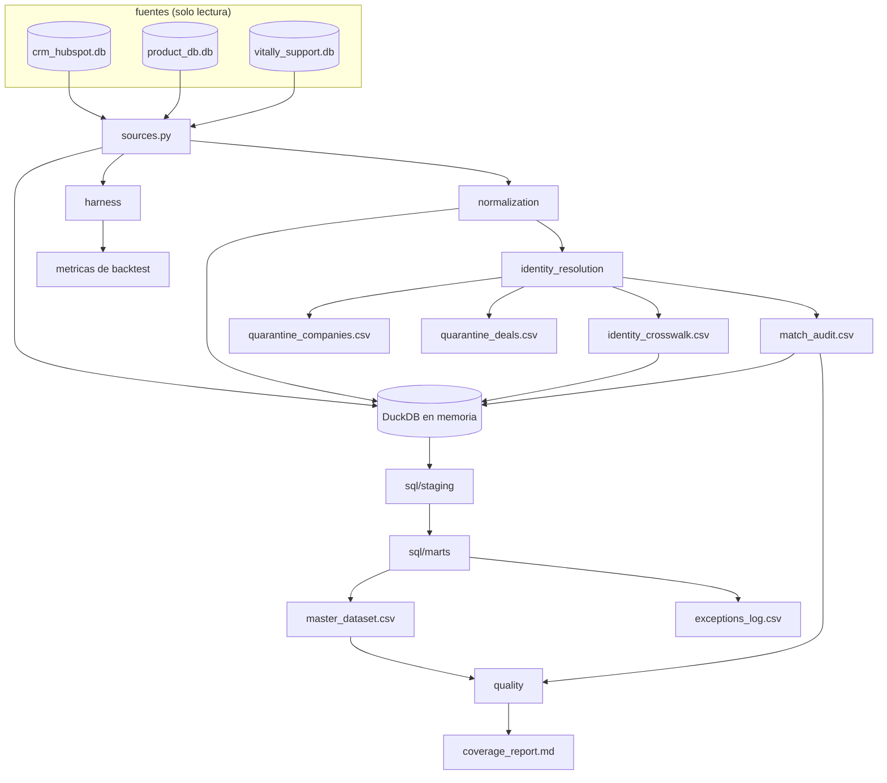

# Diseño: motor del dataset maestro de A0

Este documento decide cómo se construye el motor que produce una fila por empresa real a partir de HubSpot, la base de datos de producto y Vitally. Los tres ADR ya fijaron el comportamiento (qué se cruza, qué se imputa, cómo se mide la tendencia); aquí se define la estructura del código, el esquema exacto de cada tabla de salida, el orden de los pasos y cómo se prueba. Un analista junior debería poder abrir el paquete y saber en qué archivo vive cada regla; un director debería poder leer el resumen de decisiones y el reporte de cobertura sin abrir código.

## Resumen de decisiones

| # | Decisión | Elegido | Rechazado | Por qué |
|---|---|---|---|---|
| D1 | Lenguaje del puntaje de identidad | Python con RapidFuzz | Recalcular niveles con las funciones de similitud de DuckDB | DuckDB no trae WRatio, token_set_ratio ni partial_ratio; recalcular en SQL invalidaría los umbrales medidos sobre los 596 pares |
| D2 | Lenguaje del ensamblaje | SQL de DuckDB en capas staging y marts | Todo en pandas | El caso pide indicar el motor; el SQL es lo que un revisor de datos espera leer, y A1 y A4 heredan las mismas consultas |
| D3 | Carga de las tres SQLite | `sqlite3` de la librería estándar hacia DataFrames, registrados en DuckDB | Extensión `sqlite` de DuckDB con `ATTACH` | La extensión necesita red en su primera instalación; el dataset completo son ~16 mil filas, así que la carga en memoria cuesta milisegundos y elimina la pregunta de versión y caché |
| D4 | Instalación automática de extensiones | Apagada de forma explícita en la conexión | Dejar el valor por omisión | Una descarga silenciosa convertiría una corrida reproducible en una que depende de la red |
| D5 | Goldens en `outputs/` | Tablas completas | Muestra con comando de regeneración | Las tablas caben en cientos de kilobytes y son la entrada de la prueba de idempotencia; una muestra no se puede comparar byte a byte |
| D6 | Archivo `.duckdb` | Se regenera en `.build/` y se ignora en Git | Persistirlo en el repositorio | Es un binario que cambia en cada corrida y no se puede revisar en un diff; A4 hereda el SQL y el crosswalk, que sí son legibles |
| D7 | Marca de tiempo de las decisiones | `dataset_asof`, derivada de la fecha máxima presente en los datos | `datetime.now()` o una constante fija | Una hora de reloj rompe la comparación byte a byte; una constante se vuelve mentira en cuanto cambian los datos |
| D8 | Formato numérico en los CSV | Dos decimales para dinero y seis para razones, generados con `printf` en SQL | Dejar que pandas imprima el flotante | La representación de un flotante cambia entre versiones de numpy y produce diffs falsos en los goldens |
| D9 | Desempate en un bloque de fecha con más de un candidato | Bajar al siguiente nivel y, si el margen no alcanza, a revisión manual | Quedarse con el primero, el de id menor o el de puntaje más alto | La calibración mostró que un candidato incorrecto también llega a 100 de 100, así que un empate es ambigüedad real |
| D10 | Normalización de dominio | Reglas propias sobre texto ya limpiado para mostrarse | Public Suffix List | Los datos traen acentos dentro del hostname (`gaitán115.com.mx`), que no es una etiqueta DNS válida; una dependencia de PSL resolvería un problema que estos datos no tienen |
| D11 | Corte de entrega | Cuatro PR encadenados | Los dos PR de la propuesta | La estimación por archivo da ~2,330 líneas escritas; el PR 1 de la propuesta llegaría a ~1,750 y rompería el presupuesto de 800 (ver sección 8) |

## 1. Arquitectura del paquete

### Módulos y responsabilidades

| Módulo | Responsabilidad | Entradas | Salidas |
|---|---|---|---|
| `worky_engine/sources.py` | Leer las tres bases SQLite en modo solo lectura y entregar un DataFrame por tabla | `--data-dir` | `raw_companies`, `raw_deals`, `raw_marketing_touches`, `raw_accounts`, `raw_product_usage`, `raw_customers`, `raw_tickets` |
| `worky_engine/normalization/` | Funciones puras de fecha, dominio, nombre y moneda | Valores crudos | Valores normalizados y filas de excepción |
| `worky_engine/identity_resolution/` | Deduplicación, blocking, puntaje, cascada de niveles, veto, `master_id`, cuarentenas | Tablas crudas más columnas normalizadas | `identity_crosswalk`, `match_audit`, `quarantine_companies`, `quarantine_deals` |
| `worky_engine/master_dataset/` | Registrar los DataFrames en DuckDB y ejecutar el SQL en orden | Tablas crudas, normalizadas y de identidad | `master_dataset`, `exceptions_log` |
| `worky_engine/sql/staging/` | Un archivo por tabla origen: tipado, fechas ISO, conversión a MXN, recortes | Tablas registradas | Vistas `stg_*` |
| `worky_engine/sql/marts/` | Supervivencia, imputación de MRR, agregados de uso, soporte y comercial, cobertura | Vistas `stg_*` más identidad | Vistas `mart_*` |
| `worky_engine/quality/` | Reporte de cobertura y pruebas de contrato en tiempo de build | Salidas de marts e identidad | `coverage_report.md`, excepción con el contrato violado |
| `worky_engine/harness/` | Backtest del ADR-003 en k = 0, 2 y 3 | `product_usage`, `churn_date` | Métricas por fórmula y por k |
| `worky_engine/writers.py` | Escritura de CSV y Markdown con formato fijo | DataFrames | Archivos en `--out-dir` |
| `worky_engine/cli.py` | Comandos `build`, `resolve` y `backtest` | Argumentos | Códigos de salida y las siete salidas |

### Dependencias permitidas entre módulos

La regla es una sola: las flechas apuntan siempre hacia abajo en esta lista, y cualquier importación en sentido contrario es un error de diseño que la revisión debe rechazar.

| Módulo | Puede importar | No puede importar |
|---|---|---|
| `normalization` | Solo la librería estándar | Nada del paquete, ni pandas, ni duckdb |
| `identity_resolution` | `normalization`, rapidfuzz, pandas | `master_dataset`, `quality`, `harness`, duckdb |
| `master_dataset` | `normalization`, `identity_resolution`, duckdb, pandas | `quality`, `harness` |
| `quality` | Lee las salidas ya materializadas de `master_dataset` e `identity_resolution` | Recalcular reglas de cruce o de imputación |
| `harness` | `normalization`, pandas | `identity_resolution`, `master_dataset`, `quality` |
| `cli` | Todos los anteriores | Nada lo importa a él |

`normalization` no depende de nada porque el script de limpieza de A6 va a importarlo tal cual, y una dependencia de base de datos ahí lo volvería inservible fuera de este motor. `quality` solo lee salidas para que el reporte de cobertura no pueda diferir del dataset que describe: si recalculara, tendríamos dos fuentes de la misma cifra.

El punto exacto donde Python entrega el control a SQL es el registro de DataFrames en la conexión de DuckDB. Solo `master_dataset/assemble.py` hace ese registro, y los nombres registrados (`raw_*`, `norm_*`, `identity_crosswalk`, `match_audit`) son el contrato entre los dos lenguajes.

### Flujo de datos



## 2. Contratos de datos

Convenciones para las siete salidas: codificación UTF-8 sin marca de orden de bytes, salto de línea `\n`, separador coma, sin columna de índice, nulo escrito como campo vacío. Los tipos son los de DuckDB; en el CSV todo es texto con el formato que fija la decisión D8.

Los nombres de columna de esta sección son los canónicos del cambio. En particular `csm_owner`, `tickets_total`, `tickets_urgent`, `csat_avg` y `closed_revenue_mxn` se conservan tal cual, y el spec de la capacidad `master-dataset-assembly` los adopta.

### identity_crosswalk (650 filas)

| Columna | Tipo | Nulable | Ejemplo |
|---|---|---|---|
| master_id | VARCHAR(12) | no, única | `3f9a1c0d7b21` |
| hubspot_id | VARCHAR | no, única | `HS-100028` |
| account_id | VARCHAR | sí (82 empresas no tienen cuenta de producto) | `ACC-2027` |
| vitally_id | VARCHAR | sí | `cus_004512` |
| account_match_tier | VARCHAR | sí (nulo cuando no hay cuenta) | `T2` |
| vitally_match_tier | VARCHAR | sí | `T1` |
| confidence_tier | VARCHAR | no | `T2` |
| resolved_at | DATE | no | `2024-08-31` |
| ruleset_version | VARCHAR | no | `1.0.0` |

`confidence_tier` es el nivel más débil entre los vínculos que forman la fila. Si una fila se resolvió con T0 hacia producto y T3 hacia Vitally, la fila reporta T3, porque la confianza de un registro dorado no puede ser mejor que su evidencia más floja.

`account_match_tier` y `vitally_match_tier` son una extensión de este diseño sobre el mínimo que fija el spec, y guardan el nivel con el que se resolvió cada vínculo por separado. Llevan el sufijo `match` para que nadie las confunda con un atributo de negocio como `segment` o `plan`.

### match_audit (1,978 filas: 678 + 650 + 650)

| Columna | Tipo | Nulable | Ejemplo |
|---|---|---|---|
| source_system | VARCHAR | no | `product_db` |
| source_id | VARCHAR | no | `ACC-2027` |
| master_id | VARCHAR(12) | sí (nulo cuando la fila quedó en cuarentena) | `3f9a1c0d7b21` |
| tier | VARCHAR | no | `T2` |
| score | DECIMAL(5,2) | sí (nulo en T0 y en el propio registro dorado) | `100.00` |
| score_runner_up | DECIMAL(5,2) | sí | `74.00` |
| score_margin | DECIMAL(5,2) | sí | `26.00` |
| candidate_count | INTEGER | no | `1` |
| blocking_rule | VARCHAR | no | `signup_date` |
| evidence_json | VARCHAR | no | `{"created_at":"2022-10-04","name_norm":"sanches y asocia","partial_ratio":100}` |
| veto_applied | BOOLEAN | no | `false` |
| veto_reason | VARCHAR | sí | `shared_domain_distinct_company` |
| needs_review | BOOLEAN | no | `false` |
| ruleset_version | VARCHAR | no | `1.0.0` |
| decided_by | VARCHAR | no | `worky_engine` |
| decided_at | DATE | no | `2024-08-31` |

Valores permitidos de `tier`: `S` (la propia empresa de HubSpot, que define el registro dorado), `T0`, `T1`, `T2`, `T3`, `M` (revisión manual), `Q` (en cuarentena). La columna se llama `tier` porque ese es el nombre que fijan el ADR-001 y el spec de `identity-resolution`. Valores permitidos de `blocking_rule`: `hubspot_id`, `domain_label`, `signup_date`, `global`, `none`.

`evidence_json` se serializa con `json.dumps(obj, sort_keys=True, separators=(",", ":"), ensure_ascii=False)`. Sin llaves ordenadas, dos corridas producen el mismo contenido en distinto orden y la comparación byte a byte falla sin que nada esté mal.

### quarantine_companies (28 filas)

| Columna | Tipo | Nulable | Ejemplo |
|---|---|---|---|
| hubspot_id | VARCHAR | no, única | `HS-900001` |
| company_name | VARCHAR | no | `CORDERO 501 SA DE CV` |
| domain | VARCHAR | no | `cordero501.com.mx` |
| mrr | DECIMAL(12,2) | sí (las 28 vienen en nulo) | (vacío) |
| currency | VARCHAR | no | `MXN` |
| signup_date | DATE | sí | `2022-10-04` |
| churn_date | DATE | sí | `2024-04-30` |
| reason_code | VARCHAR | no | `duplicate_company_clone` |
| survivor_hubspot_id | VARCHAR | no | `HS-100469` |
| survivor_master_id | VARCHAR(12) | no | `3f9a1c0d7b21` |
| evidence_json | VARCHAR | no | `{"mrr_is_null":true,"name_norm_equal":true,"referenced_by_accounts":false}` |
| ruleset_version | VARCHAR | no | `1.0.0` |
| decided_at | DATE | no | `2024-08-31` |

### quarantine_deals (35 filas)

| Columna | Tipo | Nulable | Ejemplo |
|---|---|---|---|
| deal_id | VARCHAR | no, única | `D-000412` |
| hubspot_id | VARCHAR | no | `HS-990017` |
| stage | VARCHAR | no | `closedwon` |
| amount | DECIMAL(14,2) | no | `19056.00` |
| created_date | DATE | sí | `2024-02-11` |
| close_date | DATE | sí | `2024-03-02` |
| pipeline | VARCHAR | sí | `New Business` |
| lead_source | VARCHAR | sí | `Referral` |
| reason_code | VARCHAR | no | `orphan_deal_missing_company` |
| ruleset_version | VARCHAR | no | `1.0.0` |
| decided_at | DATE | no | `2024-08-31` |

El monto se conserva en las unidades del origen y no se convierte, porque la moneda de un deal se hereda de su empresa y estos deals no tienen empresa. El reporte de cobertura declara el total excluido (667,251) para que nadie lo pierda de vista.

### exceptions_log

| Columna | Tipo | Nulable | Ejemplo |
|---|---|---|---|
| exception_id | VARCHAR(12) | no, única | `a71b0c3d9e44` |
| exception_code | VARCHAR | no | `mrr_imputed_from_deal` |
| source_system | VARCHAR | no | `crm_hubspot` |
| source_id | VARCHAR | no | `HS-100133` |
| master_id | VARCHAR(12) | sí | `3f9a1c0d7b21` |
| field_name | VARCHAR | no | `mrr_mxn` |
| original_value | VARCHAR | sí | (vacío) |
| applied_value | VARCHAR | no | `12480.00` |
| evidence_ref | VARCHAR | sí | `D-000287` |
| ruleset_version | VARCHAR | no | `1.0.0` |
| decided_at | DATE | no | `2024-08-31` |

`exception_id` es `sha256(f"{exception_code}|{source_system}|{source_id}|{field_name}")` truncado a 12 caracteres hexadecimales, para que la fila se pueda referenciar desde otra tabla sin depender del orden.

Códigos y conteos esperados:

| exception_code | Filas esperadas | Qué registra |
|---|---|---|
| `mrr_imputed_from_deal` | 28 exactas | Imputación del ADR-002, con `evidence_ref` = el `deal_id` origen |
| `date_format_normalized` | al menos 31 | Fechas DD/MM/YYYY convertidas a ISO |
| `currency_converted_usd_mxn` | 22 | Empresas que cobran en USD, una fila por empresa |
| `clone_attribute_conflict` | pocas | Valor en conflicto entre una empresa y su clon, por ejemplo la moneda de HS-900001 contra HS-100469 |
| `imputation_ambiguous` | 0 en este dataset | La empresa sin MRR tiene más de un monto distinto entre sus deals; no se imputa |

El criterio de éxito de la propuesta se afirma sobre el código, no sobre el archivo completo: `COUNT(*) WHERE exception_code = 'mrr_imputed_from_deal'` debe ser exactamente 28.

Los 48 valores negativos de `resolution_hours` no generan filas aquí. A0 no publica ninguna columna derivada de `resolution_hours`, así que corregirlos sería un cambio sin consumidor; ese defecto pertenece a A6.

### master_dataset (650 filas)

| # | Columna | Tipo | Nulable | Ejemplo |
|---|---|---|---|---|
| 1 | master_id | VARCHAR(12) | no, única | `3f9a1c0d7b21` |
| 2 | hubspot_id | VARCHAR | no | `HS-100028` |
| 3 | account_id | VARCHAR | sí | `ACC-2027` |
| 4 | vitally_id | VARCHAR | sí | `cus_004512` |
| 5 | company_name | VARCHAR | no | `Sanches y Asociados SA de CV` |
| 6 | domain | VARCHAR | no | `gaitán115.com.mx` |
| 7 | domain_label | VARCHAR | no | `gaitan115` |
| 8 | segment | VARCHAR | no | `Mid-Market` |
| 9 | plan | VARCHAR | no | `Pro` |
| 10 | industry | VARCHAR | sí | `Retail` |
| 11 | state | VARCHAR | sí | `Jalisco` |
| 12 | csm_owner | VARCHAR | sí | `ana.perez@worky.mx` |
| 13 | signup_date | DATE | no | `2022-10-04` |
| 14 | churn_date | DATE | sí | `2024-04-30` |
| 15 | churn_status | VARCHAR | no | `churned` |
| 16 | reference_month | VARCHAR(7) | no | `2024-04` |
| 17 | confidence_tier | VARCHAR | no | `T2` |
| 18 | mrr_mxn | DECIMAL(12,2) | sí, solo cuando `mrr_source = 'unresolved'` | `47414.00` |
| 19 | mrr_source | VARCHAR | no | `crm` |
| 20 | mrr_confidence | VARCHAR | no | `high` |
| 21 | mrr_original | DECIMAL(12,2) | sí | `2563.00` |
| 22 | currency_original | VARCHAR | no | `USD` |
| 23 | trend_usage | DECIMAL(12,6) | sí, solo cuando `trend_status <> 'computed'` | `-0.412300` |
| 24 | trend_asof_month | VARCHAR(7) | no | `2024-02` |
| 25 | trend_status | VARCHAR | no | `computed` |
| 26 | usage_months | INTEGER | no | `24` |
| 27 | active_users_latest | INTEGER | sí | `43` |
| 28 | active_users_avg | DECIMAL(10,2) | sí | `38.75` |
| 29 | tickets_total | INTEGER | no | `7` |
| 30 | tickets_urgent | INTEGER | no | `2` |
| 31 | csat_avg | DECIMAL(3,2) | sí | `4.33` |
| 32 | acquisition_channel | VARCHAR | no | `paid_search` |
| 33 | closed_revenue_mxn | DECIMAL(14,2) | no | `667251.00` |
| 34 | ruleset_version | VARCHAR | no | `1.0.0` |
| 35 | dataset_asof | DATE | no | `2024-08-31` |

Dominios de valores: `churn_status` en {`active`, `churned`}; `mrr_source` en {`crm`, `imputed_from_deal`, `unresolved`}; `mrr_confidence` en {`high`, `medium`}; `confidence_tier` en {`T0`, `T1`, `T2`, `T3`, `M`}; `trend_status` en {`computed`, `insufficient_history`, `no_usage`}.

`mrr_confidence` vale `high` para toda fila con valor del CRM. Para una fila imputada vale `high` cuando la empresa tiene un deal en `closedwon` (4 de 28) y `medium` cuando solo tiene deals abiertos o perdidos (24 de 28). La columna que separa un monto confirmado de una estimación es `mrr_source`; `mrr_confidence` gradúa qué tan sólida es la evidencia dentro de cada caso.

`usage_months` cuenta los meses de uso hasta `trend_asof_month` inclusive. Existe para que `insufficient_history` se pueda auditar sin volver a la fuente.

`active_users_latest` y `active_users_avg` describen el mes de referencia y toda la serie hasta él. No traen resguardo contra fuga de datos porque son columnas descriptivas. Cualquier modelo predictivo de A3 debe usar `trend_usage` y no estas dos, y esa restricción queda escrita aquí y en el spec de la capacidad `master-dataset-assembly`.

### coverage_report.md

Documento Markdown generado, con estas secciones fijas y en este orden:

1. Encabezado: `dataset_asof`, `ruleset_version`, conteo de filas de cada salida.
2. Cobertura por sistema: filas totales, resueltas, porcentaje, cola de revisión manual.
3. Cobertura por nivel: T0, T1, T2, T3, M con conteo y porcentaje. Valores esperados según la lista de verificación del ADR-001: 596 en T0, 650 en T1, 54 en T2, 0 en T3, 0 en M. El desglose exacto se confirma con la prueba de calibración durante la implementación.
4. Cola de revisión manual: el tamaño, que es la respuesta directa a A0.3.
5. MRR: total reportado del CRM, total incluyendo imputados, proporción imputada, filas imputadas por `mrr_confidence`.
6. Cuarentena: 28 empresas clon, 35 deals huérfanos, monto excluido de 667,251.
7. Tendencia de uso: conteo por `trend_status`.
8. Excepciones: conteo por `exception_code`.
9. Canal de adquisición: filas por primer touch, filas por respaldo de `lead_source`, filas en `unknown`.

El reporte no lleva hora de reloj. La única marca temporal es `dataset_asof`, que sale de los datos.

## 3. Resolución de identidad, paso a paso

### 3.1 Normalización

Cuatro funciones puras, cada una determinista y probada con tablas de casos.

| Función | Regla | Ejemplo |
|---|---|---|
| `normalize_date(raw)` | Acepta `YYYY-MM-DD` y `DD/MM/YYYY`. Cualquier otro formato devuelve `None` y genera una fila de excepción. | `04/10/2022` da `2022-10-04` |
| `domain_label(raw)` | Minúsculas, quita acentos con NFKD, quita esquema y ruta si aparecen, quita los subdominios `www`, `app`, `mail` y `portal`, quita la última etiqueta y, si la nueva última queda en {`com`, `org`, `net`, `gob`, `edu`}, también la quita. | `app.cordero501.com.mx` y `cordero501.mx` dan `cordero501` |
| `normalize_company_name(raw)` | Quita acentos, minúsculas, quita puntuación, quita razones sociales como token final (`sa de cv`, `s a de c v`, `sa`, `sc`, `ac`, `y asociados`, `e hijos`), colapsa espacios. | `Sanches y Asociados SA de CV` da `sanches` |
| `to_mxn(amount, currency)` | `USD` multiplica por 18.5, `MXN` pasa igual, cualquier otra moneda genera excepción. | `(2563, "USD")` da `47415.50` |

La eliminación de razones sociales se aplica solo cuando el token calza completo. Por eso `Sanches y Asocia`, que viene truncado en la base de producto, conserva su cola y `partial_ratio` la resuelve contra `sanches` con puntaje 100.

La lista incluye `s a de c v` porque la puntuación se quita antes de buscar la razón social: `S.A. de C.V.`, que aparece 80 veces en el dataset, queda como `s a de c v` en ese momento y no calzaría con la entrada `sa de cv`. La forma `s de rl` no está en la lista porque no aparece en ningún nombre de las tres bases.

Seguimiento pendiente: 29 nombres del dataset traen la variante `S. R.L. de C.V.`, que la lista actual no elimina. No afecta el cruce, porque T1 y T2 no dependen de esa forma, así que agregar `s r l de c v` se evalúa en un cambio posterior; hacerlo aquí movería los nombres normalizados y con ellos los goldens ya commiteados.

Todas las lecturas de archivo pasan `encoding="utf-8"` de forma explícita. `sqlite3` decodifica TEXT como UTF-8 por omisión, y `cli.py` reconfigura `sys.stdout` y `sys.stderr` a UTF-8 antes de imprimir, porque la consola de Windows viene en cp1252 y un nombre acentuado tiraría el proceso al escribirlo.

### 3.2 Deduplicación de companies

Las 28 filas HS-9000xx se detectan por evidencia, no por el prefijo del id. Una fila es clon cuando cumple las cuatro condiciones a la vez:

1. Su `normalize_company_name` es igual al de otra fila de HubSpot.
2. Su `domain_label` es igual al de esa misma fila.
3. Su `mrr` viene en nulo.
4. Ningún `accounts.hubspot_id` la referencia.

El id con patrón `HS-9000\d\d` se guarda en `evidence_json` como señal corroborante. Diseñar la regla sobre la evidencia y no sobre el patrón del id significa que un clon nuevo con otro prefijo se seguiría detectando, y que una fila real con prefijo HS-9 no se perdería.

La fila sobreviviente es la HS-1xxxxx. El clon se escribe en `quarantine_companies` con `survivor_hubspot_id` y `survivor_master_id`, y en `match_audit` con `tier = 'Q'`. Cuando un atributo del clon contradice al del sobreviviente, por ejemplo HS-900001 en MXN contra HS-100469 en USD, se escribe una fila `clone_attribute_conflict` en `exceptions_log` con ambos valores y el impacto en MXN de cada opción, y no se resuelve de forma automática.

### 3.3 Blocking

El blocking es la regla que limita con qué candidatos se compara un registro antes de calcular puntajes.

| Bloque | Definición | Usado por |
|---|---|---|
| `hubspot_id` | Igualdad exacta del id contra companies ya deduplicada | T0 |
| `domain_label` | Igualdad exacta de la etiqueta registrable | T1 |
| `signup_date` | `accounts.created_at` igual a `companies.signup_date` | T2 |
| `global` | Las 650 empresas | T3 |

A 650 por 650 comparaciones el costo es trivial, así que aquí el blocking existe para dejar escrito qué evidencia justificó cada vínculo, y de paso mantiene el trabajo pequeño.

### 3.4 Cascada de niveles y veto

Cada registro origen recorre los niveles en orden y se detiene en el primero donde queda exactamente un candidato.

| Nivel | Condición | Confianza | Cobertura esperada |
|---|---|---|---|
| T0 | `hubspot_id` presente y existente en companies deduplicada | alta | 596 cuentas |
| T1 | Mismo `domain_label` y `token_set_ratio >= 90`, candidato único | alta | 650 clientes de Vitally |
| T2 | `created_at = signup_date`, `partial_ratio >= 90`, candidato único en el bloque de fecha | alta | las 54 cuentas restantes |
| T3 | `WRatio >= 94` y margen de al menos 10 puntos sobre el segundo mejor | media | 0 esperadas |
| M | Ningún nivel resuelve | baja, va a revisión manual | 0 esperadas |

La cobertura de T2 son las 54 cuentas sin `hubspot_id`, y no 50, porque la normalización de fechas corre antes del cruce: al convertir las 31 fechas en formato DD/MM/YYYY, las 4 cuentas que sin ese paso no tenían bloque de fecha sí lo tienen, y el ADR-001 fija ese resultado en su lista de verificación (596 en T0, 650 en T1, 54 en T2). Con eso T3 queda en cero en este dataset, aunque el nivel sigue existiendo como red de seguridad. El desglose exacto se confirma con la prueba de calibración durante la implementación.

El veto se evalúa antes de aceptar cualquier nivel cuya única evidencia estructural sea el dominio compartido, es decir T1. Se activa cuando se cumplen las cuatro condiciones: mismo `domain_label`, `token_set_ratio < 70`, fechas de alta distintas y ambos registros con valor de MRR. El ADR-001 dice "similitud de nombre por debajo de 70" sin nombrar la métrica, así que este diseño supone `token_set_ratio`, la misma que usa T1, para que el veto y el nivel que anula se midan con la misma vara. El candidato vetado se saca del conjunto de candidatos de ese nivel y el hecho queda escrito en `match_audit` con `veto_applied = true` y `veto_reason = 'shared_domain_distinct_company'`. Si al sacarlo queda exactamente un candidato, ese gana; si no queda ninguno, el registro cae al siguiente nivel.

Las empresas de HubSpot nunca se fusionan entre sí por dominio. Cada una de las 650 filas reales es su propio registro dorado, así que las 9 empresas repartidas en 4 dominios compartidos conservan 9 `master_id` distintos por construcción, y el veto protege el caso donde un cliente de Vitally con ese dominio tendría dos candidatos.

### 3.5 Desempate en un bloque de fecha con más de un candidato

T2 exige unicidad. Cuando el bloque de fecha devuelve dos o más candidatos con `partial_ratio >= 90`, T2 no dispara y el registro baja a T3. T3 exige `WRatio >= 94` y un margen de al menos 10 puntos sobre el segundo mejor. Si el margen no alcanza, el registro termina en M, con `candidate_count` y los dos puntajes escritos en `match_audit` para que la persona que revise vea exactamente qué tan cerrado estuvo.

Nunca se desempata por el orden de las filas, por el id más chico ni por el puntaje más alto sin margen. La calibración midió que un candidato incorrecto también llega a 100 de 100, así que un empate es ambigüedad real y la única salida honesta es un margen medido o una persona. El tamaño máximo observado de un bloque de fecha es 4.

### 3.6 master_id idempotente

Idempotente significa que correr el proceso otra vez sobre la misma entrada produce la misma salida.

1. Si el par `(source_system, source_id)` ya existe en el `identity_crosswalk` cargado desde `outputs/` y su `ruleset_version` coincide con el actual, se reutiliza su `master_id`.
2. Si no, y el registro es un registro dorado nuevo, `master_id = sha256(f"{domain_label}|{normalized_name}".encode("utf-8")).hexdigest()[:12]`.

La barra vertical forma parte de la llave para que el par `("ab", "c")` y el par `("a", "bc")` no puedan producir el mismo id. Después de generar todos los ids, el build verifica que `master_id` sea único entre los registros dorados; una colisión aborta la corrida nombrando las dos llaves. Dos empresas reales con el mismo dominio y el mismo nombre normalizado serían indistinguibles con la evidencia disponible, y detener el build convierte una fusión silenciosa en una pregunta explícita.

La reutilización del crosswalk se puede apagar con `--no-reuse-crosswalk`. Como la regla de generación es determinista, ambos caminos producen los mismos ids sobre los mismos datos, y la prueba de idempotencia corre los dos y compara.

### 3.7 Supervivencia por atributo

| Atributo | Fuente que gana | Por qué |
|---|---|---|
| `company_name`, `domain` | La ortografía de la fila HS-1xxxxx | Vitally coincide con ella en 636 de 650 y la base de producto en 538, y ninguna coincide con la ortografía de HS-9 |
| `mrr`, `currency`, `plan`, `segment`, `industry`, `state`, `csm_owner` | La fila de HubSpot que trae el valor de MRR | HubSpot es el sistema de registro comercial |
| `churn_date` | HubSpot después de quitar los clones | Las 6 filas clon con churn_date repiten la fecha de su original |
| Métricas de uso | Base de producto | Es el único sistema que las tiene |
| Métricas de soporte | Vitally | Es el único sistema que las tiene |
| Valores en conflicto entre empresa y clon | Nadie gana de forma automática | Se escribe `clone_attribute_conflict` y va a revisión manual |

### 3.8 Cuarentena de deals

Después de la deduplicación, cada deal se clasifica en tres casos:

1. Su `hubspot_id` apunta a una empresa real: se une por el `master_id` de esa empresa.
2. Su `hubspot_id` apunta a un clon en cuarentena: se remapea al `master_id` del sobreviviente y el remapeo queda en `evidence_json` de esa fila de cuarentena.
3. Su `hubspot_id` no existe en companies: se escribe en `quarantine_deals` con `reason_code = 'orphan_deal_missing_company'`.

Los 35 deals huérfanos quedan fuera de `closed_revenue_mxn` y fuera de la imputación de MRR. El reporte de cobertura declara los 667,251 excluidos.

### 3.9 La calibración convertida en prueba de regresión

Los 596 pares donde `accounts.hubspot_id` conecta una cuenta con su empresa son la verdad etiquetada. La prueba oculta ese id, corre el puntaje solo por nombre y compara contra valores esperados guardados en `tests/fixtures/calibration_expectations.json`:

| Métrica | Valor esperado |
|---|---|
| Aciertos en primer lugar con WRatio | 590 de 596, es decir 99.0% |
| Puntaje WRatio mínimo entre los cruces correctos | 83.33 |
| Percentil 5 de los puntajes correctos | 92.84 |
| Pares verdaderos donde `created_at = signup_date` | 95.5% |
| Tamaño del bloque de fecha | mediana 1, máximo 4 |
| Cuentas sin `hubspot_id` resueltas por T2, con las fechas ya normalizadas | 54 de 54 |
| Cuentas que llegan a T3 | 0 |

Los tres primeros valores son los que midió la implementación real con la normalización del motor y rapidfuzz 3.14.6, y quedan registrados en `tests/fixtures/calibration_expectations.json`. Sustituyen a los que el ADR-001 declaró desde la calibración anterior (99.3%, mínimo 86, percentil 5 de 94), medida con una normalización distinta. Los 6 fallos son empates que el nombre no puede resolver: dos empresas reales se llaman `Galindo S. R.L. de C.V.`, y `Rangel S.A. de C.V.` contra `Rangel y Asociados` queda idéntico después de quitar la razón social. No son errores del scorer, son casos donde el nombre deja de ser evidencia suficiente y la cascada tiene que apoyarse en otro nivel.

El resto de las expectativas se confirma con esa misma corrida sobre los datos ya normalizados, que es la que fija el desglose exacto por nivel. Los valores de cobertura por nivel son los que declara la lista de verificación del ADR-001, y la prueba falla si la implementación no los reproduce.

Guardar los números en un archivo de expectativas, y no dentro del código de la prueba, hace que un cambio en la calibración aparezca como un diff legible. Si una actualización de rapidfuzz mueve un puntaje, esta prueba falla, y la respuesta correcta es subir `ruleset_version`, actualizar el archivo de expectativas y revisar el ADR-001 en su propio cambio, nunca ajustar el umbral en silencio.

## 4. Ensamblaje en DuckDB

### 4.1 Cómo se cargan las tres bases SQLite

`sources.py` abre cada archivo con `sqlite3` de la librería estándar en modo solo lectura (`file:...?mode=ro`, con `uri=True`), ejecuta un `SELECT *` por tabla y devuelve un DataFrame. `master_dataset/assemble.py` los registra en la conexión de DuckDB con `con.register("raw_companies", df)` y a partir de ahí todo es SQL.

La alternativa era la extensión `sqlite` de DuckDB con `ATTACH`. Se descarta porque su primera instalación descarga desde el repositorio de extensiones, lo que introduce una dependencia de red en un build que queremos reproducible, y obligaría a fijar y empaquetar una versión de extensión que después hay que mantener. El dataset completo son alrededor de 16 mil filas entre las siete tablas, así que la carga en memoria cuesta milisegundos y no compensa esa dependencia. Para que el descarte sea verificable y no solo una intención, la conexión se abre con `duckdb.connect(database=db_path, config={"autoinstall_known_extensions": False, "autoload_known_extensions": False})`, y una prueba afirma que la corrida no instala extensiones.

Si un cambio posterior necesita `ATTACH` por volumen de datos, entra como su propia decisión con versión fijada y estrategia de caché documentada.

Cuando `--data-dir` no contiene los tres archivos `.db` pero sí contiene `dataset_caso_v3.zip`, el CLI lo extrae a `.build/dataset/` y sigue. Así un repositorio recién clonado corre con un solo comando.

### 4.2 Capas staging y marts

| Capa | Archivos | Qué hace | Qué no hace |
|---|---|---|---|
| staging | `stg_companies`, `stg_deals`, `stg_marketing_touches`, `stg_accounts`, `stg_product_usage`, `stg_customers`, `stg_tickets` | Tipar columnas, tomar las fechas ya normalizadas, convertir montos a MXN, recortar espacios | Ningún join entre sistemas |
| marts | `mart_company_core`, `mart_mrr`, `mart_usage`, `mart_support`, `mart_commercial`, `mart_master_dataset`, `mart_coverage` | Supervivencia, imputación, agregados, ensamblaje final y conteos de cobertura | Ninguna regla de cruce, que vive en Python |

`assemble.py` ejecuta los archivos en orden fijo declarado en una lista, no por orden alfabético del directorio, para que el orden de dependencias sea explícito y revisable.

### 4.3 Imputación de MRR (ADR-002)

```sql
-- mart_mrr.sql, fragmento con la regla completa
WITH company_deals AS (
  SELECT master_id,
         COUNT(DISTINCT amount_mxn)            AS distinct_amounts,
         MIN(amount_mxn)                       AS candidate_mrr_mxn,
         MIN(deal_id)                          AS candidate_deal_id,
         MAX(CASE WHEN stage = 'closedwon' THEN 1 ELSE 0 END) AS has_closedwon
  FROM stg_deals
  WHERE master_id IS NOT NULL          -- los huerfanos ya estan en cuarentena
  GROUP BY master_id
)
SELECT c.master_id,
       CASE
         WHEN c.mrr_crm_mxn IS NOT NULL              THEN c.mrr_crm_mxn
         WHEN d.distinct_amounts = 1                 THEN d.candidate_mrr_mxn
         ELSE NULL
       END AS mrr_mxn,
       CASE
         WHEN c.mrr_crm_mxn IS NOT NULL              THEN 'crm'
         WHEN d.distinct_amounts = 1                 THEN 'imputed_from_deal'
         ELSE 'unresolved'
       END AS mrr_source,
       CASE
         WHEN c.mrr_crm_mxn IS NOT NULL              THEN 'high'
         WHEN d.has_closedwon = 1                    THEN 'high'
         ELSE 'medium'
       END AS mrr_confidence,
       c.mrr_original,
       c.currency_original
FROM mart_company_core c
LEFT JOIN company_deals d USING (master_id);
```

Un valor del CRM nunca se sobrescribe. Cuando una empresa sin MRR tiene más de un monto distinto entre sus deals, no se imputa: la fila queda en `unresolved` y se registra `imputation_ambiguous`. En este dataset cada una de las 28 empresas sin MRR tiene un único monto distinto, así que el caso ambiguo debe salir en cero, y la guarda existe para que un dato nuevo no se resuelva por accidente.

### 4.4 Agregados de uso y resguardo contra fuga de datos (ADR-003)

El mes de referencia sale del estado de la empresa: el mes de `churn_date` para una empresa con baja, y el último mes presente en `product_usage` para una empresa activa. Ese último mes se calcula con `MAX(month)` sobre los datos, no se escribe como constante, para que el motor siga siendo correcto si el dataset se actualiza. En estos datos da `2024-08`.

`trend_asof_month` es el mes de referencia menos 2. Solo entran al cálculo las filas con `month <= trend_asof_month`.

DuckDB no tiene una función de promedio móvil exponencialmente ponderado, así que se calcula con su forma cerrada, que es exactamente lo que produce `pandas.Series.ewm(span=s, adjust=True).mean()` en su último punto:

```sql
-- alpha = 2 / (span + 1); k = meses de distancia hacia atras desde el mes de corte
WITH w AS (
  SELECT master_id, active_users,
         datediff('month', month, trend_asof_month) AS k
  FROM stg_product_usage_asof
  WHERE month <= trend_asof_month
)
SELECT master_id,
       SUM(active_users * pow(1 - 2.0/(3+1), k)) / SUM(pow(1 - 2.0/(3+1), k)) AS ewma_3,
       SUM(active_users * pow(1 - 2.0/(9+1), k)) / SUM(pow(1 - 2.0/(9+1), k)) AS ewma_9
FROM w GROUP BY master_id;
```

`trend_usage = ewma_3 / ewma_9 - 1`. Cuando `ewma_9` es cero, todos los valores de la ventana son cero, y `trend_usage` se fija en `0.000000`.

Estados:

| trend_status | Condición | trend_usage |
|---|---|---|
| `no_usage` | La empresa no tiene cuenta de producto, o no tiene ninguna fila de uso hasta el mes de corte | nulo |
| `insufficient_history` | Tiene menos de 3 meses de uso hasta el mes de corte | nulo |
| `computed` | Tiene 3 meses o más | el valor calculado |

`trend_asof_month` siempre se puebla, incluso cuando el estado no es `computed`, porque el mes de referencia existe para toda empresa. Nunca se escribe un nulo sin estado que lo explique.

La forma cerrada asume que la serie no tiene huecos internos, ya que `ewm` de pandas opera sobre posiciones y no sobre el calendario. El perfil confirma 0 cuentas con huecos y que el uso cero se guarda como cero explícito. Una prueba de contrato afirma esa condición en cada build; si algún día aparece un hueco, el build falla en lugar de calcular en silencio un número distinto al del harness.

Además de la tendencia, el mart de uso produce `usage_months`, `active_users_latest` (el mes de referencia) y `active_users_avg` (promedio de toda la serie hasta el mes de referencia).

### 4.5 Soporte y comercial

| Columna | Regla | Nulo o cero |
|---|---|---|
| `tickets_total` | Conteo de tickets del `vitally_id` vinculado | 0 cuando no hay vínculo o no hay tickets |
| `tickets_urgent` | Conteo de tickets con `priority = 'Urgent'` | 0 |
| `csat_avg` | Promedio de `csat_score` no nulos, redondeado a 2 decimales | nulo cuando ningún ticket tiene puntaje |
| `acquisition_channel` | `channel` del `marketing_touches` más antiguo de la empresa, ordenado por `touch_date` y luego por `touch_id` | respaldo y `unknown`, ver abajo |
| `closed_revenue_mxn` | Suma de `amount_mxn` de los deals en `closedwon` de la empresa, excluyendo los de cuarentena | `0.00` |

`tickets.priority` tiene exactamente cuatro valores en el dataset: `Low` (699), `Medium` (651), `High` (402) y `Urgent` (136). Solo `Urgent` cuenta como urgente, y una prueba de contrato afirma que los valores observados son un subconjunto de {`Low`, `Medium`, `High`, `Urgent`}. Si aparece un valor nuevo, el build falla y una persona decide dónde cae.

El canal de adquisición usa el primer touch. Cuando dos touches comparten la fecha más antigua, se ordena por `touch_id`, que es único y estable en la fuente. Ese desempate es aceptable porque etiquetar un canal es una decisión reversible, a diferencia de una fusión de identidad, donde el orden de las filas queda prohibido porque un error ahí no se puede deshacer desde la salida.

Cuando la empresa no tiene ningún touch, se usa el `lead_source` de su deal más antiguo por `created_date` y luego por `deal_id`. Si tampoco hay deals, el valor es `unknown`. El perfil indica que las 650 empresas tienen al menos un touch, así que el respaldo debería quedar en cero, y el reporte de cobertura publica cuántas filas usaron cada camino.

La moneda de un deal se hereda de su empresa, porque la tabla `deals` no tiene columna de moneda. Ese supuesto queda escrito aquí y es el mismo que usa la imputación del ADR-002.

## 5. Las tres preguntas de diseño de la propuesta

### 5.1 Goldens completos o muestra

Se commitean las tablas completas. La salida más grande es `match_audit.csv` con 1,978 filas, del orden de cientos de kilobytes, así que un repositorio con las siete salidas completas sigue siendo cómodo de clonar. La razón de fondo es que la prueba de idempotencia compara byte a byte contra la copia commiteada, y una muestra no se puede comparar así: bastaría con que el muestreo cambiara para que la prueba dejara de significar algo. Los goldens quedan fuera del conteo de líneas escritas del presupuesto de revisión, y la descripción del PR le dice al revisor que revise el código y verifique los goldens con un comando.

### 5.2 Versión de la extensión de SQLite de DuckDB y estrategia sin red

No se usa la extensión, así que no hay versión que fijar ni caché que empaquetar. La carga va por `sqlite3` de la librería estándar hacia DataFrames registrados en DuckDB, y la conexión desactiva de forma explícita la instalación y la carga automática de extensiones para que una descarga silenciosa sea imposible. Se fija `duckdb==1.5.5`, que es la versión verificada en el entorno. Esto convierte un riesgo abierto de la exploración en una decisión cerrada con verificación.

### 5.3 Forma del CLI y persistencia del archivo .duckdb

```
python -m worky_engine build    --data-dir <ruta> --out-dir outputs [--db-path .build/worky.duckdb] [--no-reuse-crosswalk]
python -m worky_engine resolve  --data-dir <ruta> --out-dir outputs
python -m worky_engine backtest --data-dir <ruta> --out-dir outputs [--k 0 2 3]
```

`build` es el único comando que produce las siete salidas y corre `resolve` internamente. `resolve` existe para depurar la capa de identidad sin ensamblar. `backtest` reproduce el ADR-003.

Códigos de salida: 0 correcto, 1 contrato de datos violado con el contrato nombrado en el mensaje, 2 argumentos o archivos de entrada faltantes.

El archivo `.duckdb` se regenera. Se borra al inicio de cada `build`, se escribe en `.build/worky.duckdb` y `.build/` entra a `.gitignore` junto con `*.duckdb`. Un binario que cambia en cada corrida no se puede revisar en un diff y no aporta nada que el CSV y el SQL no aporten ya. Lo que A4 hereda es el modelo, es decir los archivos `.sql` y `identity_crosswalk.csv`, ambos legibles. Si A4 llega a necesitar un archivo de warehouse persistido, lo declara como artefacto propio con su regla de retención.

## 6. Estrategia de pruebas

Corredor: pytest. Comando a nivel workspace, el que `sdd-init` puede activar como TDD estricto: `python -m pytest -q`.

Las pruebas que necesitan las tres bases reales llevan la marca `dataset`. `conftest.py` resuelve la ruta desde la opción `--data-dir`, luego desde la variable `WORKY_DATA_DIR`, luego desde `fundation-docs/dataset_caso_v3`. Cuando no la encuentra, esas pruebas se saltan con un motivo que nombra la ruta faltante. El camino rápido es `python -m pytest -q -m "not dataset"`.

| Archivo | Capa | Qué prueba |
|---|---|---|
| `tests/test_normalization.py` | unitaria | Tabla de casos de fecha, dominio, nombre y moneda; idempotencia por registro; ida y vuelta con acentos (`Gaitán`, `gaitán115.com.mx`, `Sánchez`) |
| `tests/test_writers.py` | unitaria | Codificación UTF-8, salto `\n`, sin índice, nulo como campo vacío, dos decimales para dinero y seis para razones |
| `tests/test_master_id.py` | unitaria | Determinismo del hash, separador que evita colisiones de concatenación, aborto ante colisión real |
| `tests/test_identity_resolution.py` | unitaria | Cascada T0 a T3 sobre el fixture sintético; veto de `club290.com.mx`; nombre truncado `ACC-2027` a `HS-100028` por T2 con puntaje 100; bloque de fecha con dos candidatos que no resuelve en T2 y termina en M sin margen |
| `tests/test_calibration.py` | regresión, marca `dataset` | Los seis números de la sección 3.9 contra `calibration_expectations.json` |
| `tests/test_identity_idempotency.py` | integración | Dos corridas de `resolve`, con y sin reutilización del crosswalk, producen las cuatro salidas idénticas byte a byte |
| `tests/test_mrr_imputation.py` | integración | 28 filas imputadas, 4 en `high` y 24 en `medium`, ningún valor del CRM sobrescrito, `mrr_original` y `currency_original` intactos, conversión a 18.5 |
| `tests/test_assembly_contracts.py` | contrato | `master_id` único y 650 filas; no nulos en las columnas obligatorias; todo `master_id` del dataset existe en el crosswalk; todo `master_id` de `exceptions_log` existe en el dataset; todo `source_id` de `match_audit` existe en su tabla origen; dominios de valores permitidos; `tickets.priority` dentro de {`Low`, `Medium`, `High`, `Urgent`}; series de uso sin huecos internos |
| `tests/test_usage_trend.py` | unitaria | La forma cerrada en SQL coincide con `pandas.Series.ewm(span=s, adjust=True).mean().iloc[-1]` dentro de 1e-9 sobre 20 series sintéticas; `ewma_9 = 0` da `0.000000`; los tres estados de `trend_status` |
| `tests/test_leakage_guard.py` | contrato, marca `dataset` | Para cada empresa, el mes máximo entre las filas que contribuyeron a `trend_usage` es menor o igual a `trend_asof_month`, recalculando el conjunto contribuyente en la prueba en lugar de confiar en el mart |
| `tests/test_support_commercial.py` | integración | Conteos de tickets, promedio de CSAT sobre no nulos, primer touch con su desempate, respaldo de `lead_source`, ingreso cerrado sin deals de cuarentena |
| `tests/test_coverage_report.py` | integración | Los porcentajes del reporte coinciden con los conteos recalculados y con los números de la lista de verificación de cada ADR |
| `tests/test_build_idempotency.py` | integración, marca `dataset` | Dos `build` completos en directorios temporales distintos producen las siete salidas idénticas byte a byte entre sí y contra la copia commiteada en `outputs/` |
| `tests/test_harness_regression.py` | regresión, marca `dataset` | El momentum EWMA sigue ganando por AUC en k = 2 y la tabla del ADR-003 se reproduce en k = 0, 2 y 3 |

El fixture sintético de `tests/fixtures/mini_dataset.py` tiene 12 empresas y trae, a propósito, un nombre acentuado, una fecha en DD/MM/YYYY, un clon, un deal huérfano, un par con dominio compartido que debe vetarse, un nombre truncado y una cuenta con dos meses de uso para forzar `insufficient_history`.

## 7. Reproducibilidad y determinismo

| Fuente de variación | Cómo se elimina |
|---|---|
| Versiones de dependencias | `pyproject.toml` con `==` exacto: `rapidfuzz==3.14.6`, `duckdb==1.5.5`, `pandas==3.0.5` y `pytest==9.1.1`. `requires-python = ">=3.12"`, con Python 3.14.7 como entorno verificado |
| Orden de filas | Cada salida lleva un `ORDER BY` explícito: `master_dataset` e `identity_crosswalk` por `master_id`; `match_audit` por `source_system, source_id`; `quarantine_companies` por `hubspot_id`; `quarantine_deals` por `deal_id`; `exceptions_log` por `exception_code, source_id` |
| Formato de CSV | UTF-8 sin marca de orden de bytes, `\n`, coma, sin índice, nulo como campo vacío. El archivo se abre con `open(path, "w", encoding="utf-8", newline="")` y se pasa el descriptor a `to_csv(..., lineterminator="\n", index=False)` |
| Representación de flotantes | Dinero con `printf('%.2f', x)` y razones con `printf('%.6f', x)` en SQL, de modo que el CSV nunca depende de cómo imprima un flotante la versión de numpy en turno |
| Orden de llaves en JSON | `json.dumps(..., sort_keys=True, separators=(",", ":"), ensure_ascii=False)` |
| Marca temporal | `decided_at`, `resolved_at` y `dataset_asof` toman todos el mismo valor: la fecha máxima presente en los datos, calculada sobre `companies.signup_date`, `companies.churn_date`, `deals.created_date`, `deals.close_date`, `tickets.created_date` y el último día del último mes de `product_usage` |
| Versión de reglas | `ruleset_version = 1.0.0`, escrito en las cinco tablas que registran decisiones y en el reporte |
| Estado residual entre corridas | `.build/worky.duckdb` se borra al inicio de cada `build` |

Sobre la marca temporal se consideraron tres opciones. Una hora de reloj rompe la comparación byte a byte, que es justamente el criterio de éxito de la propuesta. Una constante escrita en el código deja de decir la verdad en cuanto cambian los datos. La fecha derivada de los datos cumple las dos cosas: dos corridas sobre la misma entrada dan un resultado idéntico, y el valor cambia solo cuando cambia la entrada, que es cuando debe cambiar. La hora de reloj de la corrida se imprime en la consola, donde no contamina ninguna salida.

Sobre la versión de Python: la implementación del PR 1 fijó `requires-python = ">=3.12"` en `pyproject.toml` por instrucción del entorno, y el entorno verificado donde corre el motor es Python 3.14.7. Ese rango declara con qué intérpretes se puede instalar el paquete, y no es lo que sostiene la reproducibilidad estricta. Quien la sostiene son las versiones fijas de rapidfuzz 3.14.6, duckdb 1.5.5, pandas 3.0.5 y pytest 9.1.1, más la prueba de idempotencia que compara dos builds byte a byte contra la copia commiteada.

## 8. Corte en PR encadenados

La propuesta planteó dos rebanadas de alrededor de 750 líneas escritas en total. La estimación por archivo, incluyendo pruebas, da cerca de 2,330 líneas, de las cuales unas 1,440 son código y 890 son pruebas. Con ese tamaño, el PR 1 de la propuesta llegaría a unas 1,750 líneas y el PR 2 a unas 580, así que el primero rompería el presupuesto de 800 líneas por PR incluso si se quitaran todas las pruebas (quedaría en 1,096). El corte que sí cabe es de cuatro PR encadenados. Cada uno tiene inicio claro, fin claro, verificación propia y reversión por commit.

| PR | Entregable | Verificación | Líneas |
|---|---|---|---|
| 1 | Paquete y normalización reutilizable, la pieza que A6 va a importar | `python -m pytest -q -m "not dataset"` | ~428 |
| 2 | Capa de identidad completa: `identity_crosswalk`, `match_audit` y las dos cuarentenas | Lista de verificación del ADR-001 reproducible con `resolve` | ~594 |
| 3 | `master_dataset` con atributos y MRR, `exceptions_log`, `coverage_report.md`, comando `build` | Listas de verificación del ADR-002 y la pregunta A0.3 | ~729 |
| 4 | Agregados de uso con `trend_usage`, soporte, comercial y el harness del ADR-003 | Lista de verificación del ADR-003 y la prueba de resguardo contra fuga | ~576 |

### PR 1: paquete y normalización

| Archivo | Acción | Líneas |
|---|---|---|
| `pyproject.toml` | crear | 22 |
| `.gitignore` | modificar | 6 |
| `worky_engine/__init__.py` | crear | 3 |
| `worky_engine/normalization/__init__.py` | crear | 12 |
| `worky_engine/normalization/dates.py` | crear | 30 |
| `worky_engine/normalization/domains.py` | crear | 35 |
| `worky_engine/normalization/names.py` | crear | 40 |
| `worky_engine/normalization/currency.py` | crear | 20 |
| `worky_engine/sources.py` | crear | 40 |
| `worky_engine/writers.py` | crear | 30 |
| `tests/conftest.py` | crear | 35 |
| `tests/fixtures/mini_dataset.py` | crear | 50 |
| `tests/test_normalization.py` | crear | 70 |
| `tests/test_writers.py` | crear | 35 |

### PR 2: resolución de identidad

| Archivo | Acción | Líneas |
|---|---|---|
| `worky_engine/__main__.py` | crear | 4 |
| `worky_engine/cli.py` | crear (comando `resolve`) | 45 |
| `worky_engine/identity_resolution/__init__.py` | crear | 10 |
| `worky_engine/identity_resolution/keys.py` | crear | 25 |
| `worky_engine/identity_resolution/blocking.py` | crear | 35 |
| `worky_engine/identity_resolution/scoring.py` | crear | 30 |
| `worky_engine/identity_resolution/veto.py` | crear | 30 |
| `worky_engine/identity_resolution/cascade.py` | crear | 120 |
| `worky_engine/identity_resolution/quarantine.py` | crear | 50 |
| `tests/test_master_id.py` | crear | 35 |
| `tests/test_identity_resolution.py` | crear | 110 |
| `tests/test_calibration.py` | crear | 55 |
| `tests/test_identity_idempotency.py` | crear | 45 |
| `outputs/identity_crosswalk.csv`, `match_audit.csv`, `quarantine_companies.csv`, `quarantine_deals.csv` | generar | fuera del conteo |

### PR 3: ensamblaje, MRR y cobertura

| Archivo | Acción | Líneas |
|---|---|---|
| `worky_engine/cli.py` | modificar (comando `build`) | 25 |
| `worky_engine/master_dataset/__init__.py` | crear | 8 |
| `worky_engine/master_dataset/assemble.py` | crear | 65 |
| `worky_engine/sql/staging/` (7 archivos) | crear | 85 |
| `worky_engine/sql/marts/mart_company_core.sql` | crear | 40 |
| `worky_engine/sql/marts/mart_mrr.sql` | crear | 55 |
| `worky_engine/sql/marts/mart_master_dataset.sql` | crear | 55 |
| `worky_engine/sql/marts/mart_coverage.sql` | crear | 40 |
| `worky_engine/quality/__init__.py` | crear | 6 |
| `worky_engine/quality/contracts.py` | crear | 50 |
| `worky_engine/quality/coverage.py` | crear | 80 |
| `tests/test_assembly_contracts.py` | crear | 70 |
| `tests/test_mrr_imputation.py` | crear | 60 |
| `tests/test_coverage_report.py` | crear | 45 |
| `tests/test_build_idempotency.py` | crear | 45 |
| `outputs/master_dataset.csv`, `exceptions_log.csv`, `coverage_report.md` | generar | fuera del conteo |

### PR 4: uso, soporte, comercial y harness

| Archivo | Acción | Líneas |
|---|---|---|
| `worky_engine/sql/marts/mart_usage.sql` | crear | 65 |
| `worky_engine/sql/marts/mart_support.sql` | crear | 30 |
| `worky_engine/sql/marts/mart_commercial.sql` | crear | 40 |
| `worky_engine/sql/marts/mart_master_dataset.sql` | modificar | 35 |
| `worky_engine/sql/marts/mart_coverage.sql` | modificar | 20 |
| `worky_engine/harness/__init__.py` | crear | 6 |
| `worky_engine/harness/backtest.py` | crear | 130 |
| `worky_engine/cli.py` | modificar (comando `backtest`) | 20 |
| `tests/test_usage_trend.py` | crear | 85 |
| `tests/test_leakage_guard.py` | crear | 40 |
| `tests/test_support_commercial.py` | crear | 55 |
| `tests/test_harness_regression.py` | crear | 50 |
| `outputs/master_dataset.csv`, `coverage_report.md` | regenerar | fuera del conteo |

Los goldens se regeneran en los PR 2, 3 y 4, así que el diff del PR 4 vuelve a tocar `master_dataset.csv` y `coverage_report.md`. Es esperado y queda fuera del conteo de líneas escritas; conviene decirlo en la descripción del PR para que el revisor no lo lea como ruido.

## 9. Riesgos residuales

| Riesgo | Probabilidad | Mitigación |
|---|---|---|
| El corte real necesita cuatro PR y no dos, lo que cambia el plan de entrega aprobado | Alta, ya medida | La tabla de la sección 8 trae el conteo por archivo para que la decisión se tome con números; `sdd-tasks` debe pronosticar sobre esta base |
| Una mala decodificación en Windows desplaza puntajes cerca de los umbrales | Media | `encoding="utf-8"` explícito en toda apertura, `sys.stdout` reconfigurado, y un fixture con acentos en nombre y dominio |
| La forma cerrada del EWMA en SQL se separa del `ewm` de pandas que usó el harness | Media | Prueba de paridad dentro de 1e-9 sobre 20 series sintéticas, más el contrato de series sin huecos |
| Una actualización de rapidfuzz o duckdb mueve puntajes y ensucia los goldens | Media | Versiones fijas con `==`; la prueba de calibración falla primero, y cualquier actualización entra como su propio cambio con `ruleset_version` nuevo |
| Un empate en un bloque de fecha manda registros a revisión manual y la cola crece por encima de un dígito | Baja | La cola se publica en el reporte de cobertura; si crece, el ADR-001 se revisa en su propio cambio, no se ajusta el umbral aquí |
| Dos empresas reales con mismo dominio y mismo nombre normalizado colisionan en `master_id` | Baja | El build aborta nombrando las dos llaves, en lugar de fusionarlas en silencio |
| Los goldens commiteados se atrasan respecto al código | Baja | `test_build_idempotency` compara contra la copia commiteada en cada corrida de pruebas |

## Matriz de amenazas

No aplica. El motor no hace ruteo, no ejecuta comandos de shell, no lanza subprocesos, no automatiza operaciones de Git ni de pull requests, y no clasifica archivos ejecutables. Es un proceso local que lee tres archivos SQLite en modo solo lectura y escribe siete archivos en un directorio de salida.

Quedan dos límites que sí conviene fijar como restricciones de diseño, aunque no abran ninguna fila de la matriz:

1. Rutas del sistema de archivos: `--data-dir` y `--out-dir` llegan desde la línea de comandos. El build crea `--out-dir` si no existe y solo escribe dentro de él y dentro de `.build/`. Nunca escribe en `--data-dir`, que se abre en modo solo lectura.
2. Red: la conexión de DuckDB desactiva la instalación y la carga automática de extensiones, así que el build no tiene ningún camino de descarga. Una prueba lo afirma.

## Migración y despliegue

No hay migración. Todo lo que produce este cambio es código nuevo y archivos generados dentro de `outputs/`. Revertir es volver al commit anterior. Los tres sistemas origen se abren en modo solo lectura y no se modifican.

## Preguntas abiertas

- [ ] Decidir si el corte de entrega pasa de dos a cuatro PR encadenados, con los números de la sección 8 sobre la mesa.
