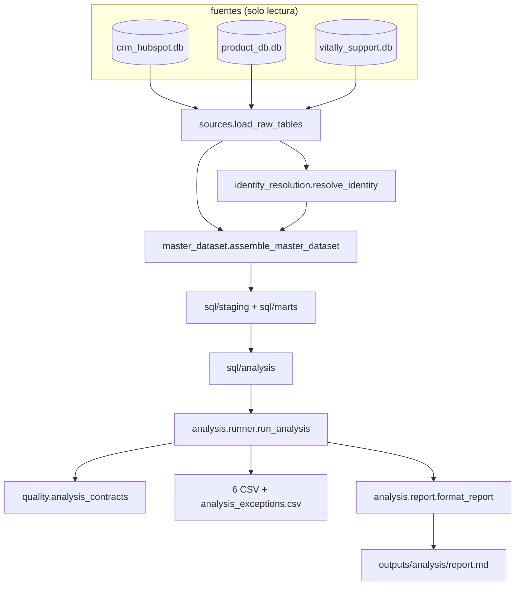

# Diseño: capa de análisis de A1 sobre la sábana de A0

Este documento decide cómo se construye la capa que responde las siete preguntas de A1. El ADR-004 ya fijó la definición de cada respuesta, y el ADR-002 y el ADR-003 fijaron las reglas de MRR y de ventana de uso que dos de ellas necesitan. Aquí se define la estructura del código, el contrato de cada consulta, el formato del reporte, las pruebas y el corte de entrega. Un analista junior debería poder abrir el paquete y saber en qué archivo vive cada regla; una dirección debería poder leer el resumen de decisiones y el `report.md` sin abrir código.

La capa se apoya en el motor de A0 sin tocarlo. Las ocho salidas de A0 quedan congeladas y `MART_FILES` no cambia; lo nuevo es un directorio de SQL, un módulo corredor, un subcomando y un directorio de salidas.

## Resumen de decisiones

| # | Decisión | Elegido | Rechazado | Por qué |
|---|---|---|---|---|
| D1 | Cómo corre el análisis | Subcomando `analyze` con su propia conexión, simétrico a `backtest` | Exigir un `build` previo, o meter el análisis dentro de `build` | El criterio de éxito es correr en un clon limpio con un comando; meterlo en `build` obligaría a pagar el costo del análisis en cada corrida del dataset maestro y mezclaría entregables de A0 con respuestas de A1 |
| D2 | Cómo llega el análisis a los marts | Llama a `assemble_master_dataset` y después corre `ANALYSIS_FILES` en la misma conexión | Registrar las tablas por su cuenta reusando `_with_iso_dates` | `_with_iso_dates` es privado de `assemble.py`; llamar a la función pública garantiza que el análisis ve exactamente las mismas vistas que produjeron los goldens, al costo de materializar diez DataFrames que no usa (650 filas, milisegundos) |
| D3 | De dónde sale la identidad | `analyze` corre `resolve_identity` en memoria y nunca lee `outputs/` | Leer el `identity_crosswalk.csv` commiteado | Leer `outputs/` volvería el análisis dependiente de un `build` previo, que es justo lo que este cambio evita. La generación de `master_id` es determinista (sección 3.6 del diseño de A0), así que los ids salen idénticos por hash |
| D4 | Semántica de `--out-dir` | Es el directorio literal donde se escribe, con valor por omisión `outputs/analysis` | Recibir `outputs` y agregarle un subdirectorio fijo `analysis/` | Un comando que le agrega un subdirectorio a la ruta que recibe puede escribir fuera de lo que el llamador nombró, y los ocho goldens de A0 viven un nivel arriba. Con el valor por omisión, `python -m worky_engine analyze --data-dir <ruta>` cumple el criterio de éxito de la propuesta sin argumentos extra |
| D5 | Cuántos archivos SQL | Siete: `a1_00_last_touch.sql` y uno por ítem de A1.1 a A1.6 | Un octavo archivo con una vista base tipada compartida | La propuesta fijó siete archivos y una vista base agregaría una pieza que ningún golden cubre. Las tres consultas que necesitan tipos hacen su propio `CAST` en su primer CTE |
| D6 | Orden de filas | Cada vista lleva su propio `ORDER BY` y el corredor repite la misma llave en el `SELECT` externo que la materializa | Confiar en el orden que devuelva la vista | El hallazgo del PR 4b de A0 fue que un `GROUP BY` no garantiza orden estable entre corridas. Con comparación byte a byte como criterio de éxito, el orden se declara dos veces y no se supone |
| D7 | Dónde vive el último touch | `mart_last_touch`, a grano deal, en `worky_engine/sql/analysis/a1_00_last_touch.sql` | Agregarla a `mart_commercial.sql`, o resolverla a grano empresa | Meterla al mart comercial obligaría a un delta de `master-dataset-assembly` sin agregar una columna al dataset maestro. A grano empresa, el último touch de una empresa con dos deals no dice a cuál pertenece (ADR-004) |
| D8 | Forma de la salida de A1.3 | Formato largo (una fila por cohorte y por k) en el CSV; `report.py` la pivotea a matriz | Cuatro columnas anchas (k = 1, 3, 6, 12) en el CSV | El formato largo deja el contrato simple (un porcentaje por fila, monotonía comprobable por cohorte) y deja la presentación donde se lee, que es el reporte |
| D9 | Cierre de los datos para las celdas censuradas | `substr(MAX(dataset_asof), 1, 7)` sobre la sábana | La constante `'2024-08'`, o `MAX(month)` de `stg_product_usage` | Una constante deja de decir la verdad en cuanto cambian los datos. `dataset_asof` ya es la fecha máxima de las siete tablas (sección 7 del diseño de A0), así que cubre más que el uso mensual y no se recalcula aquí |
| D10 | Valores que no se pueden calcular | Columna de estado al lado (`drop_status`, `cell_status`), nunca un nulo suelto | Dejar la celda vacía sin explicación | Es la misma regla que `trend_status` en A0: un nulo sin estado que lo explique se lee como un cero o como un error de la consulta |
| D11 | Dónde se registran las horas negativas | `outputs/analysis/analysis_exceptions.csv`, con las mismas columnas de `exceptions_log`, código `negative_resolution_hours` y `applied_value = 'null'` | Escribir en el `exceptions_log.csv` de A0, o dejar `applied_value` vacío | Escribir en el log de A0 rompería su golden y el contrato que lo valida. `applied_value` es no nulable en el contrato de A0, y el literal `null` dice de forma explícita que lo aplicado fue dejar el campo en nulo |
| D12 | Dónde viven los números reales | Los contratos afirman invariantes que valen para cualquier entrada; los 89, 35, 667,251.00 y 48 se fijan en pruebas marcadas `dataset` | Poner los conteos reales dentro de los contratos | Un contrato con `= 89` dentro haría fallar `analyze` sobre cualquier fixture o dataset actualizado, que es exactamente cuando el comando debe seguir corriendo |
| D13 | Cómo llega el SQL al reporte | `report.py` recibe el texto del archivo `.sql` que el corredor ya leyó y lo inserta en un bloque de código | Copiar el SQL a mano en el reporte | Copiado a mano, el reporte y la consulta se desincronizan sin que ninguna prueba lo note |
| D14 | Contratos de A0 dentro de `analyze` | `analyze` corre `run_contracts` sobre el dataset que acaba de ensamblar, antes de sus propios contratos | Saltárselos porque `build` ya los corrió | `analyze` no depende de `build`, así que nadie más los corrió en esa corrida. Un análisis sobre un dataset que viola un contrato produce números sin significado, y detenerse con código 1 cuesta cuatro líneas |
| D15 | Protección de los goldens de A0 | La prueba de idempotencia compara el hash de los ocho archivos de `outputs/` antes y después de correr `analyze` | Confiar en que el corredor solo escribe bajo `--out-dir` | La propiedad que importa es que ningún golden de A0 cambie, y eso se verifica, no se supone |

## 1. Arquitectura de la capa de análisis

### Módulos y responsabilidades

| Módulo | Responsabilidad | Entradas | Salidas |
|---|---|---|---|
| `worky_engine/sql/analysis/` | Siete archivos SQL, uno por ítem más el último touch. Cada uno abre con el motor (DuckDB 1.5.5) y la definición del ADR-004 que implementa | Vistas `stg_*` y `mart_*` ya creadas | Vistas `analysis_*` y `mart_last_touch` |
| `worky_engine/analysis/runner.py` | `ANALYSIS_FILES` con el orden fijo, `ANALYSIS_OUTPUTS` con la llave de orden y el nombre de archivo de cada salida, y `run_analysis` que materializa un DataFrame por vista | Conexión, tablas crudas, tablas de identidad | `AnalysisResult` con los DataFrames y el texto de cada `.sql` |
| `worky_engine/analysis/report.py` | Arma `report.md` a partir del `AnalysisResult`, sin abrir la conexión ni leer archivos | `AnalysisResult` | Texto Markdown |
| `worky_engine/analysis/__init__.py` | Expone `run_analysis` y `format_report` | | |
| `worky_engine/quality/analysis_contracts.py` | Contratos de las salidas de análisis, con el mismo `ContractViolation` de A0 | DataFrames ya materializados | Excepción con el contrato nombrado |
| `worky_engine/cli.py` | `cmd_analyze` y su parser | Argumentos | Códigos de salida y las ocho salidas de `outputs/analysis/` |

`report.py` no toca el sistema de archivos ni la conexión, igual que `quality/coverage.py`. Eso lo hace probable sin DuckDB y garantiza que el reporte describa las mismas filas que se escribieron en CSV.

### Dependencias permitidas

| Módulo | Puede importar | No puede importar |
|---|---|---|
| `analysis` | `master_dataset`, `writers`, duckdb, pandas | `quality`, `harness`, `identity_resolution` (la identidad la resuelve el CLI y se la pasa) |
| `quality.analysis_contracts` | pandas y el `ContractViolation` de `quality.contracts` | Recalcular cualquier regla del ADR-004 |
| `cli` | Todos los anteriores | Nada lo importa a él |

`quality.analysis_contracts` solo lee salidas ya materializadas, por la misma razón que `quality` en A0: si recalculara la regla, tendríamos dos verdades del mismo número y ninguna prueba diría cuál se movió.

### Flujo de datos



Las flechas nunca vuelven hacia `outputs/`: la única lectura del disco es la de las tres bases SQLite y la de los archivos `.sql` del paquete.

### Orden de ejecución

```python
ANALYSIS_FILES = [
    "analysis/a1_00_last_touch.sql",      # vista compartida: la usa a1_04
    "analysis/a1_01_active_mrr.sql",
    "analysis/a1_02_usage_drop.sql",
    "analysis/a1_03_cohort_retention.sql",
    "analysis/a1_04_attribution.sql",
    "analysis/a1_05_orphan_deals.sql",
    "analysis/a1_06_negative_hours.sql",  # crea la vista de detalle y analysis_exceptions
]
```

El orden se declara en una lista y no por orden alfabético del directorio, igual que `STAGING_FILES` y `MART_FILES`. `a1_00_last_touch.sql` va primero porque `a1_04_attribution.sql` la consume; el resto es independiente entre sí y su orden solo fija en qué secuencia se leen.

`ANALYSIS_OUTPUTS` declara, para cada salida, la vista, el nombre del archivo, la llave de orden y cuántas filas muestra el reporte:

| Vista | Archivo | `ORDER BY` | Filas en el reporte |
|---|---|---|---|
| `analysis_a1_01_active_mrr` | `a1_01_active_mrr.csv` | `row_type, segment, industry` | todas |
| `analysis_a1_02_usage_drop` | `a1_02_usage_drop.csv` | `drop_relative DESC NULLS LAST, master_id` | 15 más el conteo total |
| `analysis_a1_03_cohort_retention` | `a1_03_cohort_retention.csv` | `cohort_month, k` | todas, pivoteadas |
| `analysis_a1_04_attribution` | `a1_04_attribution.csv` | `model, channel_rank` | todas |
| `analysis_a1_05_orphan_deals` | `a1_05_orphan_deals.csv` | `deal_id` | todas |
| `analysis_a1_06_negative_hours` | `a1_06_negative_hours.csv` | `ticket_id` | 15 más el conteo total |
| `analysis_exceptions` | `analysis_exceptions.csv` | `exception_code, source_id` | conteo por código |

La cuenta de filas del reporte se declara por ítem y no con un umbral automático: la tabla completa se muestra donde la tabla completa es la respuesta (A1.1, A1.3, A1.4, A1.5), y un encabezado con el total se muestra donde la respuesta es un conteo más un orden (A1.2 con 89 filas, A1.6 con 48). Un umbral por número de filas habría truncado el cruce de A1.1, que es la respuesta principal del ítem.

### El comando `analyze`

```
python -m worky_engine analyze --data-dir <ruta> [--out-dir outputs/analysis] [--db-path .build/worky_analysis.duckdb]
```

`cmd_analyze` sigue el patrón de `cmd_build` y `cmd_backtest`, en este orden:

1. `_import_analyze_dependencies()`, con importación diferida, para que la falta de `duckdb` o de `rapidfuzz` salga como el mismo mensaje en español con código 2 en lugar de un traceback.
2. `_resolve_data_dir(Path(args.data_dir))`, que reusa la extracción del zip y el mensaje de código 2 cuando faltan las tres bases.
3. `load_raw_tables` y `resolve_identity(raw_tables, existing_crosswalk=None, reuse_crosswalk=True)`.
4. `open_connection(args.db_path)` con el archivo por omisión `.build/worky_analysis.duckdb`, distinto del de `build`, para que las dos corridas nunca se pisen.
5. `assemble_master_dataset`, `run_contracts` (decisión D14) y `run_analysis`.
6. `run_analysis_contracts`, `write_csv` por salida y `write_markdown` para `report.md`.

Códigos de salida, iguales a los de `build`: 0 correcto, 1 contrato violado con el contrato nombrado en el mensaje (`analyze: contrato ...` en `stderr`), 2 argumentos o archivos de entrada faltantes y dependencia ausente. El comando cierra imprimiendo `analyze: 6 consultas escritas en <out-dir>`. No lleva la bandera `--no-reuse-crosswalk` porque nunca reusa un crosswalk de disco.

## 2. Contrato de cada consulta

Convenciones comunes: dinero con `printf('%.2f', x)`, razones con `printf('%.6f', x)` y porcentajes con `printf('%.2f', x)`, según la decisión D8 de A0. Las fechas salen como texto ISO con `strftime`. Los booleanos salen como `True` y `False`, la misma representación que ya usa `veto_applied` en `match_audit.csv`. Toda vista lleva `ORDER BY`. El encabezado de cada archivo nombra el motor y copia la regla del ADR-004 que implementa, y los comentarios del SQL van en español sin acentos.

### 2.0 `mart_last_touch` (a1_00_last_touch.sql)

Entradas: `stg_deals`, `stg_marketing_touches`. Grano: deal.

| Columna | Tipo | Nulable |
|---|---|---|
| deal_id | VARCHAR | no, única |
| master_id | VARCHAR(12) | no |
| last_touch_id | VARCHAR | no |
| last_touch_date | DATE | no |
| last_touch_channel | VARCHAR | no |

```sql
-- Motor: DuckDB 1.5.5. Vista de ultimo touch a grano deal, simetrica a
-- mart_first_touch: para cada deal, el touch mas reciente de su empresa
-- con touch_date anterior al created_date del deal. El empate se rompe
-- por touch_id, la misma llave que usa el motor, en el extremo opuesto
-- del orden. Un deal sin ningun touch previo no produce fila aqui y
-- a1_04 lo etiqueta como 'no_prior_touch'.
CREATE OR REPLACE VIEW mart_last_touch AS
SELECT deal_id, master_id, last_touch_id, last_touch_date, last_touch_channel
FROM (
    SELECT
        d.deal_id,
        d.master_id,
        t.touch_id   AS last_touch_id,
        t.touch_date AS last_touch_date,
        t.channel    AS last_touch_channel,
        ROW_NUMBER() OVER (
            PARTITION BY d.deal_id
            ORDER BY t.touch_date DESC, t.touch_id DESC
        ) AS rn
    FROM stg_deals d
    JOIN stg_marketing_touches t
        ON t.master_id = d.master_id
       AND t.touch_date < d.created_date
    WHERE d.master_id IS NOT NULL
) ranked
WHERE rn = 1;
```

`mart_first_touch` ordena `touch_date, touch_id` de forma ascendente y se queda con el `touch_id` menor entre los más antiguos. Esta vista ordena de forma descendente y se queda con el `touch_id` mayor entre los más recientes. Los dos modelos toman los extremos del mismo orden, así que el empate se rompe con la misma llave y en la dirección que corresponde a cada uno. Un deal con `created_date` nulo no produce fila, porque la comparación contra un nulo no es verdadera.

### 2.1 A1.1, MRR activo (`analysis_a1_01_active_mrr`)

Regla del ADR-004: tabla segmento por industria con dos columnas de MRR, el del CRM y el total con imputados, más una fila de totales. Activa significa `churn_date` nulo. El MRR activo es el total con imputados. Entradas: `mart_master_dataset`, que ya trae los montos en MXN con el tipo de cambio 18.5 y ya viene deduplicada.

| Columna | Tipo | Nulable |
|---|---|---|
| segment | VARCHAR | no (`TOTAL` en la fila de totales) |
| industry | VARCHAR | no (vacío en la fila de totales) |
| companies_active | INTEGER | no |
| companies_imputed | INTEGER | no |
| companies_unresolved | INTEGER | no |
| mrr_crm_mxn | VARCHAR (2 decimales) | no |
| mrr_total_mxn | VARCHAR (2 decimales) | no |
| row_type | VARCHAR en {`segment`, `total`} | no |

```sql
CREATE OR REPLACE VIEW analysis_a1_01_active_mrr AS
WITH active AS (
    SELECT segment, industry, mrr_source,
           CAST(NULLIF(mrr_mxn, '') AS DECIMAL(14,2)) AS mrr_mxn
    FROM mart_master_dataset
    WHERE churn_date IS NULL
),
grouped AS (
    SELECT segment, industry,
           GROUPING(segment, industry)                                  AS grouping_id,
           COUNT(*)                                                     AS companies_active,
           SUM(CASE WHEN mrr_source = 'imputed_from_deal' THEN 1 ELSE 0 END) AS companies_imputed,
           SUM(CASE WHEN mrr_source = 'unresolved' THEN 1 ELSE 0 END)    AS companies_unresolved,
           SUM(CASE WHEN mrr_source = 'crm' THEN mrr_mxn ELSE 0 END)     AS mrr_crm_mxn,
           SUM(COALESCE(mrr_mxn, 0))                                     AS mrr_total_mxn
    FROM active
    GROUP BY GROUPING SETS ((segment, industry), ())
)
SELECT
    CASE WHEN grouping_id = 3 THEN 'TOTAL' ELSE segment END              AS segment,
    CASE WHEN grouping_id = 3 THEN '' ELSE COALESCE(industry, '') END    AS industry,
    companies_active, companies_imputed, companies_unresolved,
    printf('%.2f', mrr_crm_mxn)                                          AS mrr_crm_mxn,
    printf('%.2f', mrr_total_mxn)                                        AS mrr_total_mxn,
    CASE WHEN grouping_id = 3 THEN 'total' ELSE 'segment' END             AS row_type
FROM grouped
ORDER BY row_type, segment, industry;
```

`row_type` ordena la fila de totales al final sin necesidad de una llave numérica, porque `segment` es menor que `total` en orden alfabético. Una fila con `mrr_source = 'unresolved'` cuenta en `companies_active` y aporta cero pesos, y el reporte lo declara junto a la tabla.

### 2.2 A1.2, caída de uso (`analysis_a1_02_usage_drop`)

Regla del ADR-004: promedio de `active_users` en los tres meses calendario anteriores al mes de baja, contra el promedio de los primeros tres meses con uso de la cuenta. Caída relativa igual a inicial menos final entre inicial, orden descendente. El mes de baja no entra. Se entregan las 89 cuentas con churn y cuenta de producto, con `windows_overlap` en las que tienen menos de seis meses de uso. Entradas: `mart_master_dataset` y `stg_product_usage`.

| Columna | Tipo | Nulable |
|---|---|---|
| master_id | VARCHAR(12) | no, única |
| hubspot_id | VARCHAR | no |
| company_name | VARCHAR | no |
| account_id | VARCHAR | no |
| churn_date | VARCHAR (ISO) | no |
| churn_month | VARCHAR(7) | no |
| usage_months | INTEGER | no |
| avg_users_first_3 | VARCHAR (2 decimales) | sí, vacío sin serie |
| avg_users_last_3_before_churn | VARCHAR (2 decimales) | sí, vacío sin ventana |
| drop_relative | VARCHAR (6 decimales) | sí, con valor solo cuando `drop_status = 'computed'` |
| drop_status | VARCHAR en {`computed`, `no_usage`, `final_window_empty`, `initial_avg_zero`} | no |
| windows_overlap | BOOLEAN | no |

```sql
CREATE OR REPLACE VIEW analysis_a1_02_usage_drop AS
WITH churned AS (
    SELECT master_id, hubspot_id, company_name, account_id, churn_date,
           substr(churn_date, 1, 7) AS churn_month
    FROM mart_master_dataset
    WHERE churn_status = 'churned' AND account_id IS NOT NULL
),
series AS (
    SELECT c.master_id, u.month, u.active_users,
           ROW_NUMBER() OVER (PARTITION BY c.master_id ORDER BY u.month) AS month_rank
    FROM churned c
    JOIN stg_product_usage u ON u.account_id = c.account_id
),
-- primeros tres meses con uso por orden calendario, no los tres meses
-- siguientes al signup_date: la cuenta de producto puede arrancar despues
first_window AS (
    SELECT master_id, AVG(active_users) AS avg_first
    FROM series WHERE month_rank <= 3 GROUP BY master_id
),
-- los tres meses calendario anteriores al mes de baja; el mes de baja
-- queda fuera (ADR-003, misma razon que el resguardo de trend_usage)
last_window AS (
    SELECT s.master_id, AVG(s.active_users) AS avg_last
    FROM series s
    JOIN churned c ON c.master_id = s.master_id
    WHERE s.month < c.churn_month
      AND s.month >= strftime(CAST(c.churn_month || '-01' AS DATE) - INTERVAL 3 MONTH, '%Y-%m')
    GROUP BY s.master_id
),
totals AS (SELECT master_id, COUNT(*) AS usage_months FROM series GROUP BY master_id)
SELECT
    c.master_id, c.hubspot_id, c.company_name, c.account_id, c.churn_date, c.churn_month,
    COALESCE(t.usage_months, 0)                                   AS usage_months,
    printf('%.2f', f.avg_first)                                   AS avg_users_first_3,
    printf('%.2f', l.avg_last)                                    AS avg_users_last_3_before_churn,
    CASE WHEN t.usage_months IS NULL OR l.avg_last IS NULL OR f.avg_first = 0 THEN NULL
         ELSE printf('%.6f', (f.avg_first - l.avg_last) / f.avg_first) END AS drop_relative,
    CASE WHEN t.usage_months IS NULL THEN 'no_usage'
         WHEN l.avg_last IS NULL     THEN 'final_window_empty'
         WHEN f.avg_first = 0        THEN 'initial_avg_zero'
         ELSE 'computed' END                                       AS drop_status,
    (COALESCE(t.usage_months, 0) < 6)                              AS windows_overlap
FROM churned c
LEFT JOIN totals t       ON t.master_id = c.master_id
LEFT JOIN first_window f ON f.master_id = c.master_id
LEFT JOIN last_window l  ON l.master_id = c.master_id
ORDER BY drop_relative DESC NULLS LAST, master_id;
```

La comparación de meses es lexicográfica sobre texto `YYYY-MM`, que es como `stg_product_usage` guarda `month` y como el motor ya lo compara en `mart_usage`. `windows_overlap` implementa la regla del ADR-004 tal cual, es decir menos de seis meses de uso; con esa cantidad las dos ventanas pueden compartir al menos un mes y la fórmula dice "subió" cuando la cuenta apenas arrancaba. Las filas sin resultado llevan su `drop_status` y quedan al final del orden, con el desempate por `master_id`.

### 2.3 A1.3, retención por cohorte (`analysis_a1_03_cohort_retention`)

Regla del ADR-004: cohorte por mes de `signup_date`. Una cuenta sigue activa en el mes k si no ha hecho churn k meses después del alta. Las celdas de cohortes que no cumplen k meses al cierre de los datos quedan vacías. Una sola consulta con CTEs. Entradas: `mart_master_dataset`.

| Columna | Tipo | Nulable |
|---|---|---|
| cohort_month | VARCHAR(7) | no |
| k | INTEGER en {1, 3, 6, 12} | no |
| cohort_size | INTEGER | no |
| retained | INTEGER | sí, vacío cuando la celda está censurada |
| retention_pct | VARCHAR (2 decimales, 0 a 100) | sí, vacío cuando la celda está censurada |
| cell_status | VARCHAR en {`computed`, `censored`} | no |

```sql
CREATE OR REPLACE VIEW analysis_a1_03_cohort_retention AS
WITH dataset_end AS (
    -- cierre de los datos derivado de la sabana, nunca escrito como
    -- constante: dataset_asof es la fecha maxima presente en las siete
    -- tablas y en este dataset da 2024-08-31
    SELECT substr(MAX(dataset_asof), 1, 7) AS end_month FROM mart_master_dataset
),
cohorts AS (
    SELECT substr(signup_date, 1, 7) AS cohort_month,
           CASE WHEN churn_date IS NULL THEN NULL
                ELSE datediff('month', CAST(signup_date AS DATE), CAST(churn_date AS DATE))
           END AS months_to_churn
    FROM mart_master_dataset
),
cohort_size AS (
    SELECT c.cohort_month, COUNT(*) AS cohort_size,
           datediff('month', CAST(c.cohort_month || '-01' AS DATE),
                             CAST(e.end_month || '-01' AS DATE)) AS months_elapsed
    FROM cohorts c CROSS JOIN dataset_end e
    GROUP BY c.cohort_month, months_elapsed
),
horizons AS (SELECT unnest([1, 3, 6, 12]) AS k),
cells AS (
    SELECT s.cohort_month, h.k, s.cohort_size, s.months_elapsed,
           SUM(CASE WHEN c.months_to_churn IS NULL OR c.months_to_churn > h.k
                    THEN 1 ELSE 0 END) AS retained
    FROM cohort_size s
    JOIN cohorts c ON c.cohort_month = s.cohort_month
    CROSS JOIN horizons h
    GROUP BY s.cohort_month, h.k, s.cohort_size, s.months_elapsed
)
SELECT cohort_month, k, cohort_size,
       CASE WHEN months_elapsed < k THEN NULL ELSE retained END AS retained,
       CASE WHEN months_elapsed < k THEN NULL
            ELSE printf('%.2f', 100.0 * retained / cohort_size) END AS retention_pct,
       CASE WHEN months_elapsed < k THEN 'censored' ELSE 'computed' END AS cell_status
FROM cells
ORDER BY cohort_month, k;
```

La comparación `months_to_churn > h.k` deja fuera a la empresa que hizo churn exactamente en el mes k, porque al cerrar ese mes ya no estaba activa. Con esa regla la curva es monótona no creciente en k por construcción dentro de cada cohorte, y el contrato lo verifica. `report.py` pivotea la salida a una matriz de cohortes por k, y una celda censurada aparece vacía en la matriz.

### 2.4 A1.4, atribución (`analysis_a1_04_attribution`)

Regla del ADR-004: grano deal. Cada deal se atribuye a dos canales, el primer touch de su empresa y el último touch anterior a la fecha de creación del deal. Convierte si su etapa es `closedwon`. La tasa por canal es deals ganados entre deals atribuidos. Empates por `touch_id`. Se reportan ambos modelos y se dice si cambia el canal ganador. Entradas: `stg_deals`, `mart_first_touch`, `mart_last_touch`.

| Columna | Tipo | Nulable |
|---|---|---|
| model | VARCHAR en {`first_touch`, `last_touch`} | no |
| channel | VARCHAR | no |
| deals_attributed | INTEGER | no |
| deals_won | INTEGER | no |
| conversion_rate | VARCHAR (6 decimales, 0 a 1) | no |
| channel_rank | INTEGER | no |

```sql
CREATE OR REPLACE VIEW analysis_a1_04_attribution AS
WITH attributed AS (
    SELECT d.deal_id, d.stage,
           COALESCE(ft.first_touch_channel, 'unknown')        AS first_touch_channel,
           COALESCE(lt.last_touch_channel, 'no_prior_touch')  AS last_touch_channel
    FROM stg_deals d
    LEFT JOIN mart_first_touch ft ON ft.master_id = d.master_id
    LEFT JOIN mart_last_touch  lt ON lt.deal_id  = d.deal_id
    WHERE d.master_id IS NOT NULL      -- los 35 deals huerfanos son A1.5
),
by_model AS (
    SELECT 'first_touch' AS model, first_touch_channel AS channel, stage FROM attributed
    UNION ALL
    SELECT 'last_touch'  AS model, last_touch_channel  AS channel, stage FROM attributed
),
rates AS (
    SELECT model, channel, COUNT(*) AS deals_attributed,
           SUM(CASE WHEN stage = 'closedwon' THEN 1 ELSE 0 END) AS deals_won
    FROM by_model GROUP BY model, channel
)
SELECT model, channel, deals_attributed, deals_won,
       printf('%.6f', deals_won * 1.0 / deals_attributed) AS conversion_rate,
       ROW_NUMBER() OVER (
           PARTITION BY model
           ORDER BY deals_won * 1.0 / deals_attributed DESC, channel
       ) AS channel_rank
FROM rates
ORDER BY model, channel_rank;
```

Los dos modelos parten del mismo conjunto de deals, que son los 997 de HubSpot menos los 35 huérfanos, así que la comparación es entre modelos y no entre poblaciones. El contrato verifica esa igualdad y la prueba marcada `dataset` fija el número. `channel_rank = 1` es el canal ganador de cada modelo, así que el reporte solo compara los dos ganadores sin recalcular nada. Los dos cubos sin evidencia llevan etiquetas distintas a propósito: `unknown` cuando la empresa no tiene ningún touch (el perfil dice que son cero filas) y `no_prior_touch` cuando el deal se creó antes del primer touch de su empresa, que es un caso legítimo y no una falta de dato.

### 2.5 A1.5, deals sin empresa (`analysis_a1_05_orphan_deals`)

Regla del ADR-004: consulta SQL equivalente a la cuarentena del motor, deals cuyo `hubspot_id` no existe en ninguna empresa real. Son 35, todos ganados, por 667,251.00 en unidades mezcladas. Entradas: `stg_deals`, `mart_master_dataset`, `quarantine_companies`.

| Columna | Tipo | Nulable |
|---|---|---|
| deal_id | VARCHAR | no, única |
| hubspot_id | VARCHAR | no |
| stage | VARCHAR | no |
| amount | VARCHAR (2 decimales) | no |
| created_date | VARCHAR (ISO) | sí |
| close_date | VARCHAR (ISO) | sí |
| pipeline | VARCHAR | sí |
| lead_source | VARCHAR | sí |

```sql
CREATE OR REPLACE VIEW analysis_a1_05_orphan_deals AS
SELECT
    d.deal_id, d.hubspot_id, d.stage,
    printf('%.2f', d.amount)             AS amount,
    strftime(d.created_date, '%Y-%m-%d') AS created_date,
    strftime(d.close_date, '%Y-%m-%d')   AS close_date,
    d.pipeline, d.lead_source
FROM stg_deals d
LEFT JOIN mart_master_dataset m  ON m.hubspot_id = d.hubspot_id
LEFT JOIN quarantine_companies q ON q.hubspot_id = d.hubspot_id
WHERE m.hubspot_id IS NULL   -- ninguna empresa real de la sabana tiene ese hubspot_id
  AND q.hubspot_id IS NULL   -- y tampoco es un clon remapeado a su sobreviviente
ORDER BY d.deal_id;
```

El `LEFT JOIN` contra la sábana es la forma que pide el caso. El segundo `LEFT JOIN` es lo que evita un falso positivo: un deal que apunta a un clon en cuarentena sí tiene empresa real, porque el motor lo remapea al sobreviviente, y sin ese filtro aparecería como huérfano. La columna es `amount` y no `amount_mxn` porque la moneda de un deal se hereda de su empresa y estos deals no tienen empresa, así que el monto se reporta crudo y el reporte lo etiqueta como unidades mezcladas citando la adenda 1 del ADR-002. Un contrato compara el conjunto de `deal_id` de esta vista contra `quarantine_deals`, que es la razón de fondo para escribir la consulta cuando el número ya se conoce: el SQL y el motor de Python tienen que coincidir.

### 2.6 A1.6, horas negativas (`analysis_a1_06_negative_hours`)

Regla del ADR-004: los 48 tickets con `resolution_hours` negativo se dejan en nulo para cualquier promedio de tiempo de resolución, se conservan para conteos y CSAT, se registran en el log de excepciones, y se reporta la hipótesis de fechas invertidas como hallazgo. Entradas: `stg_tickets`, `identity_crosswalk`.

| Columna | Tipo | Nulable |
|---|---|---|
| ticket_id | VARCHAR | no, única |
| vitally_id | VARCHAR | no |
| master_id | VARCHAR(12) | sí (nulo si el cliente de Vitally no está vinculado) |
| created_date | VARCHAR (ISO) | no |
| priority | VARCHAR | no |
| status | VARCHAR | no |
| category | VARCHAR | no |
| resolution_hours | VARCHAR (2 decimales, negativo) | no |
| resolution_hours_abs | VARCHAR (2 decimales) | no |
| csat_score | VARCHAR (2 decimales) | sí |

```sql
CREATE OR REPLACE VIEW analysis_a1_06_negative_hours AS
SELECT
    t.ticket_id, t.vitally_id, x.master_id,
    strftime(t.created_date, '%Y-%m-%d')    AS created_date,
    t.priority, t.status, t.category,
    printf('%.2f', t.resolution_hours)      AS resolution_hours,
    printf('%.2f', abs(t.resolution_hours)) AS resolution_hours_abs,
    printf('%.2f', t.csat_score)            AS csat_score
FROM stg_tickets t
LEFT JOIN identity_crosswalk x ON x.vitally_id = t.vitally_id
WHERE t.resolution_hours < 0
ORDER BY t.ticket_id;
```

La vista no corrige el signo ni excluye los tickets. `resolution_hours_abs` está para que quien lea el hallazgo pueda comparar contra el rango de los tickets positivos sin rehacer la cuenta, y `status` está porque los tickets abiertos con horas ya registradas son la evidencia de por qué el signo no se voltea. Ninguna cifra del dataset maestro cambia, porque A0 no publica ninguna columna derivada de `resolution_hours`.

## 3. `analysis_exceptions.csv`

Mismas once columnas de `exceptions_log`, en el mismo orden, para que A6 pueda fusionar los dos logs cuando corrija el signo en origen.

| Columna | Valor |
|---|---|
| exception_id | `sha256` de `exception_code`, `source_system`, `ticket_id` y `field_name` unidos por barra vertical, truncado a 12 caracteres hexadecimales, con la misma fórmula y el mismo orden de campos que A0 (ver el SQL abajo) |
| exception_code | `negative_resolution_hours` |
| source_system | `vitally` |
| source_id | `ticket_id` |
| master_id | del crosswalk por `vitally_id`, nulo si no hay vínculo |
| field_name | `resolution_hours` |
| original_value | el valor negativo con dos decimales |
| applied_value | `null` |
| evidence_ref | `status` del ticket |
| ruleset_version | `1.0.0` |
| decided_at | `(SELECT MAX(resolved_at) FROM identity_crosswalk)` |

```sql
CREATE OR REPLACE VIEW analysis_exceptions AS
SELECT
    substr(sha256('negative_resolution_hours|vitally|' || t.ticket_id || '|resolution_hours'), 1, 12) AS exception_id,
    'negative_resolution_hours'                       AS exception_code,
    'vitally'                                          AS source_system,
    t.ticket_id                                        AS source_id,
    x.master_id                                        AS master_id,
    'resolution_hours'                                 AS field_name,
    printf('%.2f', t.resolution_hours)                 AS original_value,
    -- lo aplicado fue dejar el campo en nulo para promedios; el literal
    -- mantiene la columna no vacia, como en el exceptions_log de A0
    'null'                                             AS applied_value,
    t.status                                           AS evidence_ref,
    '1.0.0'                                            AS ruleset_version,
    (SELECT MAX(resolved_at) FROM identity_crosswalk)  AS decided_at
FROM stg_tickets t
LEFT JOIN identity_crosswalk x ON x.vitally_id = t.vitally_id
WHERE t.resolution_hours < 0
ORDER BY exception_code, source_id;
```

`exception_id` usa la misma fórmula y el mismo orden de campos que A0, así que la fila se puede referenciar desde otra tabla sin depender del orden de las filas. El orden del archivo es `exception_code, source_id`, igual que `exceptions_log.csv`.

## 4. `outputs/analysis/report.md`

Documento generado, con estas secciones fijas y en este orden:

1. Encabezado: motor (DuckDB 1.5.5), `dataset_asof`, `ruleset_version`, el comando que lo produce y el conteo de filas de cada salida.
2. Una sección por ítem, de A1.1 a A1.6, cada una con cuatro bloques: definición del ADR-004, motor, SQL y resultado.
3. A1.6 agrega la justificación de tres a cuatro líneas.
4. A1.7, respuesta de diseño con DDL ilustrativo.
5. Referencias al ADR-002, el ADR-003 y el ADR-004.

El bloque de SQL es el texto del archivo `.sql` tal como lo leyó el corredor, sin recortes. El bloque de resultado es la tabla completa en A1.1, A1.3, A1.4 y A1.5, y las primeras 15 filas más una línea con el total en A1.2 y A1.6, con el nombre del CSV que trae todo. La tabla de A1.3 se muestra pivoteada, con una fila por cohorte y una columna por k, y las celdas censuradas vacías.

Cada sección declara además la limitación que le toca: en A1.1, cuál de los dos totales es el MRR activo y cuántas filas quedaron en `unresolved`; en A1.2, cuántas cuentas traen `windows_overlap` y qué significa; en A1.3, cuántas celdas quedaron censuradas y por qué no se calculan con dato parcial; en A1.4, si el canal ganador cambia entre los dos modelos; en A1.5, que el monto está en unidades mezcladas y por qué no se puede llevar a mensual.

El reporte no lleva hora de reloj. La única marca temporal es `dataset_asof`, que sale de los datos.

### Justificación de A1.6, texto que va al reporte

> Los 48 tickets con `resolution_hours` negativo se dejan en nulo para cualquier promedio de tiempo de resolución, se conservan para conteos y CSAT, y quedan registrados en `analysis_exceptions.csv`. Sin el signo, 39 de los 48 caen en el rango normal de los tickets positivos (mediana 13.5 contra 12.2), lo que apunta a un error de captura con las fechas invertidas. Pero 10 de esos tickets siguen abiertos con horas ya registradas, así que voltear el signo sería asumir algo que el dato no confirma. Nulo con rastro es la única opción que no inventa datos, y la corrección en origen queda para A6.

### A1.7, respuesta de diseño

La sección responde las dos preguntas del caso: qué cambia en el modelo y cómo se refresca la sábana sin reprocesar todo. Va con DDL ilustrativo, marcado como ilustrativo, que no se ejecuta ni entra a `ANALYSIS_FILES`.

| Cambio | Qué resuelve |
|---|---|
| Particionar el uso por mes y agrupar físicamente por cuenta | Una consulta de un rango de meses lee solo esas particiones, y las de A1.2 y A1.3 tocan un rango corto |
| Agregado mensual precalculado con la llave (`account_id`, `month`) | La sábana consume el agregado y no el detalle diario, que es la diferencia entre millones y miles de filas leídas |
| Tabla de marca de agua por partición | Permite refrescar solo las particiones cuyos datos cambiaron, en lugar de reconstruir todo |
| Ventana de reproceso acotada para datos que llegan tarde | Un registro con fecha de hace dos meses vuelve a agregar solo esa partición, sin reprocesar el histórico |

```sql
-- DDL ilustrativo, no se ejecuta en este repositorio.

-- 1. Detalle diario particionado por mes y ordenado por cuenta.
CREATE TABLE usage_daily (
    account_id   VARCHAR NOT NULL,
    usage_date   DATE    NOT NULL,
    month        VARCHAR(7) NOT NULL,   -- llave de particion
    active_users INTEGER NOT NULL,
    logins       INTEGER NOT NULL,
    ingested_at  TIMESTAMP NOT NULL
) PARTITION BY (month);

-- 2. Agregado mensual, que es lo que consume la sabana.
CREATE TABLE usage_monthly_rollup (
    account_id        VARCHAR    NOT NULL,
    month             VARCHAR(7) NOT NULL,
    active_users      INTEGER    NOT NULL,
    logins            INTEGER    NOT NULL,
    source_max_ingest TIMESTAMP  NOT NULL,
    PRIMARY KEY (account_id, month)
);

-- 3. Marca de agua por particion: que se cargo y hasta cuando.
CREATE TABLE refresh_state (
    table_name     VARCHAR    NOT NULL,
    month          VARCHAR(7) NOT NULL,
    last_ingest_at TIMESTAMP  NOT NULL,
    PRIMARY KEY (table_name, month)
);

-- 4. Refresco incremental: solo los meses con datos nuevos o corregidos.
WITH stale_months AS (
    SELECT d.month
    FROM usage_daily d
    LEFT JOIN refresh_state r
        ON r.table_name = 'usage_monthly_rollup' AND r.month = d.month
    GROUP BY d.month, r.last_ingest_at
    HAVING r.last_ingest_at IS NULL OR MAX(d.ingested_at) > r.last_ingest_at
)
DELETE FROM usage_monthly_rollup WHERE month IN (SELECT month FROM stale_months);

INSERT INTO usage_monthly_rollup
SELECT account_id, month, SUM(active_users), SUM(logins), MAX(ingested_at)
FROM usage_daily
WHERE month IN (SELECT month FROM stale_months)
GROUP BY account_id, month;
```

El razonamiento que acompaña al DDL: la sábana pasa de reconstruirse completa a recalcularse por empresa solo cuando alguno de sus meses cambió, y `dataset_asof` derivado de los datos, que A0 ya usa, es lo que permite auditar hasta dónde llegó cada refresco. Un dato que llega tarde entra por su propia partición, con la ventana de reproceso acotada a los últimos meses en lugar de todo el histórico.

## 5. Contratos de las salidas de análisis

`worky_engine/quality/analysis_contracts.py`, con el mismo `ContractViolation` y la misma consecuencia que en A0: `analyze` termina con código 1 y el mensaje nombra el contrato. Todos son invariantes que valen para cualquier entrada, así que corren igual sobre el dataset real y sobre un fixture mínimo.

| Contrato | Regla |
|---|---|
| `assert_a1_01_total_row_matches_segments` | La fila `row_type = 'total'` iguala la suma de las filas `segment` en las dos columnas de MRR y en los tres conteos |
| `assert_a1_01_crm_within_total` | `mrr_crm_mxn <= mrr_total_mxn` en toda fila |
| `assert_a1_01_total_matches_master_dataset` | El `mrr_total_mxn` de la fila de totales iguala la suma de `mrr_mxn` en `master_dataset` con `churn_status = 'active'` |
| `assert_a1_02_one_row_per_churned_account` | Una fila por empresa con churn y `account_id`, sin `master_id` repetido |
| `assert_a1_02_drop_matches_status` | `drop_relative` tiene valor si y solo si `drop_status = 'computed'` |
| `assert_a1_03_pct_within_range` | `retention_pct` entre 0 y 100 cuando `cell_status = 'computed'`, y vacío si y solo si está `censored` |
| `assert_a1_03_monotone_non_increasing` | Dentro de una cohorte, `retained` no crece al crecer k entre las celdas calculadas |
| `assert_a1_03_retained_within_cohort_size` | `retained <= cohort_size` en toda celda calculada |
| `assert_a1_04_rate_within_unit` | `conversion_rate` entre 0 y 1, y `deals_won <= deals_attributed` |
| `assert_a1_04_models_cover_same_deals` | La suma de `deals_attributed` es igual en los dos modelos |
| `assert_a1_05_matches_quarantine_deals` | El conjunto de `deal_id` iguala el de `quarantine_deals` |
| `assert_a1_06_all_hours_negative` | Toda fila trae `resolution_hours < 0` |
| `assert_analysis_exceptions_shape` | Las once columnas de `exceptions_log` en el mismo orden, `exception_id` único, `exception_code` constante y una fila por ticket negativo |

Los números reales del ADR-004 no viven aquí, por la decisión D12. Se fijan en pruebas marcadas `dataset`: 89 filas en A1.2, 35 filas y 667,251.00 en A1.5, 48 filas en A1.6, el total de MRR activo contra la sábana, y los deals atribuidos por modelo (997 menos los 35 huérfanos).

## 6. Estrategia de pruebas

Corredor: pytest. Camino rápido `python -m pytest -q -m "not dataset"`, camino completo `python -m pytest -q`.

| Archivo | Capa | Qué prueba |
|---|---|---|
| `tests/test_analysis_rules.py` | integración, fixture mínimo | Una prueba por regla: dos columnas de MRR y fila de totales en A1.1; en A1.2, el mes de baja excluido, la ventana inicial como los primeros tres meses con uso, `windows_overlap` en una cuenta de tres meses y `drop_status` cuando la ventana final queda vacía; en A1.3, la celda censurada vacía, la monotonía y el caso frontera de una empresa que hace churn exactamente en el mes k; en A1.4, el último touch anterior al `created_date` con el empate por `touch_id`, el primer touch con su propio empate y un deal sin touch previo; en A1.5, el deal huérfano detectado y el deal de un clon remapeado no detectado; en A1.6, el ticket negativo en el detalle y su fila de excepción |
| `tests/test_analysis_dataset_numbers.py` | regresión, marca `dataset` | 89 filas en A1.2 con 30 en `windows_overlap`, 35 filas y 667,251.00 en A1.5, 48 filas en A1.6, el MRR activo de A1.1 igual al de `master_dataset`, los deals atribuidos iguales en los dos modelos, y las medianas de 13.5 contra 12.2 que cita la justificación de A1.6, con tolerancia de 0.05 |
| `tests/test_analysis_idempotency.py` | integración, marca `dataset` | Dos corridas de `analyze` en carpetas temporales distintas producen las ocho salidas idénticas byte a byte entre sí y contra la copia commiteada en `outputs/analysis/`; y el hash de los ocho archivos de `outputs/` es el mismo antes y después de correr `analyze` |
| `tests/test_analysis_report.py` | unitaria | Estructura de `report.md`: una sección por ítem, el bloque de SQL igual al archivo `.sql` carácter por carácter, la regla de tabla completa contra encabezado más conteo, la matriz pivoteada de A1.3 con celdas vacías donde hay censura, y la ausencia de hora de reloj |

El fixture mínimo se construye en el propio archivo de pruebas, con la forma de `_minimal_raw_tables` de `tests/test_support_commercial.py`, y no extiende `tests/fixtures/mini_dataset.py`: agregar empresas ahí movería los conteos que ya fijan las pruebas de identidad y de imputación. Trae, a propósito, una cuenta con tres meses de uso, una empresa con churn y sin uso en los tres meses previos, una cohorte reciente que fuerza celdas censuradas, dos touches con la misma fecha para ejercer el empate por `touch_id` en los dos extremos, un deal creado antes del primer touch de su empresa, un deal huérfano, un deal de un clon en cuarentena y un ticket con `resolution_hours` negativo.

## 7. Corte en PR encadenados

Tres PR encadenados a `main`, cada uno con inicio claro, fin claro, verificación propia y reversión por `git revert` de su merge. Las filas de golden quedan fuera del conteo de líneas de autoría, igual que en A0.

| PR | Entregable | Líneas de autoría | Filas de golden | Qué revisa primero |
|---|---|---|---|---|
| 1 | Corredor, subcomando `analyze`, contratos, A1.1, A1.2 y A1.5 | ~630 | ~145 | Que `analyze` no lea `outputs/` ni dependa de `build`, y que A1.2 excluya el mes de baja y marque `windows_overlap` |
| 2 | `a1_00_last_touch.sql`, A1.3 y A1.4 | ~405 | ~190 | Que las celdas censuradas de A1.3 queden vacías y que A1.4 atribuya cada deal a dos canales con el empate por `touch_id` en el extremo que le toca a cada modelo |
| 3 | A1.6, A1.7 y el ensamblaje de `report.md` | ~440 | ~96 más el reporte | La justificación de tres a cuatro líneas de A1.6, que el SQL del reporte salga del archivo y que ningún golden de A0 haya cambiado |

### PR 1

| Archivo | Acción | Líneas |
|---|---|---|
| `worky_engine/analysis/__init__.py` | crear | 10 |
| `worky_engine/analysis/runner.py` | crear | 85 |
| `worky_engine/cli.py` | modificar (`cmd_analyze` y su parser) | 45 |
| `worky_engine/sql/analysis/a1_01_active_mrr.sql` | crear | 45 |
| `worky_engine/sql/analysis/a1_02_usage_drop.sql` | crear | 75 |
| `worky_engine/sql/analysis/a1_05_orphan_deals.sql` | crear | 40 |
| `worky_engine/quality/analysis_contracts.py` | crear | 70 |
| `tests/test_analysis_rules.py` | crear (fixture y tres ítems) | 155 |
| `tests/test_analysis_dataset_numbers.py` | crear (tres ítems) | 60 |
| `tests/test_analysis_idempotency.py` | crear | 55 |
| `outputs/analysis/a1_01_active_mrr.csv`, `a1_02_usage_drop.csv`, `a1_05_orphan_deals.csv` | generar | fuera del conteo |

La estimación queda arriba de las 520 líneas de la propuesta por dos piezas que la propuesta no separó: `analysis_contracts.py` y la prueba de idempotencia con la guarda de los ocho goldens de A0. Sigue debajo del presupuesto de 800. Si al implementar el SQL de A1.2 crece y el PR se acerca a 800, A1.5 se mueve al PR 3, que es la rebanada con más holgura: son 40 líneas de SQL y unas 25 de prueba, y A1.5 no es dependencia de nada.

### PR 2

| Archivo | Acción | Líneas |
|---|---|---|
| `worky_engine/sql/analysis/a1_00_last_touch.sql` | crear | 40 |
| `worky_engine/sql/analysis/a1_03_cohort_retention.sql` | crear | 70 |
| `worky_engine/sql/analysis/a1_04_attribution.sql` | crear | 80 |
| `worky_engine/analysis/runner.py` | modificar | 10 |
| `worky_engine/quality/analysis_contracts.py` | modificar | 45 |
| `tests/test_analysis_rules.py` | modificar | 120 |
| `tests/test_analysis_dataset_numbers.py` | modificar | 40 |
| `outputs/analysis/a1_03_cohort_retention.csv`, `a1_04_attribution.csv` | generar | fuera del conteo |

### PR 3

| Archivo | Acción | Líneas |
|---|---|---|
| `worky_engine/sql/analysis/a1_06_negative_hours.sql` | crear | 60 |
| `worky_engine/analysis/report.py` | crear | 180 |
| `worky_engine/analysis/runner.py` | modificar | 10 |
| `worky_engine/cli.py` | modificar (escritura de `report.md`) | 8 |
| `worky_engine/quality/analysis_contracts.py` | modificar | 30 |
| `tests/test_analysis_report.py` | crear | 90 |
| `tests/test_analysis_dataset_numbers.py` | modificar | 60 |
| `outputs/analysis/a1_06_negative_hours.csv`, `analysis_exceptions.csv`, `report.md` | generar | fuera del conteo |

Los goldens de `outputs/analysis/` se regeneran en los tres PR, así que el diff del PR 3 vuelve a tocar archivos creados en el PR 1. Conviene decirlo en la descripción del PR para que el revisor no lo lea como ruido.

## 8. Lo que no cambia

| Pieza | Estado |
|---|---|
| Los ocho archivos de `outputs/` | Byte por byte iguales, verificado por hash antes y después de `analyze` |
| `STAGING_FILES` y `MART_FILES` | Sin cambio, ni en contenido ni en orden |
| `worky_engine/sql/marts/mart_commercial.sql` | Sin cambio; `mart_last_touch` vive en la capa de análisis |
| `worky_engine/quality/contracts.py` | Sin cambio; los contratos nuevos van en un archivo aparte |
| Las 35 columnas de `master_dataset` y el formato de `exceptions_log.csv` | Sin cambio |
| La prueba de que `build` deja exactamente siete archivos | Sigue pasando, porque `analyze` escribe en otro directorio y con su propio `--db-path` |
| `pyproject.toml` | Sin cambio; no se agrega ninguna dependencia |

## 9. Reproducibilidad y determinismo

| Fuente de variación | Cómo se elimina |
|---|---|
| Versiones de dependencias | Las que ya fija `pyproject.toml` con `==`: `duckdb==1.5.5`, `pandas==3.0.5`, `rapidfuzz==3.14.6`, `pytest==9.1.1`. Este cambio no agrega ninguna |
| Extensiones de DuckDB | `analyze` usa el mismo `open_connection`, con `autoinstall_known_extensions` y `autoload_known_extensions` apagados, así que no hay ningún camino de descarga |
| Orden de filas | Cada vista `analysis_*` lleva su `ORDER BY` y el corredor repite la misma llave en el `SELECT` que la materializa (decisión D6) |
| Representación de flotantes | Dinero y promedios con `printf('%.2f', x)`, razones con `printf('%.6f', x)`, porcentajes con `printf('%.2f', x)`, siempre en SQL |
| Formato de CSV | `write_csv` tal cual: UTF-8 sin marca de orden de bytes, salto `\n`, coma, sin índice, nulo como campo vacío |
| Marca temporal | Ninguna hora de reloj en las salidas. La única marca es `dataset_asof`, que sale de los datos, y de ahí también sale el mes de cierre de A1.3 |
| Estado residual entre corridas | `.build/worky_analysis.duckdb` se borra al inicio de cada `analyze`, igual que hace `build` con el suyo |
| Consola de Windows | `main()` reconfigura `stdout` y `stderr` a UTF-8 antes de imprimir. Al correr desde un shell que captura la salida conviene además `PYTHONIOENCODING=utf-8`, porque la consola abre en cp1252 y un nombre acentuado del dataset tiraría el proceso al escribirlo |
| Lectura de los archivos `.sql` | Siempre con `encoding="utf-8"` explícito, por `run_sql_files` |

## Matriz de amenazas

No aplica. La capa de análisis no hace ruteo, no ejecuta comandos de shell, no lanza subprocesos, no automatiza operaciones de Git ni de pull requests, y no clasifica archivos ejecutables. Es un proceso local que lee tres archivos SQLite en modo solo lectura y escribe ocho archivos en un directorio de salida.

Quedan dos límites que sí conviene fijar como restricciones de diseño:

1. Rutas del sistema de archivos: `--data-dir` y `--out-dir` llegan desde la línea de comandos. `analyze` crea `--out-dir` si no existe y solo escribe dentro de él y dentro de `.build/`. Nunca escribe en `--data-dir`, que se abre en modo solo lectura, y nunca lee ni escribe en `outputs/`.
2. Red: la conexión desactiva la instalación y la carga automática de extensiones, así que la corrida no tiene ningún camino de descarga.

## Migración y despliegue

No hay migración. Todo lo que produce este cambio es código nuevo, siete archivos SQL nuevos y archivos generados dentro de `outputs/analysis/`. Revertir los tres PR deja el repositorio con los ocho goldens de A0 intactos y `pytest -m dataset` en verde, sin ningún paso manual. Los tres sistemas origen se abren en modo solo lectura y no se modifican.

## Riesgos residuales

| Riesgo | Probabilidad | Mitigación |
|---|---|---|
| El número de deals atribuidos por modelo no es exactamente 997 menos 35 porque algún deal trae `hubspot_id` nulo o vacío | Media | El contrato afirma la igualdad entre modelos, que es la propiedad que sostiene la comparación; el conteo exacto se mide en la prueba `dataset` y, si no da 962, el reporte publica el número medido en lugar de que la prueba se ajuste |
| Las tres cuentas de A1.2 que el prototipo no pudo calcular caen en un `drop_status` distinto al previsto | Media | Los cuatro valores del dominio cubren los casos posibles y el contrato solo exige que `drop_relative` y `drop_status` se acompañen; el reporte publica el conteo por estado |
| Las medianas de 13.5 y 12.2 que cita la justificación de A1.6 no se reproducen con la convención de mediana de DuckDB | Media | La prueba `dataset` las recalcula con tolerancia de 0.05; si falla, se corrige el ADR-004 con una adenda y no la prueba con un ajuste |
| Correr `analyze` con `--out-dir outputs` dejaría los CSV de análisis junto a los goldens de A0 | Baja | El valor por omisión es `outputs/analysis` y ningún nombre de archivo choca con los ocho de A0; la prueba de hash detectaría cualquier sobreescritura |
| Reensamblar el dataset maestro en cada `analyze` duplica trabajo que `build` ya hizo | Baja | Son unos segundos sobre 16 mil filas, y el precio compra que `analyze` corra en un clon limpio, que es el criterio de éxito |
| Una cohorte con `signup_date` reciente deja las cuatro celdas censuradas y el reporte se llena de filas vacías | Baja | Es el resultado correcto según el ADR-004; el reporte publica cuántas celdas quedaron censuradas para que la matriz se lea con ese contexto |
| El golden de 89 filas de A1.2 empuja el PR 1 hacia el presupuesto | Baja | Las filas de golden quedan fuera del conteo de autoría, y la salida es mover la rebanada de A1.5 al PR 3 |

## Preguntas abiertas

- [ ] Ninguna que bloquee la implementación. Las dos preguntas abiertas del ADR-004 (la señal de adopción temprana para A3 y la regla de corrección para A6) siguen siendo de esas secciones y no de este cambio.
