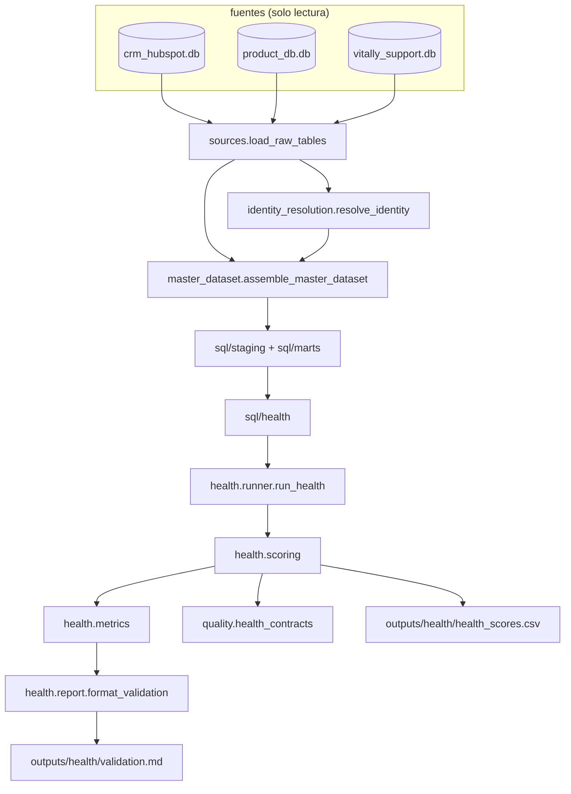

# Diseño: health score de A3 y su validación medida

Este documento decide cómo se construye el health score que el ADR-005 ya fijó. El ADR-003 fijó el mes de corte y los tres subpuntajes de uso, el ADR-004 fijó que las señales de soporte son conteos y CSAT, y el ADR-005 fijó los cuatro subpuntajes, los pesos, la banda "sin historia" y el umbral por capacidad. Aquí se define el reparto entre SQL y pandas, la maquinaria del mes de corte, la fórmula exacta de cada subpuntaje, el esquema de las dos salidas, los contratos, las pruebas y el corte de entrega.

La capa se apoya en A0 y A1 sin tocarlos. Las ocho salidas de A0, las ocho de A1 y `backtest_report.md` quedan congeladas; lo nuevo es un directorio de SQL, un paquete de Python, un subcomando y un directorio de salidas.

## Resumen de decisiones

| # | Decisión | Elegido | Rechazado | Por qué |
|---|---|---|---|---|
| D1 | Cómo corre el score | Subcomando `health` con su propia conexión, espejo de `analyze` | Extender `backtest`, o exigir un `build` previo | El criterio de éxito es correr en un clon limpio con un comando. `backtest` compara seis fórmulas de tendencia y su golden ya está fijado; meter el score ahí obligaría a regenerar un archivo que este cambio no necesita tocar |
| D2 | Dónde vive el código | Paquete nuevo `worky_engine/health/` con `scoring.py`, `metrics.py`, `runner.py`, `report.py` y `__init__.py` | Ampliar `worky_engine/harness/backtest.py` | El harness responde una pregunta cerrada del ADR-003 y su golden la fija. Un paquete aparte deja que A3 crezca sin mover ese golden, y repite la separación que ya funcionó en `analysis/` |
| D3 | Reparto entre SQL y pandas | SQL calcula los agregados ventanados por empresa en el mes de corte; pandas calcula rangos percentiles, suma ponderada, bandas, marcas y métricas | Todo en SQL, o todo en pandas | El caso pide indicar el motor y el resguardo de fuga se lee mejor como un `WHERE month <= asof_month` que como un filtro de DataFrame. Del otro lado, el rango percentil con empates promediados, el AUC y el recall ponderado ya existen en pandas y numpy, y reescribirlos en SQL crearía una segunda verdad del mismo número |
| D4 | De dónde sale el AUC | `backtest.py` expone un alias público `auc = _auc` y `harness/__init__.py` lo reexporta; `metrics.py` lo importa | Copiar el cálculo a `metrics.py`, o importar el nombre privado `_auc` | Copiarlo dejaría dos convenciones de empate que se desincronizan sin que ninguna prueba lo note. Importar un nombre privado esconde la dependencia; un alias de una línea la declara, y `tests/test_harness_regression.py` verifica que el golden no se movió |
| D5 | Quién es la referencia de las fórmulas de uso | El SQL es el camino de producción; `_features` del harness es la referencia y una prueba de regla compara los dos sobre el fixture mínimo | Llamar a `_features` desde el corredor | El SQL reusa la forma cerrada de EWMA que `mart_usage` ya implementa, así que el motor queda declarado en un solo lenguaje. La prueba de equivalencia es lo que impide que las dos implementaciones se separen |
| D6 | Mes de referencia | Mes de `churn_date` para una empresa con baja; `substr(MAX(dataset_asof), 1, 7)` de la sábana para una activa | La constante `'2024-08'`, o `MAX(month)` de `stg_product_usage` | Una constante deja de decir la verdad en cuanto cambian los datos. `dataset_asof` es la fecha máxima de las siete tablas, no solo de uso, y es la misma fuente que ya usa A1 (decisión D9 de ese diseño). Un contrato verifica que ninguna fecha de referencia caiga después de ese cierre |
| D7 | Mes de corte | `asof_month = reference_month - k`, con k = 2 para bajas y activas por igual en la corrida principal | Solo la lectura literal del caso | Es la regla del ADR-003 y del ADR-005: evaluar activas con datos frescos y bajas con datos de hace dos meses compara recencia, no salud |
| D8 | Sensibilidades | k = 3 con el mismo desplazamiento, y la lectura literal (activa evaluada en su propio mes de referencia), como corridas adicionales que solo alimentan `validation.md` | Publicar un CSV por corrida | El CSV es la entrada de A5 y de la Parte B, y tres archivos con el mismo nombre de columnas invitan a mezclarlos. Las sensibilidades son evidencia del reporte, no un entregable operativo |
| D9 | Cómo se parametriza k | El corredor crea una tabla de un renglón `health_params(k_months, active_offset)` antes de correr `HEALTH_FILES`, y cada archivo SQL la lee con `CROSS JOIN` | Interpolar el valor de k en el texto del SQL | El reporte inserta el SQL tal como está en el archivo (decisión D13 del diseño de A1); un texto mutado en memoria dejaría de ser el archivo que el revisor lee. Además, dos enteros expresan las tres corridas sin una rama de código |
| D10 | Dónde vive el SQL nuevo | Todo bajo `worky_engine/sql/health/`, incluida `mart_support_asof` | `worky_engine/sql/marts/mart_support_asof.sql`, como decía la propuesta | Ningún archivo de `sql/marts/` está fuera de `MART_FILES`, y dejarlo ahí sugeriría que `build` lo materializa. La vista conserva el prefijo `mart_` porque su grano y su forma son las de un mart, pero su directorio dice quién la corre |
| D11 | Resguardo de fuga | Uso: `month <= asof_month`. Tickets: `created_date` entre el primer día de `asof_month - 2` y el último día de `asof_month`. Activación: los tres primeros meses de uso solo cuentan si caen en `asof_month` o antes | Reusar `mart_support`, que agrega toda la vida de la cuenta | La comparación de tickets es por día porque `created_date` es una fecha, no un mes, y `mart_support` sin filtro mete tickets posteriores al corte a un puntaje que debe predecir la baja. En este dataset la fuga no infla el AUC, y se cierra igual |
| D12 | Normalización | Rango percentil dentro de la población evaluada, con `rank(pct=True, method="average")` sobre el valor orientado a riesgo, por 100; 100 es lo más sano | Escala mínimo a máximo, o puntaje z | Hace comparables señales con unidades distintas y evita que un valor extremo domine, que es lo que fijó el ADR-005. El empate promediado impide que el orden de las filas decida un puntaje |
| D13 | Población de la normalización | Una sola población: las empresas con la señal definida en ese mes de corte, bajas y activas juntas | Un percentil por grupo | Percentiles calculados por separado harían incomparables a los dos grupos, que es la asimetría que el ADR-005 rechazó |
| D14 | Redondeo | Cada subpuntaje se redondea a dos decimales antes de la suma ponderada, y el score se redondea a dos decimales antes de ordenar y de escribir | Sumar los valores sin redondear y redondear al final | Con esta regla, quien lea una fila del CSV puede recalcular el score con una calculadora y obtener exactamente el número impreso. También hace que el texto del archivo y la llave de orden sean el mismo valor |
| D15 | Denominadores degenerados | Se definen a un valor neutro (0.0) en lugar de dejarlos nulos: `ewma_9 = 0`, mes previo igual a cero y mejor promedio igual a cero | Dejar el subpuntaje nulo, o renormalizar los pesos por empresa | Con tres meses o más de uso los cuatro subpuntajes quedan siempre definidos, así que los pesos nunca cambian entre empresas. Renormalizar produciría scores que no se comparan entre sí |
| D16 | Umbral operativo | El valor de corte sale del percentil de la tasa de marcado sobre el libro de empresas ACTIVAS con score definido, y ese mismo valor se aplica a todas, activas y con baja | Cortar por el percentil de la población completa, como hace el harness | El umbral existe para repartir trabajo entre 7 CSM, y solo las activas se pueden atender. Con esta convención el 15 % da las 81 cuentas del ADR-005. La convención del harness se reporta en la tabla de sensibilidad para poder comparar contra `measurements.md` |
| D17 | Denominador del recall | Las empresas con `churn_status = 'churned'` y `account_id`, sin excepción; las que no tienen historia cuentan como no detectadas | Descontar del denominador a las cuentas sin historia | Descontarlas subiría el recall sin detectar una sola cuenta más. Se reportan aparte, en su banda y en su propio conteo |
| D18 | Regla de aceptación | `validation.md` publica el resultado y una prueba `dataset` lo fija: AUC de al menos 0.95 y recall de al menos 0.85 al 20 %. Si falla, una persona cambia la constante `WEIGHTS` a la mezcla medida y escribe la adenda al ADR-005 en el mismo PR | Que el comando cambie de pesos solo cuando el umbral no se alcanza | Un score que cambia sus pesos en silencio deja de explicarse en una oración y su CSV deja de decir con qué fórmula se produjo |
| D19 | Bandas | `risk_band` en {`sin historia`, `riesgo alto`, `riesgo medio`, `riesgo bajo`}: alto es el 15 % marcado, medio es el siguiente 15 %, bajo es el resto | Bandas por corte fijo de puntaje | El umbral operativo del ADR-005 es un top-N por capacidad, y la banda media es la fila de espera de esa misma capacidad. El corte fijo de referencia (score menor a 40) se reporta como una métrica aparte, no como banda |
| D20 | Sin banderas de corrida | El comando no lleva `--k` ni bandera de sensibilidad; las tres corridas se declaran en la constante `SENSITIVITY_RUNS` | Exponer k como argumento | Con una bandera, el golden se podría regenerar con otro k y el archivo no lo diría. Con la constante, la salida es una sola y el diff la delata |
| D21 | Números reales | Los contratos afirman invariantes que valen para cualquier entrada; 89 bajas, 10 no detectables y 81 marcadas al 15 % se fijan en pruebas marcadas `dataset` | Poner los conteos dentro de los contratos | Un contrato con `= 89` haría fallar `health` sobre un fixture o sobre un dataset actualizado, que es justo cuando el comando debe seguir corriendo (misma regla que la decisión D12 del diseño de A1) |

## 1. Arquitectura

### Módulos y responsabilidades

| Módulo | Responsabilidad | Entradas | Salidas |
|---|---|---|---|
| `worky_engine/sql/health/` | Seis archivos: identidad y mes de corte por empresa, señales de uso, antigüedad, soporte ventanado, activación temprana y la vista de entradas ya unida | Vistas `stg_*` y `mart_*` ya creadas | Vistas `health_*` y `mart_support_asof` |
| `worky_engine/health/runner.py` | `HEALTH_FILES` con el orden fijo, `SENSITIVITY_RUNS`, creación de `health_params`, materialización de `health_asof_inputs` por corrida | Conexión ya cargada por `assemble_master_dataset` | `HealthResult` con los DataFrames y el texto de cada `.sql` |
| `worky_engine/health/scoring.py` | Rango percentil por subpuntaje, redondeo, suma ponderada, bandas y las tres marcas | DataFrame de entradas | DataFrame de scores |
| `worky_engine/health/metrics.py` | AUC por señal, precisión, recall, recall ponderado por MRR, matriz de confusión, detección temprana, capacidad y las tablas de sensibilidad | DataFrames de scores de cada corrida | DataFrames de métricas |
| `worky_engine/health/report.py` | Arma `validation.md` desde los DataFrames ya materializados, sin abrir la conexión ni leer archivos | `HealthResult` | Texto Markdown |
| `worky_engine/quality/health_contracts.py` | Contratos de `health_scores.csv`, con el mismo `ContractViolation` de A0 | DataFrame ya materializado | Excepción con el contrato nombrado |
| `worky_engine/cli.py` | `cmd_health` con importación diferida y su parser | Argumentos | Códigos de salida y las dos salidas de `outputs/health/` |

Dependencias permitidas: `health` puede importar `master_dataset`, `writers`, `harness` (solo `auc`), duckdb, pandas y numpy; no puede importar `quality` ni `identity_resolution`, que el CLI resuelve y le pasa. `quality.health_contracts` solo lee la salida ya materializada y nunca recalcula una regla del ADR-005, por la misma razón que `quality` en A0: si recalculara, tendríamos dos verdades del mismo número.

### Flujo de datos



Las flechas nunca vuelven hacia `outputs/`: la única lectura de disco es la de las tres bases SQLite y la de los archivos `.sql` del paquete.

### Orden de ejecución

```python
HEALTH_FILES = [
    "health/h1_company_asof.sql",     # identidad, mes de referencia y mes de corte
    "health/h2_usage_signals.sql",    # momentum, mes a mes, caida, meses de uso
    "health/h3_tenure.sql",           # antiguedad al corte
    "health/h4_support_asof.sql",     # mart_support_asof: ventana de 3 meses
    "health/h5_activation.sql",       # activacion de los primeros 3 meses
    "health/h6_asof_inputs.sql",      # health_asof_inputs: una fila por empresa
]

SENSITIVITY_RUNS = [
    ("primaria", 2, 2),   # k = 2 para bajas y activas
    ("k3", 3, 3),
    ("literal", 2, 0),    # activa evaluada en su propio mes de referencia
]
```

`h1` va primero porque las cuatro siguientes leen su `asof_month`, y `h6` va al final porque las une. El corredor recrea `health_params` y vuelve a correr los seis archivos por cada corrida de `SENSITIVITY_RUNS`.

### El comando `health`

```
python -m worky_engine health --data-dir <ruta> [--out-dir outputs/health] [--db-path .build/worky_health.duckdb]
```

`cmd_health` sigue el mismo orden que `cmd_analyze`: importación diferida, `_resolve_data_dir`, `load_raw_tables`, `resolve_identity` en memoria, `open_connection` con un archivo propio, `assemble_master_dataset`, `run_contracts` de A0 sobre el dataset recién ensamblado, `run_health`, `run_health_contracts`, `write_csv` y `write_markdown`. Códigos de salida iguales a los de `analyze`: 0 correcto, 1 contrato violado con el contrato nombrado en `stderr`, 2 argumentos o archivos faltantes y dependencia ausente. Cierra imprimiendo `health: <n> empresas puntuadas en <out-dir>`.

## 2. Maquinaria del mes de corte

`h1_company_asof.sql` produce una fila por empresa con `master_id`, `hubspot_id`, `account_id`, `vitally_id`, `segment`, `acquisition_channel`, `mrr_mxn`, `churned`, `signup_date`, `reference_month` y `asof_month`.

```sql
-- Motor: DuckDB 1.5.5. Mes de referencia y mes de corte por empresa
-- (ADR-003 y ADR-005). El desplazamiento sale de health_params, que el
-- corredor crea antes de este archivo: k_months aplica a las empresas
-- con baja y active_offset a las activas. En la corrida principal ambos
-- valen 2; la lectura literal del caso pone active_offset en 0.
CREATE OR REPLACE VIEW health_company_asof AS
WITH dataset_end AS (
    -- cierre de los datos derivado de la sabana, nunca escrito como
    -- constante: dataset_asof es la fecha maxima de las siete tablas
    SELECT substr(MAX(dataset_asof), 1, 7) AS end_month FROM mart_master_dataset
),
reference AS (
    SELECT
        m.master_id, m.hubspot_id, m.account_id, m.vitally_id,
        m.segment, m.acquisition_channel, m.mrr_mxn, m.signup_date,
        (m.churn_status = 'churned') AS churned,
        CASE WHEN m.churn_status = 'churned' THEN substr(m.churn_date, 1, 7)
             ELSE e.end_month END AS reference_month,
        CASE WHEN m.churn_status = 'churned' THEN p.k_months
             ELSE p.active_offset END AS offset_months
    FROM mart_master_dataset m
    CROSS JOIN dataset_end e
    CROSS JOIN health_params p
)
SELECT *,
       strftime(
           CAST(reference_month || '-01' AS DATE) - INTERVAL (offset_months) MONTH, '%Y-%m'
       ) AS asof_month
FROM reference
ORDER BY master_id;
```

El resguardo de fuga completo son tres filtros, cada uno en el archivo que lo necesita:

| Señal | Filtro | Por qué así |
|---|---|---|
| Uso | `u.month <= a.asof_month` | `month` es texto `YYYY-MM` y la comparación lexicográfica es la que ya usa `mart_usage` |
| Tickets y CSAT | `t.created_date >= CAST(a.asof_month \|\| '-01' AS DATE) - INTERVAL 2 MONTH` y `t.created_date < CAST(a.asof_month \|\| '-01' AS DATE) + INTERVAL 1 MONTH` | `created_date` es una fecha, no un mes: el corte es por día, y el límite superior escrito como "menor al primer día del mes siguiente" evita depender del último día de cada mes |
| Activación | Los tres primeros meses de uso solo cuentan si el tercero cae en `asof_month` o antes | Una cuenta muy nueva podría tener sus primeros tres meses después del corte, y contarlos sería fuga |

## 3. Los cuatro subpuntajes

`h2_usage_signals.sql` calcula las tres señales de uso sobre la ventana ya recortada, con la misma forma cerrada de EWMA de `mart_usage` (alpha = 2/(span+1), pesos `(1-alpha)^k` normalizados por su suma, con k la distancia en meses hacia atrás desde `asof_month`).

| Señal | Fórmula | Dirección de riesgo | Definida cuando |
|---|---|---|---|
| `sig_momentum` | `ewma_3 / ewma_9 - 1`, spans 3 y 9 | Más bajo es más riesgo | `usage_months_asof >= 3`; con `ewma_9 = 0` vale 0.0 |
| `sig_mom` | `active_users[-1] / active_users[-2] - 1` sobre los dos últimos meses presentes, por orden de mes | Más bajo es más riesgo | `usage_months_asof >= 3`; con el mes previo en cero vale 0.0 |
| `sig_drawdown` | `promedio de los últimos 3 meses / mejor promedio móvil de 3 meses - 1` | Más bajo es más riesgo | `usage_months_asof >= 3`; con el mejor promedio en cero vale 0.0 |
| `sig_tenure` | `GREATEST(datediff('month', signup_date, CAST(asof_month \|\| '-01' AS DATE)), 0)` | Más bajo es más riesgo | Siempre, cobertura de 100 % |

`sig_mom` y `sig_drawdown` son posicionales sobre los meses presentes, igual que `_features` del harness, apoyados en el contrato `assert_usage_months_no_internal_gaps` que A0 ya verifica. Las tres definiciones degeneradas (D15) son la diferencia deliberada contra `_features`, que en esos casos devuelve `NaN`; la prueba de equivalencia las exceptúa de forma explícita y la prueba de regla las cubre una por una.

Normalización, en `scoring.py`:

```python
def percentile_score(values: pd.Series) -> pd.Series:
    """0 a 100 por rango percentil; 100 es lo mas sano. Empates promediados."""
    return (values.rank(pct=True, method="average") * 100).round(2)
```

Como las cuatro señales tienen la misma dirección (más bajo es más riesgo), el rango ascendente ya deja el 100 en la empresa más sana y no hace falta invertir nada. Los nulos se preservan: `rank` los salta y la empresa conserva su subpuntaje vacío. La población es la de las empresas con esa señal definida en ese mes de corte, bajas y activas juntas (D13).

## 4. La banda "sin historia"

Una empresa con `usage_months_asof < 3` en su mes de corte no recibe ninguno de los tres subpuntajes de uso, sí recibe `score_tenure`, queda con `health_score` vacío y `risk_band = 'sin historia'`, y entra al denominador del recall como no detectada. Nunca se puntúa con los subpuntajes que sí tiene, porque un score de solo antigüedad no es comparable contra uno de cuatro señales y una empresa nueva quedaría "sana" por default, que es exactamente lo que el ADR-003 prohibió.

Un contrato verifica la equivalencia en las dos direcciones: `health_score` vacío si y solo si `risk_band = 'sin historia'`, y los tres subpuntajes de uso presentes si y solo si `usage_months_asof >= 3`.

## 5. Score, bandas y marcas

```python
WEIGHTS = {"momentum": 0.35, "mom": 0.20, "drawdown": 0.15, "tenure": 0.30}
```

`health_score = round(0.35 * score_momentum + 0.20 * score_mom + 0.15 * score_drawdown + 0.30 * score_tenure, 2)`, con los cuatro subpuntajes ya redondeados a dos decimales (D14).

Marcas y bandas, sobre el score ya redondeado:

1. `active_book` = empresas activas con `health_score` definido.
2. Para cada tasa r en {0.10, 0.15, 0.20}: `threshold_r = active_book["health_score"].quantile(r, interpolation="lower")`.
3. `flagged_r = health_score <= threshold_r`, para toda empresa con score, activa o con baja.
4. `risk_band`: `sin historia` si el score está vacío; `riesgo alto` si `flagged_15`; `riesgo medio` si el score cae en el siguiente 15 % del libro activo; `riesgo bajo` en el resto.

`interpolation="lower"` fija el umbral en un valor que existe en los datos, así que el corte es un score real y no un punto interpolado que ninguna empresa tiene. Las tres marcas quedan anidadas por construcción, y un contrato lo verifica.

Las empresas con baja se evalúan en su propio mes de corte y se comparan contra el mismo umbral del libro activo. Esa es la simulación honesta: el equipo fija su capacidad sobre las cuentas que puede atender, y la validación pregunta cuántas de las que se fueron habrían caído bajo ese mismo corte.

El corte fijo de referencia (`health_score < 40`) se reporta como una fila más de la tabla de métricas, no como banda (D19).

## 6. Métricas de validación

Todas se calculan en `metrics.py` sobre los DataFrames de score ya materializados, con la convención del harness para el AUC (probabilidad de que una empresa con baja muestre peor señal que una activa, empates a la mitad).

| Métrica | Definición |
|---|---|
| AUC por señal | `auc` del harness sobre cada señal cruda y sobre el score, incluidas las de peso cero (tickets, urgentes, CSAT, activación) y el contexto comercial (canal por tasa leave-one-out, segmento, MRR) |
| Precisión | Bajas entre marcadas, sobre toda la población evaluada |
| Recall | Bajas marcadas entre las 89 bajas con `account_id`; las no detectables cuentan en el denominador (D17) |
| Recall ponderado por MRR | Suma de `mrr_mxn` de las bajas marcadas entre la suma de `mrr_mxn` de todas las bajas del denominador; una fila con `mrr_source = 'unresolved'` aporta cero y el reporte declara cuántas son |
| Matriz de confusión al 15 % | Verdaderos positivos, falsos positivos, falsos negativos y verdaderos negativos, con el conteo de no detectables señalado dentro de los falsos negativos |
| Detección temprana | De las bajas marcadas en k = 2, cuántas ya estaban marcadas en k = 3 con el umbral de esa misma corrida |
| Capacidad | Marcadas por cada uno de los 7 CSM en cada tasa, sobre el libro activo |
| Sensibilidades | k = 3, lectura literal, pesos iguales, y la convención del harness (percentil sobre la población completa) para poder comparar contra `measurements.md` |

Regla de aceptación, verificada en `validation.md` y fijada por prueba `dataset`: AUC de al menos 0.95 y recall de al menos 0.85 al 20 %. Si no se alcanza, la salida es cambiar `WEIGHTS` a la mezcla ya medida (uso 70, antigüedad 15, activación 15) y escribir la adenda al ADR-005 en el mismo PR que lo detecte (D18).

## 7. Salidas

### `outputs/health/health_scores.csv`

Una fila por empresa de la sábana, con la corrida principal (k = 2).

| # | Columna | Tipo | Nulable |
|---|---|---|---|
| 1 | master_id | VARCHAR(12) | no, única |
| 2 | hubspot_id | VARCHAR | no |
| 3 | segment | VARCHAR | no |
| 4 | acquisition_channel | VARCHAR | no |
| 5 | mrr_mxn | VARCHAR (2 decimales) | sí, vacío cuando `mrr_source = 'unresolved'` |
| 6 | churned | BOOLEAN (`True` / `False`) | no |
| 7 | reference_month | VARCHAR(7) | no |
| 8 | asof_month | VARCHAR(7) | no |
| 9 | usage_months_asof | INTEGER | no |
| 10 | score_momentum | VARCHAR (2 decimales, 0 a 100) | sí |
| 11 | score_mom | VARCHAR (2 decimales, 0 a 100) | sí |
| 12 | score_drawdown | VARCHAR (2 decimales, 0 a 100) | sí |
| 13 | score_tenure | VARCHAR (2 decimales, 0 a 100) | no |
| 14 | tickets_window_total | INTEGER | no |
| 15 | tickets_window_urgent | INTEGER | no |
| 16 | csat_window_avg | VARCHAR (2 decimales) | sí, vacío sin tickets con puntaje |
| 17 | activation_score | VARCHAR (2 decimales, 0 a 100) | sí |
| 18 | health_score | VARCHAR (2 decimales, 0 a 100) | sí, vacío en `sin historia` |
| 19 | risk_band | VARCHAR en {`sin historia`, `riesgo alto`, `riesgo medio`, `riesgo bajo`} | no |
| 20 | flagged_10 | BOOLEAN | no |
| 21 | flagged_15 | BOOLEAN | no |
| 22 | flagged_20 | BOOLEAN | no |

Orden de filas: `health_score` ascendente (lo más riesgoso primero), con las filas sin score al final, y `master_id` como desempate. El corredor ordena en pandas sobre el valor numérico ya redondeado, con `kind="mergesort"` y `na_position="last"`, y el contrato `assert_health_row_order` vuelve a verificarlo sobre el archivo materializado convirtiendo el texto con `CAST` a doble, que es la misma guarda que A1 aplica a `drop_relative`. Un texto formateado se ordena como texto si nadie lo convierte, y `100.00` quedaría antes de `9.50`.

### `outputs/health/validation.md`

Secciones fijas, en este orden:

1. Encabezado: motor (DuckDB 1.5.5), `dataset_asof`, `ruleset_version`, el comando que lo produce, el tamaño de la población evaluada y el conteo por banda.
2. Fórmula y pesos, escritos como la línea que se puede leer en voz alta, con la regla del mes de corte y el resguardo de fuga.
3. AUC por señal, con las de peso cero incluidas y su peso declarado en la misma tabla.
4. Métricas al 10, 15 y 20 % más el corte fijo: precisión, recall, recall ponderado por MRR, marcadas y umbral de score.
5. Matriz de confusión al 15 %, con los no detectables señalados dentro de los falsos negativos.
6. Cuenta de no detectables y por qué están en el denominador.
7. Detección temprana en k = 3.
8. Sensibilidades: k = 3, lectura literal, pesos iguales y la convención del harness.
9. Capacidad por CSM con 7 CSM.
10. Respuesta narrativa de A3.4: el falso negativo en una cuenta grande es el error más caro, y por eso el umbral se sesga hacia recall y se mide ponderado por MRR.
11. Contexto comercial: tasa de baja y tasa de marcado por canal y por segmento, declarado fuera del score.
12. Referencias al ADR-003, el ADR-004 y el ADR-005.

Cada cifra se etiqueta "en este dataset". El documento no lleva hora de reloj: la única marca temporal es `dataset_asof`, que sale de los datos.

## 8. Contratos

`worky_engine/quality/health_contracts.py`, con el mismo `ContractViolation` y la misma consecuencia: `health` termina con código 1 y el mensaje nombra el contrato.

| Contrato | Regla |
|---|---|
| `assert_health_one_row_per_company` | Una fila por `master_id`, sin repetidos, con el mismo conteo que la sábana |
| `assert_health_score_within_range` | `health_score` y los cinco subpuntajes caen en [0, 100] cuando tienen valor |
| `assert_health_band_domain` | `risk_band` solo toma los cuatro valores del dominio |
| `assert_health_band_matches_score` | `health_score` vacío si y solo si `risk_band = 'sin historia'`; ninguna empresa aparece a la vez sin historia y con score |
| `assert_health_subscores_match_history` | Los tres subpuntajes de uso tienen valor si y solo si `usage_months_asof >= 3` |
| `assert_health_score_matches_weights` | Recalcular la suma ponderada desde las columnas del archivo reproduce `health_score` en toda fila con score |
| `assert_health_flags_match_rates` | Cada `flagged_r` marca la proporción r del libro activo con score, y las tres marcas están anidadas |
| `assert_health_asof_before_reference` | `asof_month <= reference_month` en toda fila, y ninguna fecha de referencia cae después del cierre de los datos |
| `assert_health_recall_denominator` | El conteo de `churned = True` iguala el de `churn_status = 'churned'` en la sábana |
| `assert_health_row_order` | El archivo está ordenado por `CAST(health_score AS DOUBLE)` ascendente, con los vacíos al final y `master_id` de desempate |
| `assert_health_support_non_negative` | `tickets_window_total`, `tickets_window_urgent` y `activation_score` nunca son negativos, y los urgentes nunca superan el total |

Los números reales del ADR-005 no viven aquí (D21). Se fijan en pruebas marcadas `dataset`: 89 bajas, 10 no detectables en k = 2, 81 marcadas al 15 % sobre el libro activo, 650 filas y los umbrales de AUC y recall.

## 9. Estrategia de pruebas

Corredor: pytest. Camino rápido `python -m pytest -q -m "not dataset"`, camino completo `python -m pytest -q`.

| Archivo | Capa | Qué prueba |
|---|---|---|
| `tests/test_health_rules.py` | integración, fixture mínimo | Una prueba por regla: un mes de uso posterior al corte no entra a ninguna señal; un ticket creado el primer día del mes siguiente al corte no entra a la ventana y uno creado el último día sí; empates en el rango percentil producen el mismo subpuntaje; una cuenta de dos meses cae en `sin historia` con antigüedad y sin subpuntajes de uso; la suma ponderada se reproduce desde las columnas; las tres marcas quedan anidadas y con la proporción exacta; el recall ponderado por MRR con una fila sin MRR; la detección temprana con una baja marcada en k = 2 y en k = 3; la antigüedad recortada a cero para una empresa dada de alta después del corte; los tres denominadores degenerados |
| `tests/test_health_equivalence.py` | unitaria, fixture mínimo | Las tres señales de uso del SQL igualan a `_features` del harness sobre las mismas series, salvo los tres casos degenerados que D15 define de forma distinta y la prueba nombra |
| `tests/test_health_dataset_numbers.py` | regresión, marca `dataset` | 650 filas, 89 bajas en el denominador, 10 no detectables en k = 2, 81 marcadas al 15 % sobre el libro activo, unas 12 por CSM, y la regla de aceptación (AUC de al menos 0.95 y recall de al menos 0.85 al 20 %) |
| `tests/test_health_idempotency.py` | integración, marca `dataset` | Dos corridas de `health` en carpetas temporales distintas producen las dos salidas idénticas byte a byte entre sí y contra la copia commiteada; el hash de los ocho archivos de `outputs/` y de los ocho de `outputs/analysis/`, incluido `backtest_report.md`, es el mismo antes y después de correr `health` |
| `tests/test_health_report.py` | unitaria | Estructura de `validation.md`: las doce secciones en orden, cada cifra con la etiqueta "en este dataset", el soporte presente con su AUC y su peso cero, y la ausencia de hora de reloj |

El fixture mínimo se construye en el propio archivo de pruebas, con la forma de `_minimal_raw_tables` de `tests/test_support_commercial.py`, y no extiende `tests/fixtures/mini_dataset.py`: agregar empresas ahí movería los conteos que ya fijan las pruebas de identidad y de imputación.

## 10. Corte en PR encadenados

Tres PR encadenados sobre `main`, cada uno con inicio claro, fin claro, verificación propia y reversión por `git revert` de su merge. Las filas de golden quedan fuera del conteo de líneas de autoría.

| PR | Entregable | Líneas de autoría | Qué revisa primero |
|---|---|---|---|
| 1 | Los seis archivos de `sql/health/` (incluye `mart_support_asof`), `scoring.py`, el alias `auc` del harness, los contratos de forma y banda, `test_health_rules.py` y `test_health_equivalence.py` | ~600 | Que ningún mes de uso ni ticket posterior al corte entre a un subpuntaje, y que una cuenta con menos de tres meses caiga en `sin historia` sin subpuntajes de uso |
| 2 | `metrics.py`, `runner.py`, `cmd_health` y su parser, el resto de los contratos, `health_scores.csv` y las pruebas `dataset` e idempotencia | ~560, más unas 650 filas de golden fuera del conteo | Que las 10 bajas sin historia estén en el denominador del recall y que `health` corra sin `build` previo |
| 3 | `report.py` y `validation.md`, la respuesta narrativa de A3.4, línea del README y cierre de documentación | ~470 | Que cada cifra diga "en este dataset", que el soporte aparezca con su AUC y peso cero, y que ningún golden de A0 ni A1 haya cambiado |

Salida si el PR 2 se acerca al presupuesto: las tres corridas de `SENSITIVITY_RUNS` distintas de la principal se mueven al PR 3, junto con las tablas que alimentan. Son aditivas a `validation.md`, ninguna otra rebanada depende de ellas, y el CSV no cambia porque solo publica la corrida principal.

## 11. Lo que no cambia

| Pieza | Estado |
|---|---|
| `worky_engine/sql/marts/mart_support.sql` y `mart_usage.sql` | Sin cambio; la vista ventanada es nueva y vive en `sql/health/` |
| Los ocho archivos de `outputs/` y los ocho de `outputs/analysis/` | Byte por byte iguales, verificado por hash antes y después de `health` |
| `outputs/backtest_report.md` | Sin cambio; el único toque al harness es un alias público de una función existente |
| `STAGING_FILES`, `MART_FILES` y `ANALYSIS_FILES` | Sin cambio, ni en contenido ni en orden |
| Las 35 columnas de `master_dataset` | Sin cambio |
| `worky_engine/quality/contracts.py` y `analysis_contracts.py` | Sin cambio; los contratos nuevos van en su propio archivo |
| `pyproject.toml` | Sin cambio; no se agrega ninguna dependencia |

## 12. Reproducibilidad y determinismo

| Fuente de variación | Cómo se elimina |
|---|---|
| Versiones de dependencias | Las que ya fija `pyproject.toml` con `==`: `duckdb==1.5.5`, `pandas==3.0.5`, `rapidfuzz==3.14.6`, `pytest==9.1.1`. Este cambio no agrega ninguna |
| Extensiones de DuckDB | `health` usa el mismo `open_connection`, con `autoinstall_known_extensions` y `autoload_known_extensions` apagados, así que no hay ningún camino de descarga |
| Orden de filas | Cada vista `health_*` lleva su `ORDER BY` y el corredor ordena el DataFrame final con `kind="mergesort"` y `master_id` de desempate; el contrato lo verifica con `CAST` sobre el texto |
| Empates en el rango percentil | `method="average"`, que no depende del orden de las filas |
| Representación de flotantes | Subpuntajes y score redondeados a dos decimales antes de sumar, ordenar y escribir; el CSV se escribe con `write_csv` sin tocar el formato |
| Formato de CSV | `write_csv` tal cual: UTF-8 sin marca de orden de bytes, salto `\n`, coma, sin índice, nulo como campo vacío |
| Marca temporal | Ninguna hora de reloj en las salidas. La única marca es `dataset_asof`, que sale de los datos, y de ahí también sale el mes de referencia de las activas |
| Estado residual entre corridas | `.build/worky_health.duckdb` se borra al inicio de cada corrida, con su propio nombre para no pisar los de `build` ni de `analyze` |
| Consola de Windows | `main()` reconfigura `stdout` y `stderr` a UTF-8. Al correr desde un shell que captura la salida conviene además `PYTHONIOENCODING=utf-8` |
| Lectura de los archivos `.sql` | Siempre con `encoding="utf-8"` explícito, por `run_sql_files` |

## Matriz de amenazas

No aplica. La capa de health score no hace ruteo, no ejecuta comandos de shell, no lanza subprocesos, no automatiza operaciones de Git ni de pull requests, y no clasifica archivos ejecutables. Es un proceso local que lee tres archivos SQLite en modo solo lectura y escribe dos archivos en un directorio de salida.

Quedan dos límites que sí se fijan como restricciones de diseño:

1. Rutas del sistema de archivos: `--data-dir` y `--out-dir` llegan desde la línea de comandos. `health` crea `--out-dir` si no existe y solo escribe dentro de él y dentro de `.build/`. Nunca escribe en `--data-dir`, que se abre en modo solo lectura, y nunca lee ni escribe en `outputs/` ni en `outputs/analysis/`.
2. Red: la conexión desactiva la instalación y la carga automática de extensiones, así que la corrida no tiene ningún camino de descarga.

## Migración y despliegue

No hay migración. Todo lo que produce este cambio es código nuevo, seis archivos SQL nuevos y archivos generados dentro de `outputs/health/`. Revertir los tres PR deja el repositorio con los goldens de A0 y A1 intactos y `pytest -m dataset` en verde, sin ningún paso manual.

## Riesgos residuales

| Riesgo | Probabilidad | Mitigación |
|---|---|---|
| `MAX(dataset_asof)` y `MAX(month)` de `stg_product_usage` dejan de coincidir y el mes de corte de A3 se separa del `trend_asof_month` de A0 | Media | En este dataset los dos dan 2024-08. `validation.md` publica el mes de cierre que usó, y un contrato verifica que ninguna referencia caiga después de él; si se separan, la diferencia se ve en el reporte y no en silencio |
| Los pesos por juicio no alcanzan AUC 0.95 y recall 0.85 al 20 % con la convención de umbral del libro activo | Media | El PR 2 corre la verificación; si falla, se adopta la mezcla medida y se escribe la adenda al ADR-005 antes de cerrar el PR |
| Las cifras de precisión y recall no igualan a `measurements.md` porque aquel corte usó la población completa | Alta | Es esperado: los pesos y la convención de umbral son distintos. La tabla de sensibilidad publica la convención del harness al lado, para que la comparación siga siendo posible |
| Un empate masivo de scores hace que `flagged_15` marque más o menos del 15 % exacto | Media | El umbral se toma con `interpolation="lower"`, así que el corte es un valor real; el contrato verifica la proporción con la tolerancia de un empate y el reporte publica el conteo exacto |
| La normalización percentil cambia el score de todas las empresas cuando entra una cuenta nueva | Media | La población evaluada y su tamaño quedan escritos en `validation.md`; A5 consume el CSV de una corrida, no compara corridas distintas |
| El golden de 650 filas empuja el PR 2 hacia el presupuesto | Media | Las filas de golden quedan fuera del conteo de autoría, y la salida es mover las corridas de sensibilidad al PR 3 |

## Preguntas abiertas

- [ ] Ninguna que bloquee la implementación. Las dos preguntas abiertas del ADR-005 (la forma de mostrar el score en A5 y con cuántos meses reales se vuelve a medir el peso del soporte) pertenecen a A5 y a producción, no a este cambio.
