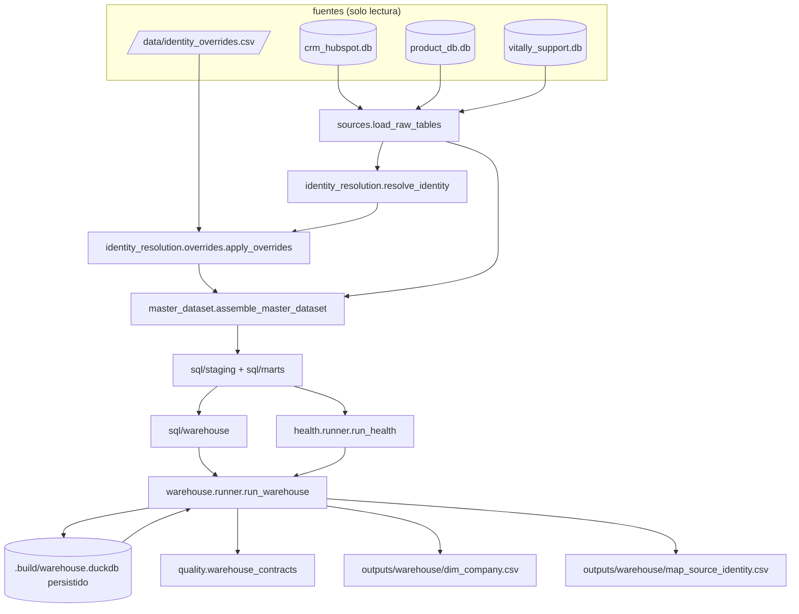

# Diseño: esquema en estrella ejecutable y overrides de identidad (A4)

Este documento decide cómo se construye el modelo de warehouse que el ADR-006 ya fijó. El ADR-001 fijó el crosswalk persistente y la bitácora de auditoría, el ADR-002 fijó que no existe una serie mensual de MRR, y el ADR-003 fijó el resguardo contra fuga de datos que ahora se traduce en uniones contra la versión vigente de la dimensión. Aquí se define cómo el comando `warehouse` obtiene los marts sin tocarlos, el algoritmo exacto de SCD tipo 2, el archivo y el efecto de los overrides de identidad, qué objetos son vista y cuáles tabla, los goldens, los contratos, las pruebas y el corte de entrega.

La capa se apoya en A0, A1 y A3 sin modificarlos. Las ocho salidas de A0, las ocho de A1 y las dos de A3 quedan congeladas; lo nuevo es un directorio de SQL, dos paquetes de Python, un archivo dentro de `identity_resolution`, un subcomando y un directorio de salidas con dos archivos.

## Resumen de decisiones

| # | Decisión | Elegido | Rechazado | Por qué |
|---|---|---|---|---|
| D1 | Cómo obtiene el warehouse los marts | `cmd_warehouse` repite el orden de `cmd_analyze` y `cmd_health`: `load_raw_tables`, `resolve_identity` en memoria, conexión propia y `assemble_master_dataset` de A0 sin cambios, y encima corre `WAREHOUSE_FILES` | Adjuntar `.build/worky.duckdb` con `ATTACH`, o exigir un `build` previo | `open_connection` borra su archivo en cada corrida (decisión D6 de A0), así que adjuntarlo obliga a un `build` inmediatamente antes y ata dos comandos que hoy son independientes. Con este orden, `warehouse` corre en un clon limpio sin `build` previo y nunca lee `outputs/`, igual que `analyze` y `health` |
| D2 | Conexión persistida | Función nueva `open_warehouse_connection` en `worky_engine/warehouse/db.py`, con la misma configuración de extensiones apagadas de A0 pero sin borrar el archivo | Agregar una bandera `keep` a `open_connection` de A0 | Cambiar `open_connection` cambia el comportamiento de `build`, `analyze` y `health`, que están fuera de alcance. Son seis líneas nuevas y dejan la excepción a D6 de A0 escrita en un solo lugar. `.gitignore` ya cubre `.build/` y `*.duckdb`, así que no hace falta tocarlo |
| D3 | De dónde sale la fecha de corrida | `--run-date` en formato `YYYY-MM-DD`; por omisión, `dataset_asof` leído de `mart_master_dataset` (2024-08-31 en este dataset) | El reloj de pared (`date.today()`) | Una fecha de reloj haría que dos corridas del mismo día produjeran goldens distintos mañana, y rompería la idempotencia byte a byte que ya exige `build-cli`. `dataset_asof` sale de los datos y es la misma fuente que ya usan A1 y A3 |
| D4 | Qué hace una recorrida con la misma fecha | Nada: si el hash de atributos no cambió, no se escribe ninguna fila; si cambió y la fila vigente abrió en esa misma fecha, se reemplaza en vez de abrir una segunda banda | Insertar siempre una foto por corrida | Una foto por corrida convertiría el historial en un log de ejecuciones y haría que el golden creciera cada vez que alguien corre el comando |
| D5 | Qué atributos rastrea el SCD2 | `plan` y `csm_owner` abren banda nueva; los demás atributos de la empresa se sobrescriben en la fila vigente (tipo 1) y las filas cerradas conservan su valor al cierre | Versionar todas las columnas | Son los dos cambios que el caso nombra. Versionar `company_name` o `industry` multiplicaría bandas sin ninguna pregunta de negocio que las use |
| D6 | Llave surrogate de la dimensión | `company_sk = substr(sha256(master_id \|\| '\|' \|\| effective_from), 1, 12)` | Un contador o una secuencia de DuckDB | Un contador depende del orden de ejecución y rompería la idempotencia. Es la misma convención de sha256 truncado a 12 hex que ya usan `master_id` y `exception_id` |
| D7 | Forma de la banda de vigencia | Intervalo semiabierto: `effective_from` inclusivo, `effective_to` exclusivo y nulo en la fila vigente, más `is_current` | `effective_to = '9999-12-31'` como centinela | Un centinela obliga a recordar que esa fecha no es una fecha. Con nulo, la unión histórica se lee tal como se dice: `fecha >= effective_from AND (effective_to IS NULL OR fecha < effective_to)` |
| D8 | Empresa que desaparece del origen | Su fila vigente queda intacta, sin cerrar | Cerrar la banda cuando la empresa no aparece en la foto | Una empresa ausente de una extracción no es evidencia de que algo cambió; puede ser una extracción parcial. Cerrarla inventaría un evento que nadie observó |
| D9 | Vistas contra tablas persistidas | Tablas: `dim_company`, `identity_overrides` y `fact_health_score_monthly`. Vistas recreadas en cada corrida: `dim_date`, `dim_csm`, `dim_plan`, `map_source_identity` y los cinco hechos | Materializar todo el esquema como tablas | Solo esas tres guardan algo que no se puede recalcular desde las fuentes. Todo lo demás es una envoltura de los marts y materializarlo crearía una segunda verdad que se desincroniza |
| D10 | `dim_date` | Un día de calendario, de `MIN(signup_date)` a `dataset_asof`, generada con `generate_series`; `date_key` entero `YYYYMMDD` | Un rango fijo escrito a mano, o grano mensual | El rango sale de los datos y se mueve con ellos. El grano diario sirve a `fact_deals` y `fact_support_tickets`; los hechos mensuales apuntan al último día del mes |
| D11 | `fact_revenue_monthly` | Agrega `stg_deals` en `closedwon` por mes de `close_date`, con el monto ya normalizado de `mart_deal_normalized` | Repetir `mrr_mxn` mes a mes | No existe ninguna fuente con MRR fechado (ADR-002); repetir el valor actual sería inventar una serie. El nombre y el documento dicen que es revenue de deals cerrados |
| D12 | De dónde sale `fact_health_score_monthly` | `run_health(con)` de A3 en proceso, sobre la misma conexión, tomando la corrida principal ya formateada | Leer `outputs/health/health_scores.csv` | Leer `outputs/` ataría `warehouse` a que alguien haya corrido `health` antes y rompería la regla de A1 y A3 de nunca leer el directorio de salidas. `run_health` ya recibe una conexión ya ensamblada y no abre la suya |
| D13 | Uniones históricas | Cada hecho resuelve su `company_sk` contra la banda vigente en la fecha del hecho, no contra la fila actual | Unir siempre contra `is_current` | Es el resguardo del ADR-003 llevado a la dimensión: un análisis de baja debe preguntar qué CSM tenía la cuenta cuando se fue |
| D14 | Archivo de overrides | `data/identity_overrides.csv`, ausente por omisión, ruta configurable con `--overrides`; sin archivo, las salidas son idénticas byte a byte | Commitear una plantilla vacía, o una tabla dentro del `.duckdb` | Una plantilla commiteada invita a que alguien la edite sin querer y mueva los goldens de A0. El ejemplo de las seis columnas vive en `docs/data-model/01-warehouse-model.md`, donde no lo lee ningún comando |
| D15 | Dónde se aplican los overrides | En `resolve`, `build` y `warehouse`, justo después de la cascada y antes de escribir; `analyze` y `health` no los aplican | Aplicarlos en los cinco comandos | A1 y A3 congelaron sus goldens y sus contratos en sus propios cambios; extenderlos pertenece a un cambio posterior. Queda como divergencia declarada en riesgos y en las preguntas abiertas |
| D16 | Efecto exacto de un override | Fija la columna del crosswalk que corresponde al sistema (`account_id` o `vitally_id`) con nivel `O`, agrega una fila `tier = 'O'` a `match_audit` con `needs_review = false` y la evidencia del archivo, y marca `needs_review = false` en la fila `M` que sustituye, extendiendo su `evidence_json` con `superseded_by` | Reemplazar la fila `M` del algoritmo | Reemplazarla borraría lo que el algoritmo decidió, que es justo lo que la bitácora existe para conservar. `mart_coverage_manual_queue` filtra por `needs_review`, así que el registro sale de la cola sin tocar ese archivo |
| D17 | Qué pasa con un override inválido | Falla cerrada: mensaje en `stderr` que nombra el contrato y la fila, código de salida 1, ninguna escritura parcial | Escribir la fila en `exceptions_log` como decía la propuesta | `exceptions_log` es una vista de `mart_mrr.sql`, un archivo de marts que este cambio no toca, y `outputs/` está fijado en siete archivos por una prueba de A0. El efecto para quien opera es el mismo: la corrida se detiene y dice cuál fila la detuvo. El delta de `identity-resolution` y la propuesta se sincronizaron con esta decisión el 2026-09-09 |
| D18 | Marca de agua incremental | Contrato documentado, implementación al final y solo si quedan líneas de presupuesto después de las rebanadas 1 a 3 | Implementarla desde el inicio | Con 1,978 registros no cambia ningún número medible. El disparador explícito está en la sección 10 |
| D19 | Goldens | Solo `outputs/warehouse/dim_company.csv` y `map_source_identity.csv`, con orden de columnas declarado y orden de filas fijo | Versionar también los hechos o el snapshot de health | Los hechos son vistas que se recalculan desde marts que ya tienen su propio golden, y `fact_health_score_monthly` crece con cada fecha de corrida, así que su golden dejaría de ser estable por diseño |
| D20 | Superficie del CLI | `warehouse --data-dir --out-dir --db-path --run-date --overrides`, mismo patrón de `argparse` y mismos códigos de salida que `analyze` y `health` | Una bandera para elegir qué hechos materializar | Las banderas de contenido permiten regenerar un golden con otra configuración sin que el archivo lo diga, que es lo que la decisión D20 de A3 ya rechazó |
| D21 | Entregables del caso | `docs/data-model/01-warehouse-model.md`, el ERD `docs/diagrams/07-modelo-estrella-warehouse.html` con `archify` tipo `erd` extendiendo el diagrama 03, su registro en `docs/diagrams/README.md` y la ruta rápida en `README.md` | Repetir el diagrama 03 desde cero | El diagrama 03 ya dibuja `master_dataset` con el crosswalk y las cuarentenas; el 07 agrega la estrella encima y se apoya en él en vez de competirle |

## 1. Arquitectura

### Módulos y responsabilidades

| Módulo | Responsabilidad | Entradas | Salidas |
|---|---|---|---|
| `worky_engine/identity_resolution/overrides.py` | `load_overrides` (lee y valida el CSV) y `apply_overrides` (aplica sobre crosswalk y `match_audit`) | Ruta del archivo, salidas de `resolve_identity`, tablas crudas | Las mismas cuatro salidas de identidad, con los overrides aplicados |
| `worky_engine/sql/warehouse/` | Cinco archivos: dimensiones generadas, mapa de identidad, foto de empresa para el SCD2 y los cinco hechos | Vistas `stg_*` y `mart_*` ya creadas, más `dim_company` | Vistas `dim_*`, `map_source_identity` y `fact_*` |
| `worky_engine/warehouse/db.py` | `open_warehouse_connection`, la conexión que no borra su archivo | Ruta del `.duckdb` | Conexión de DuckDB |
| `worky_engine/warehouse/runner.py` | `WAREHOUSE_FILES` con el orden fijo, DDL de las tres tablas, el algoritmo de SCD2 y la foto de health | Conexión ya ensamblada, fecha de corrida, overrides | `WarehouseResult` con los dos DataFrames de salida y los conteos |
| `worky_engine/quality/warehouse_contracts.py` | Contratos del esquema, con el mismo `ContractViolation` de A0 | DataFrames ya materializados | Excepción con el contrato nombrado |
| `worky_engine/cli.py` | `cmd_warehouse` con importación diferida y su parser, más la llamada a overrides en `cmd_resolve` y `cmd_build` | Argumentos | Códigos de salida y las dos salidas de `outputs/warehouse/` |

`warehouse` puede importar `master_dataset`, `identity_resolution`, `health` (solo `run_health`), `writers`, duckdb y pandas. No importa `quality`, que el CLI resuelve y le pasa, igual que hacen `analysis` y `health`.

### Flujo de datos



La única lectura de disco son las tres bases SQLite, los archivos `.sql` del paquete, el archivo de overrides y el propio `.duckdb` persistido. Ninguna flecha entra desde `outputs/`.

### Orden de ejecución

```python
WAREHOUSE_FILES = [
    "warehouse/w1_dim_date.sql",            # calendario diario derivado de los datos
    "warehouse/w2_dim_csm_plan.sql",        # dim_csm y dim_plan, valores distintos
    "warehouse/w3_map_source_identity.sql", # crosswalk y overrides, un renglon por vinculo
    "warehouse/w4_company_snapshot.sql",    # foto actual con attributes_hash, entrada del SCD2
    "warehouse/w5_facts.sql",               # los cinco hechos, con company_sk por fecha
]
```

`w4` va antes del SCD2 porque produce su entrada, y `w5` va al final porque sus hechos resuelven `company_sk` contra `dim_company` ya actualizada. El corredor intercala tres pasos de Python: crear las tres tablas si no existen (antes de `w3`), correr el algoritmo de SCD2 (entre `w4` y `w5`) y guardar la foto de health (después de `w5`).

## 2. El comando `warehouse`

```
python -m worky_engine warehouse --data-dir <ruta> [--out-dir outputs/warehouse]
    [--db-path .build/warehouse.duckdb] [--run-date YYYY-MM-DD]
    [--overrides data/identity_overrides.csv]
```

Orden interno: importación diferida, `_resolve_data_dir`, `load_raw_tables`, `resolve_identity` en memoria, `apply_overrides` si el archivo existe, `open_warehouse_connection`, `assemble_master_dataset`, `run_contracts` de A0 sobre el dataset recién ensamblado, `run_warehouse`, `run_warehouse_contracts` y dos `write_csv`.

Códigos de salida iguales a los de `build`, `analyze` y `health`: 0 correcto; 1 contrato violado o archivo de overrides inválido, con el contrato nombrado en `stderr`; 2 argumentos o archivos faltantes y dependencia ausente. Cierra imprimiendo `warehouse: <n> empresas vigentes y <m> vinculos en <out-dir>`.

Validación de `--run-date`: formato ISO y nunca anterior al `effective_from` máximo de las filas vigentes. Una fecha hacia atrás abriría una banda fuera de orden y termina con código 1.

## 3. `dim_company` y el algoritmo de SCD tipo 2

Veinte columnas, en este orden en la tabla y en el golden:

| # | Columna | Tipo | Nota |
|---|---|---|---|
| 1 | company_sk | VARCHAR(12) | única, hash de `master_id` y `effective_from` |
| 2 | master_id | VARCHAR(12) | llave de negocio, se repite entre bandas |
| 3 | hubspot_id | VARCHAR | |
| 4 | account_id | VARCHAR | nulable |
| 5 | vitally_id | VARCHAR | nulable |
| 6 | company_name | VARCHAR | tipo 1 |
| 7 | domain_label | VARCHAR | tipo 1 |
| 8 | segment | VARCHAR | tipo 1 |
| 9 | industry | VARCHAR | tipo 1 |
| 10 | plan | VARCHAR | **rastreada por SCD2** |
| 11 | csm_owner | VARCHAR | **rastreada por SCD2** |
| 12 | state | VARCHAR | tipo 1 |
| 13 | signup_date | DATE | tipo 1 |
| 14 | churn_date | DATE | nulable, tipo 1 |
| 15 | churn_status | VARCHAR | tipo 1 |
| 16 | attributes_hash | VARCHAR(12) | `substr(sha256(plan \|\| '\|' \|\| csm_owner), 1, 12)` con nulos como cadena vacía |
| 17 | effective_from | DATE | inclusivo |
| 18 | effective_to | DATE | exclusivo, vacío en la fila vigente |
| 19 | is_current | BOOLEAN | `True` o `False` |
| 20 | ruleset_version | VARCHAR | del crosswalk |

El algoritmo son cuatro sentencias en orden fijo, todas parametrizadas con la fecha de corrida:

1. Reemplazo de banda del mismo día: `DELETE FROM dim_company WHERE is_current AND effective_from = :run_date AND master_id IN (SELECT master_id FROM warehouse_company_snapshot WHERE attributes_hash <> ...)`. Esto es lo que hace que dos corridas con la misma fecha nunca dupliquen una banda (D4).
2. Cierre: `UPDATE dim_company SET effective_to = :run_date, is_current = false` para las filas vigentes cuyo `attributes_hash` difiere de la foto y cuyo `effective_from` es anterior a la fecha de corrida.
3. Apertura: `INSERT` de una fila por cada `master_id` de la foto que no tenga fila vigente, es decir las empresas nuevas y las que acaban de cerrar.
4. Tipo 1: `UPDATE` de las nueve columnas no rastreadas sobre las filas vigentes que sobrevivieron.

Primera corrida sobre una base vacía: los pasos 1, 2 y 4 no tocan nada y el paso 3 abre una fila por empresa con `effective_from = run_date`. Segunda corrida sin cambios: ninguna sentencia escribe, y por eso los dos goldens salen idénticos byte a byte.

Honestidad del historial: con el dataset del caso, que es una sola foto, no hay ninguna banda cerrada real. La evidencia de que el mecanismo funciona es una prueba que simula dos corridas con un cambio de `plan` y otra con un cambio de `csm_owner`. El documento de A4 lo dice con esas palabras y no presenta ninguna fila sintética como historial real.

## 4. `identity_overrides`

Archivo `data/identity_overrides.csv`, UTF-8, seis columnas: `source_system`, `source_id`, `master_id`, `decided_by`, `decided_at`, `reason`. Se lee con `dtype=str` y `encoding="utf-8"`, como dato y nunca como código.

Reglas de validación, todas evaluadas antes de escribir nada:

| Regla | Falla cuando |
|---|---|
| Columnas exactas | Falta una de las seis o llega una que no está en la lista |
| `source_system` conocido | No es `product_db` ni `vitally`; `crm_hubspot` no se acepta porque ahí el `master_id` se genera, no se vincula |
| `master_id` existente | No aparece en el `identity_crosswalk` que acaba de producir la cascada |
| `source_id` existente | No aparece en la tabla cruda de su sistema (`raw_accounts.account_id` o `raw_customers.vitally_id`). Sin esta regla se rompería el contrato `assert_source_id_in_origin_table` de A0 |
| `source_id` único | El mismo par `source_system` y `source_id` aparece en dos filas del archivo |
| `decided_by`, `decided_at`, `reason` presentes | Cualquiera viene vacío; `decided_at` además debe ser una fecha ISO |

Efecto de una fila válida, en este orden: se fija la columna del crosswalk que corresponde al sistema y su columna de nivel queda en `O`; se recalcula `confidence_tier` de esa fila tratando `O` con la misma fuerza que `T0`, porque una decisión humana es la evidencia más fuerte disponible; se agrega a `match_audit` una fila con `tier = 'O'`, `blocking_rule = 'override'`, `candidate_count = 1`, `needs_review = false`, `decided_by` y `decided_at` del archivo y `evidence_json` con el motivo; y la fila anterior de ese mismo `source_id` queda con `needs_review = false` y `superseded_by` en su evidencia.

Si el override desplaza un vínculo que la cascada ya había hecho, el vínculo desplazado queda registrado por la rama `duplicate_source_link` que `mart_mrr.sql` ya tiene, sin modificar ese archivo.

Consecuencia declarada: `mart_coverage_by_tier` cuenta solo los cinco niveles del algoritmo (`T0` a `T3` y `M`), así que las filas `O` no aparecen ahí. Se ven en `map_source_identity`, con `link_source = 'override'`, y en la baja de la cola manual.

El warehouse lee el mismo archivo y lo materializa como la tabla `identity_overrides` en cada corrida. Sin archivo, la tabla se crea con sus seis columnas y cero filas, con el mismo patrón de esquema fijo que `_to_quarantine_companies_frame` ya usa para no romper el `register` de DuckDB.

## 5. Objetos del esquema en estrella

| Objeto | Tipo | Grano | Llave | Fuente |
|---|---|---|---|---|
| `dim_company` | Tabla | una banda de vigencia por empresa | `company_sk` | `mart_company_core` más el historial acumulado |
| `dim_date` | Vista | un día | `date_key` (entero `YYYYMMDD`) | `generate_series` de `MIN(signup_date)` a `dataset_asof` |
| `dim_csm` | Vista | un CSM | `csm_key` (hash del valor) | valores distintos de `csm_owner` |
| `dim_plan` | Vista | un plan | `plan_key` (hash del valor) | valores distintos de `plan` |
| `map_source_identity` | Vista | un vínculo de origen | `source_system`, `source_id` | `identity_crosswalk` desdoblado, más `identity_overrides` |
| `identity_overrides` | Tabla | una decisión humana | `source_system`, `source_id` | `data/identity_overrides.csv` |
| `fact_usage_monthly` | Vista | (empresa, mes) | `company_sk`, `date_key` | `stg_product_usage` vía `account_id` |
| `fact_support_tickets` | Vista | un ticket | `ticket_id` | `stg_tickets` vía `vitally_id` |
| `fact_deals` | Vista | un deal | `deal_id` | `stg_deals` más `mart_deal_normalized` |
| `fact_revenue_monthly` | Vista | (empresa, mes) | `company_sk`, `date_key` | `fact_deals` en `closedwon`, agregado por mes de `close_date` |
| `fact_marketing_touches` | Vista | un touch | `touch_id` | `stg_marketing_touches` |
| `fact_health_score_monthly` | Tabla | (empresa, fecha de corrida) | `master_id`, `run_date` | `run_health(con)` de A3, corrida principal |

`fact_health_score_monthly` guarda diez columnas: `company_sk`, `master_id`, `run_date`, `reference_month`, `asof_month`, `health_score`, `risk_band`, `flagged_10`, `flagged_15` y `flagged_20`. Una recorrida con la misma fecha borra las filas de esa fecha antes de insertar, así que la foto es idempotente.

Todos los hechos resuelven su `company_sk` con la misma unión (D13):

```sql
JOIN dim_company d
  ON d.master_id = f.master_id
 AND f.event_date >= d.effective_from
 AND (d.effective_to IS NULL OR f.event_date < d.effective_to)
```

`map_source_identity` publica siete columnas: `source_system`, `source_id`, `master_id`, `confidence_tier`, `link_source` (`cascade` u `override`), `decided_by` y `matched_at`. Una empresa aporta siempre su fila de `crm_hubspot` y, cuando el vínculo existe, una de `product_db` y una de `vitally`.

### Ajuste del PR 3: la primera banda de cada empresa se abre hacia atrás

El dataset del caso es una sola foto y la fecha de corrida por omisión es `dataset_asof` (2024-08-31), así que la primera banda de cada empresa abre ese día y una unión literal `fecha_del_hecho >= effective_from` dejaba fuera todo el historial de uso, tickets, deals y touches. La vista `dim_company_open_bands` (en `w5_facts.sql`) trata la banda más antigua de cada `master_id` como vigente hacia atrás, sin piso, y conserva el `effective_from` real de las bandas que abre un cambio posterior. Así los hechos históricos se unen contra la única versión conocida de la empresa, y los hechos posteriores a un cambio de plan o CSM siguen viendo la banda correcta (D13 se mantiene para toda banda que no sea la primera). El spec lo recoge en el escenario "hecho anterior a la primera fila conocida de la empresa". `fact_health_score_monthly` resuelve `company_sk` contra la fila `is_current`, que es la recién actualizada en la misma corrida.

## 6. Marca de agua incremental

Contrato exacto, documentado ahora e implementado al final solo si queda presupuesto:

- La marca de agua no necesita una columna nueva: el conjunto de pares `(source_system, source_id)` ya vinculados es `map_source_identity`.
- Un registro es nuevo cuando su par no aparece ahí. La cascada T0 a T3 corre solo sobre esos registros.
- Los vínculos existentes sobreviven sin reevaluarse, que es la garantía que hoy da la reutilización del `master_id` y que la marca de agua extiende al resto de la cascada.
- Una corrida reporta cuántos registros omitió por sistema; ese conteo es la evidencia de que el trabajo no se repitió.

Sin campo de carga en el dataset, no hay marca de agua por tiempo, solo por identidad. Es la pregunta abierta 1 del ADR-006 y queda así declarada.

Disparador de presupuesto: se implementa al final, como una quinta rebanada pequeña, solo si las rebanadas 1 a 3 cerraron dentro de su tope de 800 líneas cada una y el calendario de A5, A6 y la Parte B lo permite. Si no, se entrega documentada.

## 7. Salidas, orden y determinismo

`outputs/warehouse/` queda con exactamente dos archivos. `dim_company.csv` se ordena por `master_id` y luego `effective_from`; `map_source_identity.csv` por `source_system` y luego `source_id`. Las dos se escriben con `write_csv` de A0, sin tocar su formato.

| Fuente de variación | Cómo se elimina |
|---|---|
| Fecha de corrida | Sale de `dataset_asof` o del argumento explícito, nunca del reloj (D3) |
| Llaves surrogate | Hash determinista de las columnas de negocio (D6) |
| Orden de filas | `ORDER BY` en cada vista y orden explícito antes de escribir |
| Estado residual entre corridas | El `.duckdb` sí persiste, y por eso el algoritmo es idempotente por construcción (D4); las pruebas corren dos veces sobre la misma base temporal |
| Fechas y booleanos | Fechas con `strftime('%Y-%m-%d')` y vacío para nulo; booleanos como `True` y `False`, igual que `churned` en A3 |
| Consola y archivos en Windows | `main()` ya reconfigura `stdout` y `stderr` a UTF-8; el archivo de overrides y los `.sql` se abren con `encoding="utf-8"` explícito |
| Extensiones de DuckDB | `open_warehouse_connection` repite la configuración de A0, sin instalación ni carga automática |
| Dependencias | Las que ya fija `pyproject.toml` con `==`; este cambio no agrega ninguna |

## 8. Contratos

`worky_engine/quality/warehouse_contracts.py`, con el mismo `ContractViolation` y la misma consecuencia: código de salida 1 y el contrato nombrado.

| Contrato | Regla |
|---|---|
| `assert_dim_company_one_current_per_master` | Exactamente una fila con `is_current = True` por `master_id` |
| `assert_dim_company_sk_unique` | `company_sk` nunca se repite |
| `assert_dim_company_bands_are_contiguous` | Por empresa, ordenadas por `effective_from`, el `effective_to` de una banda iguala el `effective_from` de la siguiente y solo la última queda abierta |
| `assert_dim_company_tracked_attributes_change` | Dos bandas consecutivas de la misma empresa difieren en `plan` o en `csm_owner` |
| `assert_map_source_identity_unique` | El par `source_system` y `source_id` no se repite, y todo `master_id` existe en `dim_company` |
| `assert_overrides_are_reflected` | Cada fila de `identity_overrides` aparece en `map_source_identity` con `link_source = 'override'` |
| `assert_health_snapshot_unique` | El par `master_id` y `run_date` no se repite |
| `assert_warehouse_row_order` | Los dos archivos salen con el orden declarado en la sección 7 |

Los conteos reales del dataset (650 empresas vigentes, 1,978 vínculos esperados) no viven en los contratos: se fijan en pruebas marcadas `dataset`, por la misma razón que la decisión D21 de A3.

## 9. Estrategia de pruebas

Corredor: pytest. Camino rápido `python -m pytest -q -m "not dataset"`, camino completo `python -m pytest -q`.

| Archivo | Capa | Qué prueba |
|---|---|---|
| `tests/test_identity_overrides.py` | unitaria e integración, fixture mínimo | Un override válido fija el `master_id`, agrega la fila `O` y baja la anterior de la cola manual; un `master_id` inexistente, un `source_id` ausente de la tabla cruda, un `source_id` repetido y una columna de más terminan con código 1 sin escribir nada; sin archivo, las salidas de `build` no cambian |
| `tests/test_warehouse_scd2.py` | integración, fixture mínimo | Dos corridas con cambio de `plan` cierran la banda y abren la nueva; lo mismo con `csm_owner`; dos corridas sin cambios no escriben nada; un cambio de atributo no rastreado actualiza en sitio sin abrir banda; una empresa ausente conserva su fila; una corrida con la misma fecha y un cambio reemplaza la banda en vez de duplicarla |
| `tests/test_warehouse_star.py` | integración, fixture mínimo | Grano y conteo de cada hecho; `dim_date` cubre de la primera alta al cierre de los datos; la unión histórica elige la banda vigente en la fecha del hecho y no la actual; `fact_revenue_monthly` agrega solo `closedwon` por mes de `close_date` |
| `tests/test_warehouse_idempotency.py` | integración, marca `dataset` | Dos corridas de `warehouse` sobre la misma base temporal producen los dos goldens idénticos entre sí y contra la copia commiteada; `--out-dir` queda con exactamente dos archivos; el hash de los dieciocho archivos ya versionados de `outputs/` es el mismo antes y después |

El fixture mínimo se construye en cada archivo de pruebas con la forma de `_minimal_raw_tables` de `tests/test_support_commercial.py`, y no extiende `tests/fixtures/mini_dataset.py`, porque agregar empresas ahí movería los conteos que ya fijan las pruebas de identidad y de imputación.

## 10. Corte en PR encadenados

Cuatro PR apilados sobre `main`, cada uno con inicio claro, fin claro, verificación propia y reversión por `git revert` de su merge. Son cuatro y no tres porque el presupuesto de revisión es de 400 líneas por PR y el esquema, el SCD2 y la documentación no caben en tres rebanadas sin rebasarlo. Las filas de golden quedan fuera del conteo de autoría.

| PR | Entregable | Líneas de autoría | Qué revisa primero |
|---|---|---|---|
| 1 | `overrides.py`, la llamada en `cmd_resolve` y `cmd_build`, y `test_identity_overrides.py` | ~255 | Que sin archivo de overrides las siete salidas de A0 queden idénticas, y que una fila inválida detenga la corrida antes de escribir |
| 2 | Los cinco archivos de `sql/warehouse/` salvo el SCD2, `db.py`, el esqueleto de `runner.py`, `cmd_warehouse` y su parser, los contratos del mapa, el golden de `map_source_identity` y `test_warehouse_star.py` | ~380, más unos 1,978 renglones de golden fuera del conteo | Que `warehouse` corra en un clon limpio sin `build` previo y que ningún archivo de staging ni de marts haya cambiado |
| 3 | DDL y algoritmo de SCD2, `fact_health_score_monthly`, el resto de los contratos, el golden de `dim_company`, `test_warehouse_scd2.py` y `test_warehouse_idempotency.py` | ~390, más 650 renglones de golden fuera del conteo | Que dos corridas sin cambios no escriban nada y que el cambio de plan cierre la banda anterior con `is_current = False` |
| 4 | `docs/data-model/01-warehouse-model.md`, el ERD 07 con su fuente `.mmd` y su JSON, el renglón en `docs/diagrams/README.md` y la ruta rápida en `README.md` | ~200 | Que el documento responda las cuatro preguntas de A4 y diga sin rodeos que el historial es hacia adelante |

Estimación total de autoría: unas 1,225 líneas repartidas en cuatro PR. El presupuesto de 800 líneas de `review_budget_lines` es por PR, así lo aplicaron A0 y A3, y las cuatro rebanadas quedan entre 25 % y 49 % de ese tope. Palanca de reducción si alguna rebanada se acerca a 800, en este orden: mover `fact_marketing_touches` y `fact_support_tickets` al documento como parte del modelo sin materializarlas (unas 60 líneas de SQL y 40 de prueba), y recortar `test_warehouse_star.py` a los dos hechos que alimentan A5. La marca de agua incremental ya está fuera por D18.

## 11. Lo que no cambia

| Pieza | Estado |
|---|---|
| `worky_engine/sql/staging/` y `worky_engine/sql/marts/` | Sin cambio; el esquema en estrella solo los lee |
| `cascade.py`, `keys.py`, `blocking.py`, `scoring.py`, `veto.py`, `quarantine.py` | Sin cambio; `overrides.py` es un archivo nuevo que corre después de la cascada |
| `worky_engine/master_dataset/assemble.py` | Sin cambio; `warehouse` usa sus funciones tal como están y abre su conexión aparte |
| `worky_engine/health/` | Sin cambio; `run_health` se llama con su firma actual |
| Los dieciocho archivos ya versionados de `outputs/` | Byte por byte iguales, verificado por hash antes y después de `warehouse` |
| `worky_engine/quality/contracts.py`, `analysis_contracts.py`, `health_contracts.py` | Sin cambio; los contratos nuevos van en su propio archivo |
| `pyproject.toml` y `.gitignore` | Sin cambio; no se agrega dependencia y `.build/` con `*.duckdb` ya está ignorado |

## 12. Cambios por archivo

| Archivo | Acción | Qué contiene |
|---|---|---|
| `worky_engine/identity_resolution/overrides.py` | Nuevo | `load_overrides` y `apply_overrides` (D15 a D17) |
| `worky_engine/sql/warehouse/` (cinco archivos `.sql`) | Nuevo | Dimensiones generadas, `map_source_identity`, foto de empresa para el SCD2 y los hechos (sección 5) |
| `worky_engine/warehouse/__init__.py`, `db.py`, `runner.py` | Nuevo | Conexión persistida, orden fijo, DDL de las tres tablas, SCD2 y foto de health (secciones 2 a 4) |
| `worky_engine/quality/warehouse_contracts.py` | Nuevo | Contratos del esquema (sección 8) |
| `tests/test_identity_overrides.py`, `tests/test_warehouse_star.py`, `tests/test_warehouse_scd2.py`, `tests/test_warehouse_idempotency.py` | Nuevo | Sección 9 |
| `outputs/warehouse/dim_company.csv`, `outputs/warehouse/map_source_identity.csv` | Nuevo (golden) | Fuera del conteo de autoría |
| `docs/data-model/01-warehouse-model.md` | Nuevo | Entregable del caso: las cuatro respuestas de A4 |
| `docs/diagrams/07-modelo-estrella-warehouse.html` y su fuente en `docs/diagrams/src/` | Nuevo | ERD con `archify`, extiende el diagrama 03 |
| `worky_engine/cli.py` | Modificado | `cmd_warehouse` y su parser; llamada a overrides en `cmd_resolve` y `cmd_build` |
| `README.md`, `docs/diagrams/README.md` | Modificado | Cómo correr `warehouse`; renglón del diagrama 07 |
| `worky_engine/sql/staging/`, `worky_engine/sql/marts/`, archivos existentes de `identity_resolution/`, goldens de A0, A1 y A3, `.gitignore` | Sin cambio | Sección 11 |

## Matriz de amenazas

No aplica. Este cambio agrega un subcomando de `argparse` y lee archivos locales. No hace ruteo, no ejecuta comandos de shell, no lanza subprocesos, no automatiza operaciones de Git ni de pull requests y no clasifica archivos ejecutables.

Quedan dos límites que sí se fijan como restricciones de diseño:

1. Rutas del sistema de archivos: `--data-dir`, `--out-dir`, `--db-path` y `--overrides` llegan desde la línea de comandos. `warehouse` crea `--out-dir` si no existe y solo escribe dentro de él y dentro de `.build/`. Nunca escribe en `--data-dir` ni en `data/`, y nunca lee ni escribe en `outputs/` fuera de su propio directorio.
2. Red: la conexión desactiva la instalación y la carga automática de extensiones, así que la corrida no tiene ningún camino de descarga.

El archivo de overrides se trata como dato: se lee con `pandas.read_csv` en modo texto, se valida columna por columna contra el crosswalk y las tablas crudas, y ninguna de sus celdas se interpola en SQL sin parametrizar.

## Migración y despliegue

No hay migración de datos. Todo lo que produce este cambio es código nuevo, cinco archivos SQL nuevos, un archivo nuevo dentro de `identity_resolution` y archivos generados dentro de `outputs/warehouse/`. Revertir los cuatro PR deja el repositorio con los goldens de A0, A1 y A3 intactos y `pytest -m dataset` en verde; el único paso manual es borrar `.build/warehouse.duckdb` y `outputs/warehouse/`.

Borrar `.build/warehouse.duckdb` pierde el historial acumulado y vuelve a empezar desde una primera corrida. Es la manera documentada de reiniciar el modelo y también el efecto de correrlo por primera vez en otra máquina.

## Riesgos residuales

| Riesgo | Probabilidad | Mitigación |
|---|---|---|
| Alguna rebanada rebasa el presupuesto de 800 líneas por PR (A0 midió `cascade.py` en 466 líneas contra 120 estimadas) | Media | La palanca de reducción de la sección 10 se aplica en el PR 2 antes de escribir el SQL de los dos hechos recortables; el PR 3 declara la misma salvaguarda en su nota de apertura |
| `analyze` y `health` no aplican overrides, así que con archivo presente sus salidas divergen de las de `build` | Media | Sin archivo no hay divergencia, que es el estado de este repositorio. Queda declarado en D15 y como pregunta abierta |
| Un objeto viejo queda en el `.duckdb` persistido cuando una vista cambia de nombre en un cambio posterior | Media | `CREATE OR REPLACE` cubre el caso normal; para un renombre, borrar el archivo es el procedimiento documentado |
| `run_health` dentro de `warehouse` alarga la corrida porque calcula sus tres sensibilidades | Media | Con 650 empresas el costo es de segundos. Si molesta, la salida es exponer la corrida principal de A3 por separado, que no toca este cambio |
| El golden de `map_source_identity` con casi 2,000 renglones empuja el PR 2 hacia el presupuesto | Media | Los renglones de golden quedan fuera del conteo de autoría, igual que en A3 |
| Una banda de SCD2 abierta con una fecha de corrida manual desordena el historial | Baja | La validación de `--run-date` rechaza cualquier fecha anterior al último `effective_from` vigente |

## Preguntas abiertas

- [ ] ¿`analyze` y `health` deben aplicar `identity_overrides` en un cambio posterior, dado que hoy congelaron sus goldens sin esa capa? No bloquea la implementación: sin archivo de overrides no hay diferencia observable.
- [ ] ¿La marca de agua incremental entra en este cambio o se documenta y ya? La decide el conteo real de líneas al cerrar la rebanada 3, con el disparador de la sección 6.
