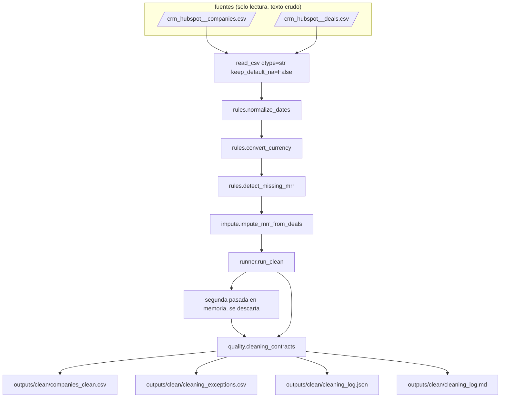

# Diseño: script de limpieza automática de companies.csv (A6)

Este documento decide cómo se construye el script que A6 pide y que el ADR-002 ya comprometió. El ADR-001 fijó la normalización de fecha y la cuarentena de los clones `HS-9000xx`; el ADR-002 fijó la conversión a 18.5 MXN por USD, la imputación del MRR desde el monto único de los deals y, en su adenda 1, la normalización de montos anuales a mensuales. Aquí se define el módulo nuevo, la réplica en pandas de la regla que hoy solo existe como SQL en `mart_mrr.sql`, las salidas, los contratos, las pruebas y el corte de entrega.

La capa se apoya en A0 a A4 sin modificarlos. Las salidas ya versionadas de `outputs/` quedan congeladas; lo nuevo es un paquete de Python, un archivo de contratos, un subcomando, un wrapper y un directorio de salidas con cuatro archivos.

## Resumen de decisiones

| # | Decisión | Elegido | Rechazado | Por qué |
|---|---|---|---|---|
| D1 | Reparto del módulo | `worky_engine/cleaning/` con `rules.py` (una función pura por regla, devuelve el valor corregido y sus correcciones), `impute.py` (la regla del ADR-002 en pandas) y `runner.py` (`run_clean` que orquesta y arma `CleanResult`) | Un solo archivo `cleaning.py` | La imputación es la única pieza que lee una segunda entrada y la única que replica SQL. Aislarla en `impute.py` deja las tres detecciones del texto literal del caso legibles por separado y hace posible el corte de entrega de la sección 9 sin reescribir nada |
| D2 | De dónde lee el comando | CSV directo: `--data-dir` (por omisión `data/raw/sistemas`) con `--companies` y `--deals` para apuntar a archivos sueltos. Sin CSV, termina en 2 nombrando el archivo que faltó | Reusar `_resolve_data_dir` y leer las tablas desde las tres bases SQLite | `_resolve_data_dir` exige las tres bases y extrae el zip; A6 no necesita ninguna de las dos cosas y fallaría en una carpeta que sí tiene los CSV. Además `sqlite3` entrega el MRR ya tipado y los nulos como `NaN`, mientras que el CSV conserva el texto crudo, que es justo lo que las tres detecciones necesitan mirar |
| D3 | Lectura del CSV | `pd.read_csv(..., dtype=str, keep_default_na=False, encoding="utf-8")`. Toda celda es texto; la cadena vacía es el único nulo | `keep_default_na=False, na_values=[""]` como en `_load_existing_crosswalk` | Con `na_values=[""]` pandas vuelve a introducir `NaN` y cada regla tendría que distinguir `NaN` de cadena vacía. Con texto puro, "vacío" es una sola condición (`value == ""`) y la escritura sale idéntica al origen sin `na_rep`. Es la lección de A4 llevada un paso más lejos |
| D4 | Regla de fecha | `signup_date` y `churn_date`, ambas por `normalize_date`. Vacío se queda vacío y no cuenta. DD/MM/YYYY cuenta como corrección; si el día es menor o igual a 12 cuenta además como ambigua. Si `normalize_date` devuelve `None` con valor presente, la celda conserva el original y sale una excepción `date_unresolved` | Marcar la ambigüedad con una columna nueva en el CSV limpio | La ambigüedad es un dato de la corrida, no de la empresa: vive en el log y en la bitácora de excepciones, donde quien audita la busca. `churn_date` entra aunque hoy traiga 0 fechas mixtas, porque la regla debe ser de la columna y no del dataset |
| D5 | Regla de moneda | `to_mxn(amount, currency)` sin tocarlo, redondeo a 2 decimales que ya hace esa función. `currency` queda en `MXN`, `currency_original` conserva la original y `mrr_original` el monto original. Una moneda fuera de `{USD, MXN}` no revienta: se captura el `ValueError`, la fila queda intacta y sale una excepción `currency_unsupported` | Convertir dentro del script con la tasa literal 18.5 | Duplicar la tasa crea un segundo lugar donde cambiarla. `to_mxn` ya es la fuente única del ADR-002 y ya está probada por tabla de casos |
| D6 | Regla de imputación | Réplica en pandas de `mart_mrr.sql` sobre `deals.csv` unido por `hubspot_id` crudo, con la normalización 12x de `mart_deal_normalized` incluida. Los clones `HS-9000xx` se excluyen por regex antes de imputar y se reportan como `clone_excluded`; esas filas no son correcciones, se reportan igual en cada corrida y no cuentan para el cero de idempotencia. Un deal con `amount` vacío o no numérico no detiene la corrida: se descarta con el reporte `deal_amount_not_numeric` (nombra el deal_id) y la imputación sigue con los deals válidos de la empresa, o la deja `unresolved` si no queda ninguno (ajuste tras la revisión nativa del PR 2) | Correr las vistas por DuckDB desde el script | Ejecutar los marts obliga a `resolve_identity`, `rapidfuzz`, DuckDB y el ensamblaje completo para llenar 28 celdas. El caso pide un script; la equivalencia se prueba, no se hereda (D7) |
| D7 | Cómo se prueba la equivalencia con `mart_mrr` | Contra los goldens ya versionados: `outputs/exceptions_log.csv` filtrado a `mrr_imputed_from_deal` (28 filas con `source_id`, `applied_value` y `evidence_ref`) y `outputs/master_dataset.csv` para `mrr_confidence` | Correr `assemble_master_dataset` con DuckDB dentro de la prueba | Es la misma evidencia a una fracción del costo: esos goldens ya se verifican byte a byte contra los marts en `tests/test_build_idempotency.py`, así que compararse con ellos es compararse con `mart_mrr`. La ruta por DuckDB agregaría la cascada de identidad y dos dependencias pesadas a una prueba que solo mira 28 montos |
| D8 | Columnas del CSV limpio e idempotencia | Las 12 columnas de origen con el valor ya corregido en su lugar (`mrr` en MXN, `currency` en `MXN`, fechas en ISO) más cinco de auditoría: `mrr_mxn`, `mrr_original`, `currency_original`, `mrr_source`, `mrr_confidence`. La idempotencia se logra por convergencia de las reglas, no por saltar filas: cada corrida vuelve a aplicar todas las reglas a todas las filas; una fecha ya en ISO, una fila ya en MXN con `currency_original` presente o un `mrr_source` ya resuelto no producen corrección, y los reportes `clone_excluded` se emiten en cada corrida para que conteos y excepciones coincidan (ajuste tras la revisión nativa del PR 1, que mostró que el paso de largo `_passthrough_if_clean` hacía tautológica la idempotencia y rompía la segunda corrida por CLI) | Renombrar `mrr` a `mrr_mxn` y quitar `currency` | Conservar los nombres de origen permite volver a correr el comando sobre su propia salida con el mismo lector, que es la prueba de idempotencia que pide el criterio de éxito. El paso de largo de las cinco columnas es lo que evita que la segunda corrida lea el valor ya imputado como si fuera un valor del CRM y cambie `mrr_source`. `mrr` y `mrr_mxn` quedan iguales por construcción: esa redundancia es el precio explícito de la compatibilidad de forma |
| D9 | Formato de los montos | `format_money` de `writers.py`, dos decimales fijos en `mrr`, `mrr_mxn` y `mrr_original` | Escribir el texto tal como llegó | Dos decimales fijos hacen que `applied_value` sea comparable carácter por carácter con el golden de `exceptions_log` y que la segunda corrida escriba los mismos bytes. Reformatear no cuenta como corrección: la detección es semántica (vacío, USD, patrón DD/MM), no de formato |
| D10 | Bitácora del log | Sin marca de tiempo ni rutas absolutas: solo nombres base de archivo, conteos, `ruleset_version` y el esquema. La fecha de la corrida la da el commit | Sellar la corrida con `datetime.now()` | Un reloj rompe la idempotencia byte a byte y obliga a excluir el archivo del golden, que es justo la auditabilidad que este cambio busca |
| D11 | Columnas de la bitácora por fila | Diez: `exception_id`, `exception_code`, `source_system`, `source_id`, `field_name`, `original_value`, `applied_value`, `evidence_ref`, `confidence`, `ruleset_version` | Las once de `exceptions_log.csv` | Es el subconjunto de las once columnas de `exceptions_log.csv` sin `master_id` ni `decided_at`, que salen del crosswalk que A6 no calcula por diseño (D6); inventarlos sería fingir una capa de identidad que el script no corrió. Se agrega `confidence`, que solo se llena en imputaciones (`high` o `medium`) y queda vacío en las demás correcciones; `evidence_ref` carga el `deal_id` de origen, igual que en el motor |
| D12 | Superficie del CLI | Subcomando `clean` con el patrón de `analyze` y `health` (importación diferida, `write_csv`, `write_markdown`, códigos 0, 1 y 2), más `scripts/clean_companies.py` que solo llama a `main(["clean", *sys.argv[1:]])` | Un script suelto con su propio `argparse` | El wrapper entrega la lectura literal del caso ("escribe un script") y el subcomando entrega la consistencia de UTF-8, códigos de salida y contratos que ya siguen los otros cinco comandos |

## 1. Arquitectura

### Módulos y responsabilidades

| Módulo | Responsabilidad | Entradas | Salidas |
|---|---|---|---|
| `worky_engine/cleaning/rules.py` | `normalize_dates`, `convert_currency`, `detect_missing_mrr`: funciones puras, una por regla, que devuelven el marco corregido y la lista de correcciones | Marco de companies en texto | Marco corregido y `list[Correction]` |
| `worky_engine/cleaning/impute.py` | `impute_mrr_from_deals`: la regla del ADR-002 en pandas, con la normalización 12x y la elección del deal de evidencia | Companies sin MRR y deals crudos | Valor imputado, `mrr_source`, `mrr_confidence`, `deal_id` de evidencia y los deals anualizados |
| `worky_engine/cleaning/runner.py` | `run_clean(companies, deals, ...) -> CleanResult`: orquesta las cuatro reglas en orden fijo, arma la bitácora y corre la segunda pasada de idempotencia | Los dos marcos ya leídos | `CleanResult(clean, exceptions, counts)` |
| `worky_engine/quality/cleaning_contracts.py` | Siete contratos con el mismo `ContractViolation` de A0 | `CleanResult` y el marco de entrada | Excepción con el contrato nombrado |
| `worky_engine/cli.py` | `cmd_clean`, su parser y la resolución de rutas de CSV | Argumentos | Códigos de salida y los cuatro archivos de `outputs/clean/` |
| `scripts/clean_companies.py` | Wrapper delgado, sin lógica propia | `sys.argv` | Código de salida del subcomando |

`cleaning` importa `normalization`, `writers` y pandas. No importa `identity_resolution`, `master_dataset`, `duckdb` ni `quality`: los contratos los resuelve el CLI y se los pasa, igual que hacen `analysis`, `health` y `warehouse`.

### Flujo de datos



Ninguna flecha entra desde `outputs/` ni desde las tres bases SQLite, y ninguna sale hacia `data/`.

### Orden de las reglas

Fechas, moneda, detección de nulos e imputación, en ese orden. La moneda va antes de la imputación porque el monto del deal hereda la moneda de su empresa (`stg_deals`), así que la conversión debe estar decidida antes de comparar montos. Las fechas van primero porque no interactúan con nada y dejan el marco en un solo formato para todo lo demás.

## 2. El comando `clean`

```
python -m worky_engine clean [--data-dir data/raw/sistemas] [--out-dir outputs/clean]
    [--companies <ruta>] [--deals <ruta>]
python scripts/clean_companies.py [mismos argumentos]
```

Orden interno: importación diferida del paquete `cleaning`, resolución de las dos rutas de CSV, lectura en texto, `run_clean`, `run_cleaning_contracts`, `write_csv` de las dos tablas y escritura del JSON y del Markdown.

Códigos de salida iguales a los de los otros cinco comandos: 0 correcto; 1 contrato violado, con el contrato nombrado en `stderr`; 2 dependencia ausente o CSV que no existe, nombrando el archivo y la bandera con la que se apunta a él. Cierra imprimiendo `clean: <n> correcciones en <m> filas, salidas en <out-dir>`.

Las filas sin resolver (`mrr_unresolved`, `date_unresolved`, `currency_unsupported`) no detienen la corrida: se reportan y se cuentan. Detenerlas convertiría un hallazgo de calidad en una falla de proceso, que es lo contrario de lo que el script existe para hacer.

## 3. La regla de imputación, línea por línea

`impute.py` replica `mart_mrr.sql` y `mart_deal_normalized.sql`. La equivalencia se sostiene por esta tabla y se prueba por D7.

| `mart_deal_normalized.sql` y `mart_mrr.sql` | `impute.py` en pandas |
|---|---|
| `stg_deals.amount_mxn`: `amount * 18.5` si la moneda de la empresa es USD | `to_mxn(float(amount), company_currency).mxn`, misma función del ADR-002 |
| `deal_pool WHERE master_id IS NOT NULL` | Unión interna de deals contra companies por `hubspot_id`; los 35 deals huérfanos caen solos |
| `company_min = MIN(amount_mxn) GROUP BY master_id` | `groupby("hubspot_id")["amount_mxn"].transform("min")` |
| `normalized_amount = CASE WHEN amount_mxn = min * 12 THEN min ELSE amount_mxn` | Comparación sobre montos redondeados a 2 decimales; cada deal así reducido produce una corrección `mrr_deal_annualized` |
| `distinct_amounts = COUNT(DISTINCT normalized_amount)` | `nunique()` sobre el monto normalizado redondeado a 2 decimales |
| `candidate_mrr_mxn = MIN(normalized_amount)` | `min()` del mismo grupo |
| `has_closedwon = MAX(stage = 'closedwon')` | `(stage == "closedwon").any()` |
| `ROW_NUMBER() ORDER BY (original_amount <> candidate), deal_id` | Orden por `(amount_mxn != candidate, deal_id)` y primer elemento: el deal de evidencia prefiere el que ya trae el monto mensual crudo |
| `CASE ... THEN 'imputed_from_deal' ELSE 'unresolved'` | `mrr_source` con las mismas tres ramas; un valor del CRM nunca se toca |
| `CASE ... has_closedwon THEN 'high' ... 'medium' ELSE 'none'` | `mrr_confidence` con las mismas tres ramas |

Dos diferencias declaradas y acotadas:

1. A6 agrupa por `hubspot_id` crudo y `mart_mrr` por `master_id`. Coinciden porque ningún deal del dataset apunta a un clon (verificado: cero coincidencias del patrón `,HS-9000xx,` en `crm_hubspot__deals.csv`), así que el remapeo de clones a sobreviviente que hace `stg_deals` no mueve ningún monto. El contrato `assert_clone_deals_absent` lo vigila y falla si un dataset futuro rompe ese supuesto.
2. La normalización 12x de `mart_deal_normalized` corre sobre todas las empresas; A6 solo la corre sobre las 28 candidatas a imputación, porque no produce un archivo de deals limpio. Los deals anualizados que reporta el log son los de ese conjunto: 3 en este dataset (HS-100337, HS-100500, HS-100585, los que nombra la adenda 1).

Redondeo: todo monto se compara y se escribe redondeado a 2 decimales antes de contar valores distintos, para que el ruido de punto flotante nunca invente un segundo monto donde `DECIMAL(14,2)` ve uno solo.

## 4. Salidas

`outputs/clean/` queda con exactamente cuatro archivos, los cuatro versionados como golden.

`companies_clean.csv`: 678 filas, 17 columnas en este orden. Ordenado por `hubspot_id` ascendente, que en este dataset es el mismo orden del archivo de origen.

| # | Columna | Contenido |
|---|---|---|
| 1 a 12 | `hubspot_id`, `name`, `domain`, `segment`, `industry`, `mrr`, `currency`, `signup_date`, `csm_owner`, `plan`, `state`, `churn_date` | Las de origen, con `mrr` en MXN y dos decimales, `currency` en `MXN` y las dos fechas en ISO o vacías |
| 13 | `mrr_mxn` | Igual a `mrr`, con el nombre que ya usa el dataset maestro |
| 14 | `mrr_original` | El monto del CRM tal como llegó; vacío en las filas imputadas y en los clones |
| 15 | `currency_original` | `MXN` o `USD` |
| 16 | `mrr_source` | `crm`, `imputed_from_deal`, `unresolved` o `clone_excluded` |
| 17 | `mrr_confidence` | `high`, `medium` o `none` |

`cleaning_exceptions.csv`: nueve columnas (D11), ordenado por `exception_code`, `source_id` y `field_name`. `exception_id` es `sha256("<code>|<source_system>|<source_id>|<field_name>")` truncado a 12 hex, la misma convención de A0. `ruleset_version` es la constante `1.0.0`.

| `exception_code` | `source_id` | `field_name` | `evidence_ref` | Filas esperadas |
|---|---|---|---|---|
| `mrr_imputed_from_deal` | `hubspot_id` | `mrr_mxn` | `deal_id` de origen | 28 |
| `mrr_deal_annualized` | `deal_id` | `amount` | `hubspot_id` de la empresa | 3 |
| `currency_converted_to_mxn` | `hubspot_id` | `mrr_mxn` | `USD@18.5` | 22 |
| `date_normalized` | `hubspot_id` | `signup_date` o `churn_date` | `dd_mm_yyyy` o `dd_mm_yyyy_ambiguous` | 31, de las cuales 12 ambiguas |
| `clone_excluded` | `hubspot_id` | `mrr_mxn` | `ADR-001 HS-9000xx` | 28 |
| `mrr_unresolved` | `hubspot_id` | `mrr_mxn` | `sin deals` o `montos ambiguos` | 0 |
| `date_unresolved` | `hubspot_id` | `signup_date` o `churn_date` | `formato desconocido` | 0 |
| `currency_unsupported` | `hubspot_id` | `currency` | La moneda recibida | 0 |

Total esperado: 112 filas.

`cleaning_log.json`, esquema `worky.cleaning-log/v1`:

```json
{
  "schema": "worky.cleaning-log/v1",
  "ruleset_version": "1.0.0",
  "inputs": {"companies": "crm_hubspot__companies.csv", "deals": "crm_hubspot__deals.csv",
             "rows_in": 678, "deals_in": 997, "deals_matched": 962},
  "rules": [
    {"rule": "missing_mrr", "columns": ["mrr"], "detected": 56, "corrected": 28,
     "excluded_clones": 28, "annualized_deals": 3, "ambiguous": 0, "unresolved": 0},
    {"rule": "currency_to_mxn", "columns": ["mrr", "currency"], "detected": 22,
     "corrected": 22, "ambiguous": 0, "unresolved": 0},
    {"rule": "date_format", "columns": ["signup_date", "churn_date"], "detected": 31,
     "corrected": 31, "ambiguous": 12, "unresolved": 0}
  ],
  "totals": {"rows_out": 678, "corrections": 84, "exception_rows": 112},
  "outputs": ["companies_clean.csv", "cleaning_exceptions.csv", "cleaning_log.json", "cleaning_log.md"]
}
```

Sin rutas absolutas, sin nombre de usuario, sin marca de tiempo (D10). Se escribe con `json.dumps(..., ensure_ascii=False, indent=2, sort_keys=False)` y salto `\n`.

`cleaning_log.md`: el mismo contenido en español, en una tabla por regla más un párrafo que dice qué significa cada conteo, escrito con `write_markdown`.

## 5. Contratos

`worky_engine/quality/cleaning_contracts.py`, mismo `ContractViolation` y misma consecuencia: código 1 con el contrato nombrado.

| Contrato | Regla |
|---|---|
| `assert_clean_row_count_preserved` | El marco limpio tiene exactamente las mismas filas que el de entrada, sin agregar ni perder ninguna |
| `assert_clean_columns_and_order` | Las 17 columnas de la sección 4, en ese orden |
| `assert_no_null_mrr_after_imputation` | `mrr_mxn` solo queda vacío en filas con `mrr_source` en `{unresolved, clone_excluded}` |
| `assert_currency_all_mxn` | Toda fila sale con `currency = 'MXN'` y con `currency_original` en `{MXN, USD}` |
| `assert_dates_iso_or_empty` | `signup_date` y `churn_date` son ISO o vacías, salvo las filas que tienen su excepción `date_unresolved` |
| `assert_exception_ids_unique` | `exception_id` nunca se repite y todo `source_id` existe en su tabla de origen |
| `assert_counts_match_exceptions` | Los conteos del log cuadran uno a uno con las filas de la bitácora por código |
| `assert_clean_is_idempotent` | La segunda pasada en memoria sobre la salida reporta cero correcciones y el mismo marco |
| `assert_clone_deals_absent` | Ningún deal apunta a un `hubspot_id` `HS-9000xx`, el supuesto que sostiene la equivalencia con `mart_mrr` (sección 3) |

La segunda pasada de `assert_clean_is_idempotent` corre siempre dentro de `run_clean` y se descarta sin escribirse. Sobre 678 filas cuesta milisegundos, y convierte la idempotencia en una garantía del comando y no solo de una prueba.

Los conteos reales del dataset (56, 28, 22, 31, 12, 3) no viven en los contratos: van en pruebas marcadas `dataset`, por la misma razón que la decisión D21 de A3.

## 6. Determinismo

| Fuente de variación | Cómo se elimina |
|---|---|
| Orden de filas | `sort_values("hubspot_id")` en el CSV limpio y orden explícito de tres claves en la bitácora |
| Punto flotante | Redondeo a 2 decimales antes de comparar y `format_money` al escribir (D9) |
| Nulos inventados por pandas | Lectura en texto puro con `keep_default_na=False` (D3) |
| Reloj | El log no lleva marca de tiempo (D10) |
| Rutas y usuario | El log solo guarda nombres base de archivo (D10) |
| Consola y archivos en Windows | `main()` ya reconfigura `stdout` y `stderr` a UTF-8; los CSV se leen y escriben con `encoding="utf-8"` explícito y `write_csv` sin BOM |
| Dependencias | Solo pandas, ya fijado con `==` en `pyproject.toml`; este cambio no agrega ninguna |

## 7. Estrategia de pruebas

Corredor pytest, mismos dos caminos del repositorio: `python -m pytest -q -m "not dataset"` y `python -m pytest -q`.

| Archivo | Capa | Qué prueba |
|---|---|---|
| `tests/test_cleaning_rules.py` | Unitaria, fixture mínima nueva | Una fecha DD/MM se normaliza y una ISO no se toca; el vacío no cuenta; el día menor o igual a 12 marca ambigüedad; una fecha imposible (`31/02/2023`) conserva el original y sale como `date_unresolved`; USD se convierte a 18.5 con original conservado; una moneda desconocida no revienta; los clones se excluyen por regex |
| `tests/test_cleaning_imputation.py` | Unitaria e integración, fixture mínima | Monto único imputa con `medium`; el mismo caso con un deal `closedwon` imputa con `high`; dos montos distintos que no son múltiplos de 12 quedan `unresolved`; un monto que es 12 veces otro se anualiza y produce su corrección; una empresa sin deals queda `unresolved`; el deal de evidencia es el del monto mensual crudo |
| `tests/test_cleaning_dataset_numbers.py` | Integración, marca `dataset` | Los conteos exactos 678, 56, 28, 22, 31, 12, 3, 0 y las 112 filas de bitácora sobre los CSV reales |
| `tests/test_cleaning_equivalence.py` | Integración, marca `dataset` | Las 28 imputaciones coinciden empresa por empresa en monto y en `deal_id` de evidencia con `outputs/exceptions_log.csv`, y el reparto 4 `high` y 24 `medium` coincide con `outputs/master_dataset.csv` (D7) |
| `tests/test_cleaning_idempotency.py` | Integración, marca `dataset` | Dos corridas seguidas producen los cuatro archivos idénticos byte a byte; una tercera corrida sobre `companies_clean.csv` reporta cero correcciones; el hash de los archivos ya versionados de `outputs/` no cambia; `outputs/clean/` queda con exactamente cuatro archivos |

La fixture mínima se construye dentro de `tests/test_cleaning_rules.py` con marcos de texto de pocas filas, y no extiende `tests/fixtures/mini_dataset.py`, porque agregar empresas ahí movería los conteos que ya fijan las pruebas de identidad y de imputación de A0.

## 8. Cambios por archivo

| Archivo | Acción | Qué contiene |
|---|---|---|
| `worky_engine/cleaning/__init__.py` | Nuevo | Exporta `run_clean` y `CleanResult` |
| `worky_engine/cleaning/rules.py` | Nuevo | Las tres reglas puras (sección 1) |
| `worky_engine/cleaning/impute.py` | Nuevo | La réplica del ADR-002 (sección 3) |
| `worky_engine/cleaning/runner.py` | Nuevo | `run_clean`, la bitácora y la segunda pasada |
| `worky_engine/quality/cleaning_contracts.py` | Nuevo | Los nueve contratos (sección 5) |
| `scripts/clean_companies.py` | Nuevo | Wrapper delgado (D12) |
| `tests/test_cleaning_rules.py`, `test_cleaning_imputation.py`, `test_cleaning_dataset_numbers.py`, `test_cleaning_equivalence.py`, `test_cleaning_idempotency.py` | Nuevo | Sección 7 |
| `outputs/clean/` (cuatro archivos) | Nuevo (golden) | Fuera del conteo de autoría |
| `worky_engine/cli.py` | Modificado | `cmd_clean`, `_import_clean_dependencies`, `_resolve_clean_inputs` y el parser |
| `README.md` | Modificado | Paso 7 de la ruta rápida y cuatro renglones en la tabla de salidas. A6 es dueño de esa sección mientras A5 corre en su worktree |
| `worky_engine/normalization/`, `sql/staging/`, `sql/marts/`, `master_dataset/`, `identity_resolution/`, goldens de A0 a A4, `pyproject.toml` | Sin cambio | Verificado por `tests/test_cleaning_idempotency.py` |

## 9. Corte en PR

Una sola PR planeada, `feat/a6-pr1-clean`, apilada sobre `main`.

| Archivo | Líneas de autoría estimadas |
|---|---|
| `cleaning/rules.py` | 110 |
| `cleaning/impute.py` | 120 |
| `cleaning/runner.py` | 130 |
| `cleaning/__init__.py` | 10 |
| `quality/cleaning_contracts.py` | 90 |
| `cli.py` (subcomando y parser) | 60 |
| `scripts/clean_companies.py` | 20 |
| Las cinco pruebas | 350 |
| `README.md` | 15 |
| Total | ~905 |

La estimación ya roza el tope de 800 líneas de autoría por PR, y en este repositorio las estimaciones se han quedado cortas por un factor de 2 (A0 midió `cascade.py` en 466 líneas contra 120 estimadas). Por eso el corte queda decidido de antemano en lugar de improvisarse:

- **Rebanada 1** (`feat/a6-pr1-clean`): `rules.py`, `runner.py` sin imputación, el log JSON y Markdown, los contratos de forma, orden e idempotencia, el subcomando, el wrapper, `test_cleaning_rules.py`, `test_cleaning_idempotency.py` y el renglón del README. Entrega las tres detecciones que el texto literal de A6 pide, con su log. Estimado ~500.
- **Rebanada 2** (`feat/a6-pr2-impute`): `impute.py`, `cleaning_exceptions.csv`, los contratos de imputación y equivalencia, `test_cleaning_imputation.py`, `test_cleaning_dataset_numbers.py` y `test_cleaning_equivalence.py`. Entrega el compromiso del ADR-002. Estimado ~400.

Disparador: al cerrar la rebanada 1 se mide con `git diff --numstat` sobre los archivos de autoría (los cuatro goldens de `outputs/clean/` quedan fuera del conteo, igual que en A3 y A4). Si la suma medida de las dos rebanadas queda bajo 800, se entrega como una sola PR; si no, se entregan apiladas, la segunda contra la rama de la primera. Palanca de reducción si aun así se rebasa: mover `cleaning_log.md` a una tercera rebanada, porque el JSON ya cubre el requisito del caso y el Markdown es la versión legible.

## 10. Matriz de amenazas

No aplica. Este cambio agrega un subcomando de `argparse`, un wrapper que solo llama a ese subcomando y lectura y escritura de archivos locales. No hace ruteo, no ejecuta comandos de shell, no lanza subprocesos, no automatiza operaciones de Git ni de pull requests y no clasifica archivos ejecutables.

Quedan dos límites que sí se fijan como restricciones de diseño:

1. Rutas del sistema de archivos: `--data-dir`, `--out-dir`, `--companies` y `--deals` llegan desde la línea de comandos. `clean` crea `--out-dir` si no existe y solo escribe dentro de él. Nunca escribe en `--data-dir` ni en `data/`, y nunca lee `outputs/` fuera de su propio directorio.
2. Contenido de los CSV: cada celda se trata como dato y nunca como código. No hay `eval`, no hay `pd.read_csv` con motor de Python arbitrario, no hay interpolación de celdas en SQL porque el comando no abre ninguna conexión, y el `hubspot_id` que arma cada `exception_id` entra a `hashlib.sha256` como bytes UTF-8.

## 11. Migración y despliegue

No hay migración de datos. Todo lo que produce este cambio es código nuevo, un paquete nuevo, un subcomando aditivo y archivos generados dentro de `outputs/clean/`. Revertir el merge deja el repositorio con los goldens de A0 a A4 intactos y `pytest` en verde; el único paso manual es borrar `outputs/clean/`.

## 12. Riesgos residuales

| Riesgo | Probabilidad | Mitigación |
|---|---|---|
| La estimación de 905 líneas se queda corta, como pasó en A0 | Alta | El corte de la sección 9 ya está decidido y su disparador es una medición, no un juicio |
| La regla del ADR-002 queda en pandas y en SQL, y ambas deben coincidir | Alta | La prueba de equivalencia contra los dos goldens (D7) más la tabla línea por línea de la sección 3 |
| Un dataset futuro con deals que apunten a un clon rompería la equivalencia de la sección 3 | Baja | El contrato `assert_clone_deals_absent` falla antes de escribir nada |
| Pandas infiere nulos donde no los hay | Media | Lectura en texto puro (D3), con prueba unitaria sobre una celda vacía y una celda con la palabra `NA` |
| Las 12 fechas donde DD/MM y MM/DD son ambas válidas se normalizan con una lectura y no la otra | Media | Se normalizan como DD/MM según el ADR-001, el log las reporta aparte y la bitácora conserva el original en cada una |
| A5 toca `README.md` en paralelo y provoca un conflicto | Baja | A6 es dueño de la sección de pasos de corrida y de sus renglones en la tabla de salidas; el conflicto, si aparece, es de renglones contiguos |

## Preguntas abiertas

- [ ] ¿`companies_clean.csv` debe conservar `mrr` y `mrr_mxn` con el mismo valor (D8) o conviene publicar solo `mrr_mxn` y documentar que la segunda corrida necesita un lector distinto? No bloquea: la redundancia es la ruta que cumple el criterio de idempotencia tal como está escrito en la propuesta.
- [ ] ¿La normalización 12x debe reportarse sobre todos los deals del dataset (261 anualizados) y no solo sobre los del conjunto imputable (3)? Hoy queda acotada al alcance de A6 porque el script no publica un archivo de deals limpio; ampliarla pertenece a un cambio posterior sobre `mart_deal_normalized`.
